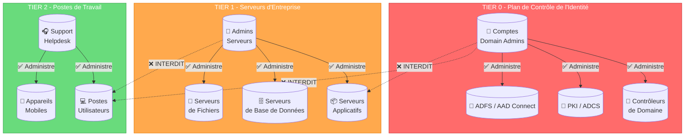

# Module 1 : Le Modèle de Tiering

## Objectifs du Module

À l'issue de ce module, vous serez capable de :

- :material-check: Comprendre le modèle d'administration en couches (Tiering Model)
- :material-check: Identifier les ressources appartenant à chaque Tier
- :material-check: Appliquer la règle d'or de séparation des credentials
- :material-check: Planifier une stratégie de migration vers le Tiering

---

## 1. Pourquoi le Tiering Model ?

### 1.1 Le Problème : L'Administration Plate

Dans une infrastructure AD traditionnelle, les administrateurs utilisent souvent **un seul compte** pour toutes leurs tâches :

- Se connecter à leur poste de travail
- Administrer les contrôleurs de domaine
- Gérer les serveurs applicatifs
- Dépanner les postes utilisateurs

!!! danger "Le Danger de l'Administration Plate"
    Lorsqu'un administrateur Domain Admin se connecte à un poste utilisateur compromis, ses credentials sont **mis en cache** sur cette machine.

    Un attaquant peut alors :

    1. Extraire le hash NTLM avec Mimikatz
    2. Effectuer une attaque **Pass-the-Hash**
    3. Se connecter directement aux contrôleurs de domaine
    4. **Prendre le contrôle total du domaine**

    Temps nécessaire : quelques secondes.

### 1.2 La Solution : Segmentation des Privilèges

Le **Tiering Model** (ou Microsoft Enterprise Access Model) résout ce problème en :

- Séparant l'infrastructure en **couches de confiance** (Tiers)
- Exigeant des **comptes séparés** pour chaque Tier
- Interdisant les **connexions descendantes** (Tier 0 → Tier 2)

---

## 2. Les Trois Tiers

### 2.1 Vue d'Ensemble



### 2.2 Tier 0 : Le Plan de Contrôle de l'Identité

!!! danger "Zone Sacrée"
    Le Tier 0 représente le **contrôle total** de l'identité dans l'organisation. Sa compromission équivaut à la compromission de **l'ensemble du SI**.

**Ressources Tier 0 :**

| Ressource | Justification |
|-----------|---------------|
| **Contrôleurs de Domaine** | Stockent la base NTDS.dit (tous les hashs) |
| **Serveurs PKI / ADCS** | Peuvent émettre des certificats pour n'importe qui |
| **ADFS / AAD Connect** | Pont vers le cloud, token signing |
| **Serveurs SCCM** | Peuvent exécuter du code sur tous les postes |
| **Hyperviseurs hébergeant des DC** | Accès direct aux disques virtuels |

**Comptes Tier 0 :**

- Domain Admins
- Enterprise Admins
- Schema Admins
- Administrateurs du domaine racine
- Comptes de service des DC

```powershell
# Lister les membres des groupes Tier 0
Get-ADGroupMember -Identity "Domain Admins" -Recursive |
    Select-Object Name, objectClass, distinguishedName

Get-ADGroupMember -Identity "Enterprise Admins" -Recursive |
    Select-Object Name, objectClass, distinguishedName

Get-ADGroupMember -Identity "Schema Admins" -Recursive |
    Select-Object Name, objectClass, distinguishedName
```

### 2.3 Tier 1 : Les Serveurs d'Entreprise

**Ressources Tier 1 :**

| Ressource | Exemples |
|-----------|----------|
| **Serveurs applicatifs** | IIS, Tomcat, serveurs métier |
| **Serveurs de bases de données** | SQL Server, Oracle, PostgreSQL |
| **Serveurs de fichiers** | File servers, DFS |
| **Serveurs d'impression** | Print servers |
| **Serveurs de sauvegarde** | Veeam, Commvault (attention : souvent Tier 0 !) |

**Comptes Tier 1 :**

- Server Admins (groupe personnalisé)
- Comptes de service applicatifs
- DBA (Database Administrators)

```powershell
# Créer un groupe d'administration Tier 1
New-ADGroup -Name "Tier1-ServerAdmins" `
    -GroupScope Global `
    -GroupCategory Security `
    -Path "OU=Groups,OU=Tier1,DC=corp,DC=local" `
    -Description "Administrateurs des serveurs Tier 1"
```

### 2.4 Tier 2 : Les Postes de Travail

**Ressources Tier 2 :**

| Ressource | Exemples |
|-----------|----------|
| **Postes utilisateurs** | Desktops, laptops |
| **Appareils mobiles** | Téléphones, tablettes gérées |
| **Kiosques** | Bornes d'accueil, affichage |

**Comptes Tier 2 :**

- Helpdesk / Support niveau 1
- Administrateurs locaux des postes
- Comptes utilisateurs standard

```powershell
# Créer un groupe Helpdesk Tier 2
New-ADGroup -Name "Tier2-Helpdesk" `
    -GroupScope Global `
    -GroupCategory Security `
    -Path "OU=Groups,OU=Tier2,DC=corp,DC=local" `
    -Description "Support Helpdesk - Administration postes uniquement"
```

---

## 3. La Règle d'Or

!!! warning "Règle Absolue"
    **Un compte d'un Tier supérieur ne doit JAMAIS se connecter à une ressource d'un Tier inférieur.**

    - ❌ Tier 0 → Tier 1 : INTERDIT
    - ❌ Tier 0 → Tier 2 : INTERDIT
    - ❌ Tier 1 → Tier 2 : INTERDIT
    - ✅ Tier 0 → Tier 0 : AUTORISÉ
    - ✅ Tier 1 → Tier 1 : AUTORISÉ
    - ✅ Tier 2 → Tier 2 : AUTORISÉ

### 3.1 Pourquoi cette Règle ?

```
┌─────────────────────────────────────────────────────────────────┐
│              SCÉNARIO D'ATTAQUE SANS TIERING                    │
├─────────────────────────────────────────────────────────────────┤
│                                                                 │
│  1. L'utilisateur "jdupont" ouvre un email de phishing          │
│                           │                                     │
│                           ▼                                     │
│  2. Malware installé sur son poste PC-JDUPONT                   │
│                           │                                     │
│                           ▼                                     │
│  3. L'admin "admin-pierre" se connecte pour "dépanner"          │
│     (admin-pierre = Domain Admin)                               │
│                           │                                     │
│                           ▼                                     │
│  4. Mimikatz extrait le hash de admin-pierre                    │
│     sekurlsa::logonpasswords                                    │
│                           │                                     │
│                           ▼                                     │
│  5. Pass-the-Hash vers le contrôleur de domaine                 │
│     → GAME OVER                                                 │
│                                                                 │
│  ⏱️ Temps total : 10 minutes                                    │
│                                                                 │
└─────────────────────────────────────────────────────────────────┘
```

### 3.2 Avec le Tiering Model

```
┌─────────────────────────────────────────────────────────────────┐
│              SCÉNARIO D'ATTAQUE AVEC TIERING                    │
├─────────────────────────────────────────────────────────────────┤
│                                                                 │
│  1. L'utilisateur "jdupont" ouvre un email de phishing          │
│                           │                                     │
│                           ▼                                     │
│  2. Malware installé sur son poste PC-JDUPONT                   │
│                           │                                     │
│                           ▼                                     │
│  3. L'admin Tier 2 "helpdesk-marie" se connecte                 │
│     (helpdesk-marie = Admin local Tier 2 uniquement)            │
│                           │                                     │
│                           ▼                                     │
│  4. Mimikatz extrait le hash de helpdesk-marie                  │
│                           │                                     │
│                           ▼                                     │
│  5. Pass-the-Hash... vers d'autres postes Tier 2 uniquement     │
│     → Dommages LIMITÉS au Tier 2                                │
│     → Tier 0 et Tier 1 INTACTS                                  │
│                                                                 │
│  🛡️ Impact : Contenu, pas de compromission globale             │
│                                                                 │
└─────────────────────────────────────────────────────────────────┘
```

---

## 4. Implémentation Technique

### 4.1 Structure OU Recommandée

```powershell
# Créer la structure OU pour le Tiering
$domain = "DC=corp,DC=local"

# Tier 0
New-ADOrganizationalUnit -Name "Tier0" -Path $domain
New-ADOrganizationalUnit -Name "Accounts" -Path "OU=Tier0,$domain"
New-ADOrganizationalUnit -Name "Groups" -Path "OU=Tier0,$domain"
New-ADOrganizationalUnit -Name "Servers" -Path "OU=Tier0,$domain"
New-ADOrganizationalUnit -Name "PAW" -Path "OU=Tier0,$domain"

# Tier 1
New-ADOrganizationalUnit -Name "Tier1" -Path $domain
New-ADOrganizationalUnit -Name "Accounts" -Path "OU=Tier1,$domain"
New-ADOrganizationalUnit -Name "Groups" -Path "OU=Tier1,$domain"
New-ADOrganizationalUnit -Name "Servers" -Path "OU=Tier1,$domain"

# Tier 2
New-ADOrganizationalUnit -Name "Tier2" -Path $domain
New-ADOrganizationalUnit -Name "Accounts" -Path "OU=Tier2,$domain"
New-ADOrganizationalUnit -Name "Groups" -Path "OU=Tier2,$domain"
New-ADOrganizationalUnit -Name "Workstations" -Path "OU=Tier2,$domain"
```

### 4.2 GPO de Restriction de Connexion

La clé du Tiering est d'**empêcher techniquement** les connexions inter-Tiers via GPO :

```
┌─────────────────────────────────────────────────────────────────┐
│                    GPO - TIER RESTRICTIONS                      │
├─────────────────────────────────────────────────────────────────┤
│                                                                 │
│  GPO: "Tier0-RestrictLogon" (liée à OU=Servers,OU=Tier0)        │
│  ────────────────────────────────────────────────────────────   │
│  Computer Configuration > Policies > Windows Settings >        │
│  Security Settings > Local Policies > User Rights Assignment   │
│                                                                 │
│  • Deny log on locally:                                         │
│    - Tier1-ServerAdmins                                         │
│    - Tier2-Helpdesk                                             │
│    - Domain Users                                               │
│                                                                 │
│  • Deny log on through Remote Desktop Services:                 │
│    - Tier1-ServerAdmins                                         │
│    - Tier2-Helpdesk                                             │
│    - Domain Users                                               │
│                                                                 │
│  • Allow log on locally:                                        │
│    - Tier0-DomainAdmins (groupe personnalisé)                   │
│                                                                 │
└─────────────────────────────────────────────────────────────────┘
```

```powershell
# Créer et lier une GPO de restriction Tier 0
New-GPO -Name "Tier0-RestrictLogon" |
    New-GPLink -Target "OU=Servers,OU=Tier0,DC=corp,DC=local"

# Note : La configuration des droits de connexion doit être faite
# via GPMC ou avec des cmdlets AGPM pour les paramètres de sécurité
```

### 4.3 Authentication Policies (Windows Server 2012 R2+)

Pour les environnements modernes, utilisez les **Authentication Policies** :

```powershell
# Créer une Authentication Policy pour Tier 0
New-ADAuthenticationPolicy -Name "Tier0-AuthPolicy" `
    -Description "Restreint les comptes Tier 0 aux ressources Tier 0" `
    -UserTGTLifetimeMins 240 `
    -ProtectedFromAccidentalDeletion $true

# Créer un Authentication Policy Silo
New-ADAuthenticationPolicySilo -Name "Tier0-Silo" `
    -Description "Silo pour les comptes et ressources Tier 0" `
    -UserAuthenticationPolicy "Tier0-AuthPolicy" `
    -ComputerAuthenticationPolicy "Tier0-AuthPolicy" `
    -ProtectedFromAccidentalDeletion $true

# Ajouter un compte au Silo
Set-ADUser -Identity "admin-t0" `
    -AuthenticationPolicySilo "Tier0-Silo"
```

---

## 5. Les PAW (Privileged Access Workstations)

### 5.1 Concept

Une **PAW** est un poste de travail durci, dédié **exclusivement** à l'administration d'un Tier spécifique.

!!! info "Caractéristiques d'une PAW Tier 0"
    - **Hardware dédié** : Pas de VM, pas de dual-boot
    - **OS durci** : Windows 10/11 Enterprise avec Device Guard, Credential Guard
    - **Réseau isolé** : VLAN d'administration séparé
    - **Pas d'accès Internet** : Ou via proxy très restrictif
    - **Pas d'email/navigation** : Uniquement outils d'administration
    - **Chiffrement** : BitLocker obligatoire
    - **MFA** : Carte à puce ou Windows Hello for Business

### 5.2 Architecture PAW

```
┌─────────────────────────────────────────────────────────────────┐
│                    ARCHITECTURE PAW                              │
├─────────────────────────────────────────────────────────────────┤
│                                                                 │
│   Administrateur Tier 0                                         │
│          │                                                      │
│          ├──► [PAW-T0]  ──────────► [DC, PKI, ADFS]            │
│          │    (Poste durci)         (Ressources Tier 0)         │
│          │                                                      │
│          └──► [Poste Standard] ──► [Email, Internet, Apps]      │
│               (Usage quotidien)    (Pas d'admin)                │
│                                                                 │
│   ⚠️ L'admin utilise 2 postes physiques séparés                │
│                                                                 │
└─────────────────────────────────────────────────────────────────┘
```

### 5.3 Alternative : Jump Server / Bastion

Pour les organisations ne pouvant pas déployer des PAW physiques :

```powershell
# Le Jump Server est une VM Tier 0 durcie
# L'admin se connecte via RDP avec Restricted Admin Mode

# Connexion en Restricted Admin Mode (ne laisse pas de credentials)
mstsc /restrictedAdmin /v:YOURJUMPSERVER

# Activer Restricted Admin Mode sur le Jump Server
reg add HKLM\System\CurrentControlSet\Control\Lsa /v DisableRestrictedAdmin /t REG_DWORD /d 0
```

---

## 6. Plan de Migration

### 6.1 Approche Progressive

!!! tip "Migration en 4 Phases"
    Le Tiering ne s'implémente pas en un jour. Procédez par étapes :

    1. **Phase 1 - Inventaire** (2-4 semaines)
       - Cartographier tous les comptes à privilèges
       - Identifier les ressources par Tier
       - Documenter les flux d'administration actuels

    2. **Phase 2 - Tier 0** (4-8 semaines)
       - Créer les comptes Tier 0 dédiés
       - Déployer les PAW ou Jump Servers
       - Appliquer les GPO de restriction
       - Migrer les Domain Admins

    3. **Phase 3 - Tier 1** (4-8 semaines)
       - Créer les comptes Tier 1 dédiés
       - Appliquer les restrictions
       - Former les équipes serveur

    4. **Phase 4 - Tier 2** (4-8 semaines)
       - Créer les comptes Helpdesk Tier 2
       - Retirer les droits admin local des utilisateurs
       - Déployer LAPS pour les mots de passe admin local

### 6.2 Quick Wins

Actions immédiates à fort impact :

```powershell
# 1. Auditer les membres des groupes privilégiés
Get-ADGroupMember -Identity "Domain Admins" -Recursive

# 2. Vérifier les comptes avec "AdminCount = 1" (protégés par AdminSDHolder)
Get-ADUser -Filter {AdminCount -eq 1} -Properties AdminCount, memberOf |
    Select-Object Name, AdminCount, @{N='Groups';E={($_.memberOf -join ', ')}}

# 3. Identifier les sessions actives des Domain Admins
# (Nécessite des outils comme BloodHound ou des scripts personnalisés)

# 4. Activer le "Protected Users" group pour les comptes Tier 0
Add-ADGroupMember -Identity "Protected Users" -Members "admin-t0"
```

---

## Quiz d'Auto-Évaluation

??? question "Question 1 : Un Domain Admin peut-il se connecter à un serveur de fichiers (Tier 1) ?"
    **Réponse :** **Non**, c'est interdit par la règle d'or du Tiering. Un compte Tier 0 ne doit jamais se connecter à une ressource Tier 1 ou Tier 2. Pour administrer un serveur de fichiers, utilisez un compte Tier 1 dédié.

??? question "Question 2 : Pourquoi les hyperviseurs hébergeant des DC sont-ils Tier 0 ?"
    **Réponse :** Parce qu'un administrateur de l'hyperviseur peut :

    - Accéder directement au disque virtuel du DC
    - Extraire le fichier NTDS.dit (base AD complète)
    - Créer des snapshots et les analyser offline
    - Modifier la mémoire de la VM

    L'accès à l'hyperviseur = accès au DC = Tier 0.

??? question "Question 3 : Qu'est-ce que le Restricted Admin Mode pour RDP ?"
    **Réponse :** C'est un mode de connexion RDP qui n'envoie pas les credentials de l'utilisateur vers la machine distante. Seul un ticket Kerberos est utilisé, ce qui empêche les attaques de type credential dumping sur le serveur cible. Idéal pour les Jump Servers.

---

## Prochaine Étape

Maintenant que vous comprenez l'architecture de sécurité, apprenez à identifier les attaques qui la ciblent.

[:octicons-arrow-right-24: Module 2 : Vecteurs d'Attaque AD](02-attack-vectors.md)

---

**Temps estimé :** 60 minutes
**Niveau :** Intermédiaire
