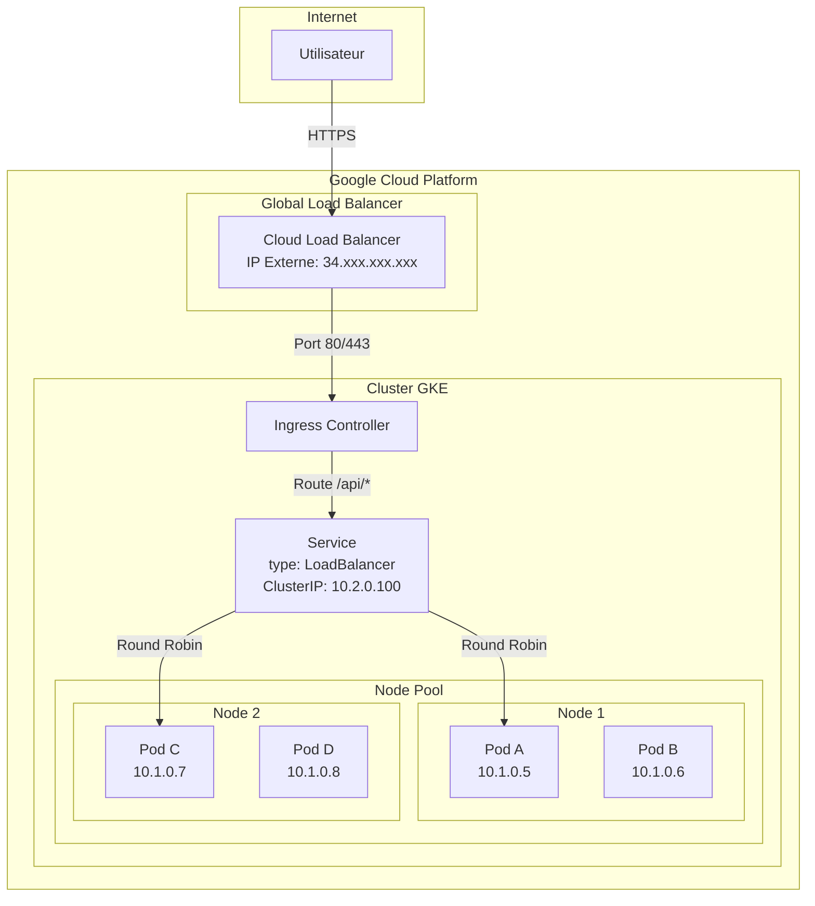

# Module 1 : Architecture GKE

## Objectifs du Module

À l'issue de ce module, vous serez capable de :

- :material-check: Expliquer la différence entre Control Plane et Nodes
- :material-check: Choisir entre un cluster Zonal et Régional
- :material-check: Comprendre le mode VPC-Native et l'IP Aliasing
- :material-check: Configurer des Node Pools adaptés aux workloads

---

## 1. Architecture Master / Nodes

### 1.1 Le Control Plane (Master)

En GKE, le **Control Plane** est entièrement géré par Google. Vous n'y avez pas accès SSH, et c'est une bonne chose.

```
┌─────────────────────────────────────────────────────────────────┐
│              CONTROL PLANE GKE (Géré par Google)                │
├─────────────────────────────────────────────────────────────────┤
│                                                                 │
│   ┌─────────────┐  ┌─────────────┐  ┌─────────────┐            │
│   │   etcd      │  │ API Server  │  │  Scheduler  │            │
│   │  (HA, SSD)  │  │   (HA)      │  │    (HA)     │            │
│   └─────────────┘  └─────────────┘  └─────────────┘            │
│                                                                 │
│   ┌─────────────┐  ┌─────────────┐                             │
│   │ Controller  │  │   Cloud     │                             │
│   │  Manager    │  │ Controller  │                             │
│   └─────────────┘  └─────────────┘                             │
│                                                                 │
│   ✅ Mises à jour automatiques                                  │
│   ✅ SLA 99.95% (régional) / 99.5% (zonal)                     │
│   ✅ Backup etcd automatique                                    │
│   ✅ Scaling automatique                                        │
│                                                                 │
└─────────────────────────────────────────────────────────────────┘
```

!!! info "Ce que Google gère pour vous"
    - **etcd** : Stockage distribué, répliqué, sauvegardé
    - **API Server** : Hautement disponible, avec authentification intégrée
    - **Scheduler** : Placement intelligent des pods
    - **Controller Manager** : Réconciliation de l'état désiré
    - **Cloud Controller** : Intégration native GCP (LoadBalancers, PersistentVolumes)

### 1.2 Les Nodes (Worker Nodes)

Les **Nodes** sont des VMs Compute Engine que vous contrôlez partiellement :

```
┌─────────────────────────────────────────────────────────────────┐
│              NODE GKE (VM Compute Engine)                        │
├─────────────────────────────────────────────────────────────────┤
│                                                                 │
│   ┌─────────────────────────────────────────────────────────┐   │
│   │                    Container Runtime                     │   │
│   │                    (containerd)                          │   │
│   └─────────────────────────────────────────────────────────┘   │
│                                                                 │
│   ┌─────────────┐  ┌─────────────┐  ┌─────────────┐            │
│   │   kubelet   │  │ kube-proxy  │  │  gke-agent  │            │
│   │             │  │             │  │             │            │
│   └─────────────┘  └─────────────┘  └─────────────┘            │
│                                                                 │
│   ┌─────────────┐  ┌─────────────┐  ┌─────────────┐            │
│   │    Pod A    │  │    Pod B    │  │    Pod C    │            │
│   │  (App)      │  │  (API)      │  │  (Worker)   │            │
│   └─────────────┘  └─────────────┘  └─────────────┘            │
│                                                                 │
└─────────────────────────────────────────────────────────────────┘
```

**Composants clés :**

| Composant | Rôle |
|-----------|------|
| `kubelet` | Agent K8s, communique avec l'API Server |
| `kube-proxy` | Gestion des règles réseau (iptables/IPVS) |
| `containerd` | Runtime de conteneurs (remplace Docker) |
| `gke-agent` | Agent spécifique GKE (métriques, logs) |

---

## 2. Clusters Zonaux vs Régionaux

### 2.1 Cluster Zonal

Un cluster **zonal** a son Control Plane dans une seule zone :

```
┌─────────────────────────────────────────────────────────────────┐
│              CLUSTER ZONAL (europe-west1-b)                      │
├─────────────────────────────────────────────────────────────────┤
│                                                                 │
│   Zone: europe-west1-b                                          │
│   ┌───────────────────────────────────────────────────────┐     │
│   │                                                       │     │
│   │   ┌─────────────┐                                     │     │
│   │   │   Control   │   SLA: 99.5%                        │     │
│   │   │    Plane    │   (Single Point of Failure)         │     │
│   │   └─────────────┘                                     │     │
│   │          │                                            │     │
│   │          ▼                                            │     │
│   │   ┌──────┬──────┬──────┐                             │     │
│   │   │Node 1│Node 2│Node 3│                             │     │
│   │   └──────┴──────┴──────┘                             │     │
│   │                                                       │     │
│   └───────────────────────────────────────────────────────┘     │
│                                                                 │
│   ⚠️  Si la zone tombe, TOUT le cluster est indisponible        │
│                                                                 │
└─────────────────────────────────────────────────────────────────┘
```

**Caractéristiques :**

| Aspect | Détail |
|--------|--------|
| **SLA Control Plane** | 99.5% |
| **Coût** | Moins cher (pas de réplication) |
| **Maintenance** | Downtime pendant les upgrades |
| **Cas d'usage** | Dev, Test, Workloads non-critiques |

### 2.2 Cluster Régional

Un cluster **régional** réplique le Control Plane sur 3 zones :

```
┌─────────────────────────────────────────────────────────────────┐
│              CLUSTER RÉGIONAL (europe-west1)                     │
├─────────────────────────────────────────────────────────────────┤
│                                                                 │
│   ┌─────────────────┐ ┌─────────────────┐ ┌─────────────────┐   │
│   │ europe-west1-b  │ │ europe-west1-c  │ │ europe-west1-d  │   │
│   │                 │ │                 │ │                 │   │
│   │ ┌─────────────┐ │ │ ┌─────────────┐ │ │ ┌─────────────┐ │   │
│   │ │   Control   │ │ │ │   Control   │ │ │ │   Control   │ │   │
│   │ │   Plane     │◄┼─┼►│   Plane     │◄┼─┼►│   Plane     │ │   │
│   │ │  (replica)  │ │ │ │  (replica)  │ │ │ │  (replica)  │ │   │
│   │ └─────────────┘ │ │ └─────────────┘ │ │ └─────────────┘ │   │
│   │       │         │ │       │         │ │       │         │   │
│   │       ▼         │ │       ▼         │ │       ▼         │   │
│   │ ┌───┬───┬───┐   │ │ ┌───┬───┬───┐   │ │ ┌───┬───┬───┐   │   │
│   │ │N1 │N2 │N3 │   │ │ │N4 │N5 │N6 │   │ │ │N7 │N8 │N9 │   │   │
│   │ └───┴───┴───┘   │ │ └───┴───┴───┘   │ │ └───┴───┴───┘   │   │
│   │                 │ │                 │ │                 │   │
│   └─────────────────┘ └─────────────────┘ └─────────────────┘   │
│                                                                 │
│   ✅ SLA 99.95% - Une zone peut tomber sans impact              │
│                                                                 │
└─────────────────────────────────────────────────────────────────┘
```

**Caractéristiques :**

| Aspect | Détail |
|--------|--------|
| **SLA Control Plane** | 99.95% |
| **Coût** | ~3x le coût du Control Plane |
| **Maintenance** | Zero-downtime upgrades (rolling) |
| **Cas d'usage** | Production, Workloads critiques |

### 2.3 Comparaison et Recommandations

| Critère | Zonal | Régional |
|---------|-------|----------|
| **SLA** | 99.5% | 99.95% |
| **Coût Control Plane** | $0.10/h | $0.10/h (gratuit Standard) |
| **Coût Nodes** | 1x | 3x (répliqués sur 3 zones) |
| **Résilience** | Single zone | Multi-zone |
| **Upgrades** | Downtime | Zero-downtime |

!!! success "Recommandation Worldline"
    **Production** : Toujours **Régional** pour les workloads critiques.

    **Dev/Test** : **Zonal** acceptable pour réduire les coûts.

    Astuce : Même en régional, vous pouvez limiter les nodes à 1-2 zones pour réduire les coûts tout en gardant le Control Plane HA.

---

## 3. VPC-Native et IP Aliasing

### 3.1 Le Problème des Clusters Non VPC-Native

Dans un cluster Kubernetes classique (routes-based), les pods ont des IPs internes au cluster, non routables dans le VPC :

```
┌─────────────────────────────────────────────────────────────────┐
│              CLUSTER ROUTES-BASED (Legacy)                       │
├─────────────────────────────────────────────────────────────────┤
│                                                                 │
│   VPC: 10.0.0.0/16                                              │
│                                                                 │
│   Node 1 (10.0.1.10)          Node 2 (10.0.1.11)               │
│   ┌─────────────────┐         ┌─────────────────┐              │
│   │                 │         │                 │              │
│   │ Pod (10.244.0.5)│ ──X──▶  │ Cloud SQL      │              │
│   │                 │         │ (10.0.2.50)    │              │
│   └─────────────────┘         └─────────────────┘              │
│                                                                 │
│   ❌ Le Pod ne peut PAS communiquer directement avec Cloud SQL  │
│   ❌ Nécessite NAT ou routes personnalisées                     │
│   ❌ Plus de 1000 nodes = problème de quotas de routes          │
│                                                                 │
└─────────────────────────────────────────────────────────────────┘
```

### 3.2 La Solution : VPC-Native (IP Aliasing)

En mode **VPC-Native**, les pods reçoivent des IPs du VPC, directement routables :

```
┌─────────────────────────────────────────────────────────────────┐
│              CLUSTER VPC-NATIVE                                  │
├─────────────────────────────────────────────────────────────────┤
│                                                                 │
│   VPC: 10.0.0.0/8                                               │
│   ├── Subnet Nodes:    10.0.0.0/16                              │
│   ├── Subnet Pods:     10.1.0.0/16 (Secondary Range)            │
│   └── Subnet Services: 10.2.0.0/16 (Secondary Range)            │
│                                                                 │
│   Node 1 (10.0.1.10)                                            │
│   ┌─────────────────────────────────────────────────────────┐   │
│   │                                                         │   │
│   │  Pod A (10.1.0.5) ──────────────▶ Cloud SQL (10.0.2.50) │   │
│   │  Pod B (10.1.0.6) ──────────────▶ Memorystore (10.0.3.1)│   │
│   │                                                         │   │
│   │  IP Aliases: 10.1.0.0/24 (jusqu'à 110 pods)            │   │
│   │                                                         │   │
│   └─────────────────────────────────────────────────────────┘   │
│                                                                 │
│   ✅ Pods directement routables dans le VPC                     │
│   ✅ Pas de NAT nécessaire                                      │
│   ✅ Scalabilité > 1000 nodes                                   │
│   ✅ Compatible Private Google Access                           │
│                                                                 │
└─────────────────────────────────────────────────────────────────┘
```

### 3.3 Configuration VPC-Native

```bash
# Créer un cluster VPC-Native
gcloud container clusters create my-cluster \
    --region europe-west1 \
    --enable-ip-alias \
    --cluster-ipv4-cidr "/16" \
    --services-ipv4-cidr "/16" \
    --network my-vpc \
    --subnetwork my-subnet
```

**Ou avec des ranges secondaires existants :**

```bash
# Créer le subnet avec ranges secondaires
gcloud compute networks subnets create my-subnet \
    --network my-vpc \
    --region europe-west1 \
    --range 10.0.0.0/20 \
    --secondary-range pods=10.1.0.0/16,services=10.2.0.0/20

# Créer le cluster avec ces ranges
gcloud container clusters create my-cluster \
    --region europe-west1 \
    --enable-ip-alias \
    --network my-vpc \
    --subnetwork my-subnet \
    --cluster-secondary-range-name pods \
    --services-secondary-range-name services
```

!!! warning "Planification IP Cruciale"
    Avant de créer un cluster GKE, planifiez vos plages IP :

    | Ressource | CIDR Recommandé | Capacité |
    |-----------|-----------------|----------|
    | Nodes | /20 | 4,096 nodes |
    | Pods | /14 | 262,144 pods |
    | Services | /20 | 4,096 services |

    **Règle :** Chaque node peut héberger jusqu'à 110 pods par défaut.

---

## 4. Node Pools

### 4.1 Concept

Un **Node Pool** est un groupe de nodes avec la même configuration (machine type, labels, taints).

```
┌─────────────────────────────────────────────────────────────────┐
│              CLUSTER GKE AVEC NODE POOLS                         │
├─────────────────────────────────────────────────────────────────┤
│                                                                 │
│   ┌─────────────────────────────────────────────────────────┐   │
│   │              Node Pool: "default-pool"                  │   │
│   │              Machine Type: e2-medium                    │   │
│   │              Nodes: 3 (min: 1, max: 5)                  │   │
│   │                                                         │   │
│   │   ┌──────────┐  ┌──────────┐  ┌──────────┐             │   │
│   │   │  Node 1  │  │  Node 2  │  │  Node 3  │             │   │
│   │   │ 2 vCPU   │  │ 2 vCPU   │  │ 2 vCPU   │             │   │
│   │   │ 4GB RAM  │  │ 4GB RAM  │  │ 4GB RAM  │             │   │
│   │   └──────────┘  └──────────┘  └──────────┘             │   │
│   └─────────────────────────────────────────────────────────┘   │
│                                                                 │
│   ┌─────────────────────────────────────────────────────────┐   │
│   │              Node Pool: "high-memory"                   │   │
│   │              Machine Type: n2-highmem-8                 │   │
│   │              Nodes: 2 (min: 0, max: 10)                 │   │
│   │              Labels: workload=memory-intensive          │   │
│   │                                                         │   │
│   │   ┌──────────┐  ┌──────────┐                           │   │
│   │   │  Node 4  │  │  Node 5  │                           │   │
│   │   │ 8 vCPU   │  │ 8 vCPU   │                           │   │
│   │   │ 64GB RAM │  │ 64GB RAM │                           │   │
│   │   └──────────┘  └──────────┘                           │   │
│   └─────────────────────────────────────────────────────────┘   │
│                                                                 │
│   ┌─────────────────────────────────────────────────────────┐   │
│   │              Node Pool: "gpu-pool"                      │   │
│   │              Machine Type: n1-standard-8                │   │
│   │              Accelerator: nvidia-tesla-t4               │   │
│   │              Taints: nvidia.com/gpu=present:NoSchedule  │   │
│   │                                                         │   │
│   │   ┌──────────┐                                          │   │
│   │   │  Node 6  │                                          │   │
│   │   │ 8 vCPU   │                                          │   │
│   │   │ 1x T4 GPU│                                          │   │
│   │   └──────────┘                                          │   │
│   └─────────────────────────────────────────────────────────┘   │
│                                                                 │
└─────────────────────────────────────────────────────────────────┘
```

### 4.2 Création et Gestion

```bash
# Créer un node pool standard
gcloud container node-pools create general-pool \
    --cluster my-cluster \
    --region europe-west1 \
    --machine-type e2-standard-4 \
    --num-nodes 3 \
    --enable-autoscaling \
    --min-nodes 1 \
    --max-nodes 10

# Créer un node pool haute mémoire avec labels
gcloud container node-pools create highmem-pool \
    --cluster my-cluster \
    --region europe-west1 \
    --machine-type n2-highmem-8 \
    --num-nodes 0 \
    --enable-autoscaling \
    --min-nodes 0 \
    --max-nodes 5 \
    --node-labels workload=memory-intensive

# Créer un node pool avec taints
gcloud container node-pools create gpu-pool \
    --cluster my-cluster \
    --region europe-west1 \
    --machine-type n1-standard-8 \
    --accelerator type=nvidia-tesla-t4,count=1 \
    --num-nodes 0 \
    --enable-autoscaling \
    --min-nodes 0 \
    --max-nodes 3 \
    --node-taints nvidia.com/gpu=present:NoSchedule
```

### 4.3 Cibler un Node Pool dans un Deployment

```yaml
apiVersion: apps/v1
kind: Deployment
metadata:
  name: memory-intensive-app
spec:
  replicas: 2
  selector:
    matchLabels:
      app: memory-intensive
  template:
    metadata:
      labels:
        app: memory-intensive
    spec:
      # Cibler le node pool via nodeSelector
      nodeSelector:
        workload: memory-intensive
      containers:
      - name: app
        image: europe-west1-docker.pkg.dev/my-project/my-repo/app:latest
        resources:
          requests:
            memory: "32Gi"
            cpu: "4"
          limits:
            memory: "48Gi"
            cpu: "6"
```

```yaml
apiVersion: apps/v1
kind: Deployment
metadata:
  name: gpu-workload
spec:
  replicas: 1
  selector:
    matchLabels:
      app: gpu-app
  template:
    metadata:
      labels:
        app: gpu-app
    spec:
      # Tolération pour le taint GPU
      tolerations:
      - key: "nvidia.com/gpu"
        operator: "Equal"
        value: "present"
        effect: "NoSchedule"
      containers:
      - name: gpu-container
        image: nvidia/cuda:11.0-base
        resources:
          limits:
            nvidia.com/gpu: 1
```

---

## 5. Flux de Trafic : User to Pod

### 5.1 Diagramme de Flux



### 5.2 Types de Services

| Type | Description | IP | Cas d'usage |
|------|-------------|----|----|
| `ClusterIP` | Interne au cluster | 10.2.x.x | Communication inter-pods |
| `NodePort` | Port sur chaque node | NodeIP:30000-32767 | Debug, tests |
| `LoadBalancer` | Load Balancer GCP | IP externe | Exposition directe |
| `Ingress` | HTTP(S) Load Balancer | IP externe | Multi-services, TLS termination |

---

## 6. Commandes de Référence

```bash
# === CRÉATION CLUSTER ===
# Cluster régional VPC-Native
gcloud container clusters create prod-cluster \
    --region europe-west1 \
    --num-nodes 3 \
    --enable-ip-alias \
    --network my-vpc \
    --subnetwork my-subnet \
    --enable-private-nodes \
    --master-ipv4-cidr 172.16.0.0/28 \
    --enable-master-authorized-networks

# === GESTION CLUSTER ===
# Lister les clusters
gcloud container clusters list

# Obtenir les credentials
gcloud container clusters get-credentials prod-cluster --region europe-west1

# Mettre à jour la version du cluster
gcloud container clusters upgrade prod-cluster --region europe-west1 --master

# === NODE POOLS ===
# Lister les node pools
gcloud container node-pools list --cluster prod-cluster --region europe-west1

# Redimensionner un node pool
gcloud container clusters resize prod-cluster \
    --node-pool default-pool \
    --num-nodes 5 \
    --region europe-west1

# === KUBECTL ===
# Vérifier les nodes
kubectl get nodes -o wide

# Voir les pods par node
kubectl get pods -o wide --all-namespaces | sort -k 8

# Describe un node
kubectl describe node gke-prod-cluster-default-pool-xxx
```

---

## Quiz d'Auto-Évaluation

??? question "Question 1 : Quelle est la différence de SLA entre un cluster zonal et régional ?"
    **Réponse :**

    - **Zonal** : SLA 99.5% - Le Control Plane est dans une seule zone
    - **Régional** : SLA 99.95% - Le Control Plane est répliqué sur 3 zones

    La différence de 0.45% peut sembler faible, mais en pratique :
    - 99.5% = ~43 heures de downtime potentiel par an
    - 99.95% = ~4 heures de downtime potentiel par an

??? question "Question 2 : Pourquoi le mode VPC-Native est-il recommandé ?"
    **Réponse :**

    Le mode VPC-Native (IP Aliasing) offre plusieurs avantages :

    1. **Routabilité** : Les pods ont des IPs directement routables dans le VPC
    2. **Scalabilité** : Pas de limite de 1000 nodes liée aux routes
    3. **Intégration** : Accès direct aux services GCP (Cloud SQL, Memorystore)
    4. **Sécurité** : Compatible avec les VPC Firewalls et Private Google Access
    5. **Performance** : Pas de NAT, latence réduite

??? question "Question 3 : Quand utiliser plusieurs Node Pools ?"
    **Réponse :**

    Utilisez plusieurs Node Pools quand vous avez :

    - **Workloads hétérogènes** : CPU-intensive vs Memory-intensive
    - **Besoins GPU** : Isoler les workloads GPU avec taints
    - **Coûts différenciés** : Spot VMs pour les workloads interruptibles
    - **Exigences réglementaires** : Nodes dédiés pour certains workloads
    - **Mises à jour graduelles** : Tester une nouvelle version de node sur un pool

---

## Prochaine Étape

Maintenant que vous comprenez l'architecture, découvrez comment sécuriser votre cluster GKE.

[:octicons-arrow-right-24: Module 2 : Sécurité & IAM](02-security-iam.md)

---

**Temps estimé :** 60 minutes
**Niveau :** Intermédiaire
