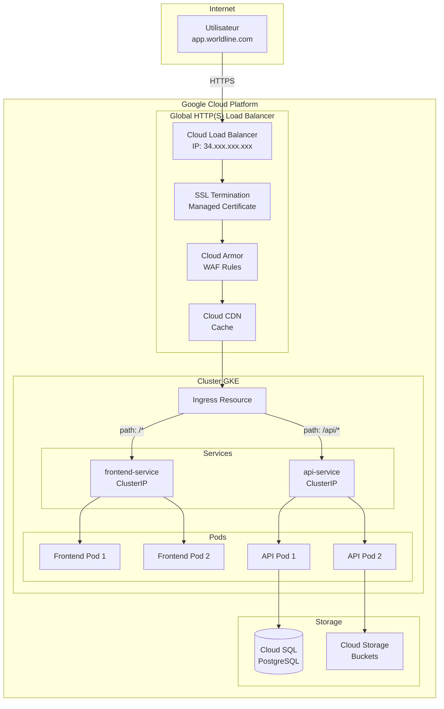

# Module 3 : Storage & Networking

## Objectifs du Module

À l'issue de ce module, vous serez capable de :

- :material-check: Configurer des StorageClasses (pd-standard, pd-ssd, pd-balanced)
- :material-check: Créer et utiliser des Persistent Volume Claims
- :material-check: Exposer des applications via Services et Ingress
- :material-check: Choisir entre GCE Ingress et Nginx Ingress

---

## 1. Storage dans GKE

### 1.1 Architecture de Stockage

```
┌─────────────────────────────────────────────────────────────────┐
│              ARCHITECTURE STORAGE GKE                            │
├─────────────────────────────────────────────────────────────────┤
│                                                                 │
│   ┌─────────────────────────────────────────────────────────┐   │
│   │                      Application                        │   │
│   │                                                         │   │
│   │   Container ─────► Volume Mount (/data)                 │   │
│   │                                                         │   │
│   └─────────────────────────────────────────────────────────┘   │
│                          │                                      │
│                          │ volumeMounts                         │
│                          ▼                                      │
│   ┌─────────────────────────────────────────────────────────┐   │
│   │              Persistent Volume Claim (PVC)              │   │
│   │              "mon-app-data" - 100Gi                     │   │
│   │              StorageClass: pd-ssd                       │   │
│   └─────────────────────────────────────────────────────────┘   │
│                          │                                      │
│                          │ Binding                              │
│                          ▼                                      │
│   ┌─────────────────────────────────────────────────────────┐   │
│   │              Persistent Volume (PV)                     │   │
│   │              Créé dynamiquement par le provisioner      │   │
│   └─────────────────────────────────────────────────────────┘   │
│                          │                                      │
│                          │ CSI Driver                           │
│                          ▼                                      │
│   ┌─────────────────────────────────────────────────────────┐   │
│   │              Google Persistent Disk                     │   │
│   │              (pd-ssd, pd-standard, pd-balanced)         │   │
│   │              Zone: europe-west1-b                       │   │
│   └─────────────────────────────────────────────────────────┘   │
│                                                                 │
└─────────────────────────────────────────────────────────────────┘
```

### 1.2 StorageClasses GKE

GKE fournit des StorageClasses pré-configurées :

| StorageClass | Type de Disque | Performance | Coût | Cas d'usage |
|--------------|----------------|-------------|------|-------------|
| `standard` | pd-standard (HDD) | Low | $ | Logs, archives |
| `standard-rwo` | pd-balanced | Medium | $$ | Workloads généraux |
| `premium-rwo` | pd-ssd | High | $$$ | Databases, caches |

```bash
# Lister les StorageClasses disponibles
kubectl get storageclasses

# Voir les détails
kubectl describe storageclass premium-rwo
```

### 1.3 Créer des StorageClasses Personnalisées

```yaml
# StorageClass SSD avec réplication régionale
apiVersion: storage.k8s.io/v1
kind: StorageClass
metadata:
  name: regional-ssd
provisioner: pd.csi.storage.gke.io
parameters:
  type: pd-ssd
  replication-type: regional-pd
volumeBindingMode: WaitForFirstConsumer
reclaimPolicy: Retain
allowVolumeExpansion: true

---
# StorageClass pour snapshots
apiVersion: storage.k8s.io/v1
kind: StorageClass
metadata:
  name: ssd-snapshot-capable
provisioner: pd.csi.storage.gke.io
parameters:
  type: pd-ssd
volumeBindingMode: WaitForFirstConsumer
reclaimPolicy: Delete
allowVolumeExpansion: true
```

**Paramètres importants :**

| Paramètre | Description |
|-----------|-------------|
| `volumeBindingMode: WaitForFirstConsumer` | Crée le disque dans la zone du pod (recommandé) |
| `reclaimPolicy: Retain` | Conserve le disque après suppression du PVC |
| `allowVolumeExpansion: true` | Permet d'agrandir les volumes |
| `replication-type: regional-pd` | Réplication sur 2 zones (HA) |

### 1.4 Persistent Volume Claims

```yaml
# PVC pour une base de données PostgreSQL
apiVersion: v1
kind: PersistentVolumeClaim
metadata:
  name: postgres-data
  namespace: production
spec:
  accessModes:
  - ReadWriteOnce  # Un seul node à la fois
  storageClassName: premium-rwo
  resources:
    requests:
      storage: 100Gi
```

```yaml
# PVC régional pour haute disponibilité
apiVersion: v1
kind: PersistentVolumeClaim
metadata:
  name: postgres-data-ha
  namespace: production
spec:
  accessModes:
  - ReadWriteOnce
  storageClassName: regional-ssd
  resources:
    requests:
      storage: 100Gi
```

### 1.5 Utilisation dans un StatefulSet

```yaml
apiVersion: apps/v1
kind: StatefulSet
metadata:
  name: postgres
  namespace: production
spec:
  serviceName: postgres
  replicas: 1
  selector:
    matchLabels:
      app: postgres
  template:
    metadata:
      labels:
        app: postgres
    spec:
      containers:
      - name: postgres
        image: postgres:15
        ports:
        - containerPort: 5432
        env:
        - name: POSTGRES_PASSWORD
          valueFrom:
            secretKeyRef:
              name: postgres-secret
              key: password
        - name: PGDATA
          value: /var/lib/postgresql/data/pgdata
        volumeMounts:
        - name: data
          mountPath: /var/lib/postgresql/data
        resources:
          requests:
            memory: "1Gi"
            cpu: "500m"
          limits:
            memory: "2Gi"
            cpu: "1"
  volumeClaimTemplates:
  - metadata:
      name: data
    spec:
      accessModes: ["ReadWriteOnce"]
      storageClassName: premium-rwo
      resources:
        requests:
          storage: 100Gi
```

### 1.6 Volume Snapshots

```yaml
# Créer une VolumeSnapshotClass
apiVersion: snapshot.storage.k8s.io/v1
kind: VolumeSnapshotClass
metadata:
  name: pd-snapshot-class
driver: pd.csi.storage.gke.io
deletionPolicy: Delete

---
# Créer un snapshot
apiVersion: snapshot.storage.k8s.io/v1
kind: VolumeSnapshot
metadata:
  name: postgres-snapshot-20250128
  namespace: production
spec:
  volumeSnapshotClassName: pd-snapshot-class
  source:
    persistentVolumeClaimName: postgres-data

---
# Restaurer depuis un snapshot
apiVersion: v1
kind: PersistentVolumeClaim
metadata:
  name: postgres-data-restored
  namespace: production
spec:
  accessModes:
  - ReadWriteOnce
  storageClassName: premium-rwo
  resources:
    requests:
      storage: 100Gi
  dataSource:
    name: postgres-snapshot-20250128
    kind: VolumeSnapshot
    apiGroup: snapshot.storage.k8s.io
```

---

## 2. Networking dans GKE

### 2.1 Types de Services

```
┌─────────────────────────────────────────────────────────────────┐
│              TYPES DE SERVICES KUBERNETES                        │
├─────────────────────────────────────────────────────────────────┤
│                                                                 │
│   ClusterIP (Défaut)                                            │
│   ─────────────────                                             │
│   ┌─────────────┐     ┌─────────────┐                          │
│   │  Pod Client │────►│  Service    │────► Pods Backend        │
│   │  (interne)  │     │ 10.2.0.100  │                          │
│   └─────────────┘     └─────────────┘                          │
│   Accessible uniquement depuis le cluster                       │
│                                                                 │
│   NodePort                                                      │
│   ─────────                                                     │
│   ┌─────────────┐     ┌─────────────┐     ┌─────────────┐      │
│   │  External   │────►│  Node       │────►│  Service    │──►Pods│
│   │  Client     │     │ :30080      │     │ 10.2.0.100  │      │
│   └─────────────┘     └─────────────┘     └─────────────┘      │
│   Port fixe (30000-32767) sur tous les nodes                   │
│                                                                 │
│   LoadBalancer                                                  │
│   ─────────────                                                 │
│   ┌─────────────┐     ┌─────────────┐     ┌─────────────┐      │
│   │  External   │────►│  GCP LB     │────►│  Service    │──►Pods│
│   │  Client     │     │34.xxx.xxx   │     │ 10.2.0.100  │      │
│   └─────────────┘     └─────────────┘     └─────────────┘      │
│   Crée un Network Load Balancer GCP                            │
│                                                                 │
└─────────────────────────────────────────────────────────────────┘
```

### 2.2 Service ClusterIP

```yaml
# Service interne pour une API
apiVersion: v1
kind: Service
metadata:
  name: api-service
  namespace: production
spec:
  type: ClusterIP  # Défaut, peut être omis
  selector:
    app: api
  ports:
  - name: http
    port: 80
    targetPort: 8080
  - name: grpc
    port: 9090
    targetPort: 9090
```

### 2.3 Service LoadBalancer

```yaml
# Service avec Load Balancer externe
apiVersion: v1
kind: Service
metadata:
  name: frontend-lb
  namespace: production
  annotations:
    # IP statique réservée
    networking.gke.io/load-balancer-type: "External"
spec:
  type: LoadBalancer
  loadBalancerIP: 34.78.123.45  # IP réservée via gcloud
  selector:
    app: frontend
  ports:
  - name: https
    port: 443
    targetPort: 8443

---
# Service Internal Load Balancer (ILB)
apiVersion: v1
kind: Service
metadata:
  name: internal-api
  namespace: production
  annotations:
    networking.gke.io/load-balancer-type: "Internal"
spec:
  type: LoadBalancer
  selector:
    app: internal-api
  ports:
  - port: 80
    targetPort: 8080
```

```bash
# Réserver une IP externe statique
gcloud compute addresses create frontend-ip \
    --region europe-west1

# Voir l'IP réservée
gcloud compute addresses describe frontend-ip \
    --region europe-west1 \
    --format="value(address)"
```

---

## 3. Ingress : Exposition HTTP(S)

### 3.1 GCE Ingress vs Nginx Ingress

```
┌─────────────────────────────────────────────────────────────────┐
│              COMPARAISON INGRESS CONTROLLERS                     │
├─────────────────────────────────────────────────────────────────┤
│                                                                 │
│   GCE INGRESS (Google Cloud Load Balancer)                      │
│   ─────────────────────────────────────────                     │
│   ✅ Managé par Google (pas de maintenance)                     │
│   ✅ Intégration native GCP (Cloud Armor, Cloud CDN)            │
│   ✅ SSL géré (Google-managed certificates)                     │
│   ✅ Global Load Balancing (Anycast IP)                         │
│   ❌ Latence de propagation (2-5 minutes)                       │
│   ❌ Coût par règle de forwarding                               │
│   ❌ Fonctionnalités avancées limitées (rewrites, etc.)         │
│                                                                 │
│   NGINX INGRESS                                                 │
│   ─────────────                                                 │
│   ✅ Très flexible (rewrites, rate limiting, auth)              │
│   ✅ Propagation rapide des changements                         │
│   ✅ Familier pour les équipes (même config qu'on-prem)         │
│   ❌ À gérer soi-même (updates, scaling)                        │
│   ❌ Pas d'intégration Cloud Armor native                       │
│   ❌ Network LB (L4), pas Global LB (L7)                        │
│                                                                 │
│   RECOMMANDATION WORLDLINE :                                    │
│   • Production externe : GCE Ingress (Cloud Armor, SSL géré)    │
│   • Interne/Microservices : Nginx Ingress (flexibilité)         │
│                                                                 │
└─────────────────────────────────────────────────────────────────┘
```

### 3.2 GCE Ingress avec Certificat Géré

```yaml
# Ingress avec GCE et certificat Google-managed
apiVersion: networking.k8s.io/v1
kind: Ingress
metadata:
  name: main-ingress
  namespace: production
  annotations:
    kubernetes.io/ingress.class: "gce"
    kubernetes.io/ingress.global-static-ip-name: "main-ingress-ip"
    networking.gke.io/managed-certificates: "main-cert"
spec:
  rules:
  - host: app.worldline.com
    http:
      paths:
      - path: /api/*
        pathType: ImplementationSpecific
        backend:
          service:
            name: api-service
            port:
              number: 80
      - path: /*
        pathType: ImplementationSpecific
        backend:
          service:
            name: frontend-service
            port:
              number: 80

---
# Certificat SSL géré par Google
apiVersion: networking.gke.io/v1
kind: ManagedCertificate
metadata:
  name: main-cert
  namespace: production
spec:
  domains:
  - app.worldline.com
  - api.worldline.com

---
# Réserver une IP globale
# gcloud compute addresses create main-ingress-ip --global
```

### 3.3 Nginx Ingress Controller

```bash
# Installer Nginx Ingress Controller via Helm
helm repo add ingress-nginx https://kubernetes.github.io/ingress-nginx
helm repo update

helm install nginx-ingress ingress-nginx/ingress-nginx \
    --namespace ingress-nginx \
    --create-namespace \
    --set controller.service.type=LoadBalancer \
    --set controller.service.loadBalancerIP=34.78.123.100
```

```yaml
# Ingress avec Nginx
apiVersion: networking.k8s.io/v1
kind: Ingress
metadata:
  name: app-ingress
  namespace: production
  annotations:
    kubernetes.io/ingress.class: "nginx"
    nginx.ingress.kubernetes.io/ssl-redirect: "true"
    nginx.ingress.kubernetes.io/proxy-body-size: "100m"
    nginx.ingress.kubernetes.io/rate-limit: "100"
    nginx.ingress.kubernetes.io/rate-limit-window: "1m"
spec:
  tls:
  - hosts:
    - app.worldline.com
    secretName: app-tls-secret
  rules:
  - host: app.worldline.com
    http:
      paths:
      - path: /api
        pathType: Prefix
        backend:
          service:
            name: api-service
            port:
              number: 80
      - path: /
        pathType: Prefix
        backend:
          service:
            name: frontend-service
            port:
              number: 80
```

### 3.4 Backend Config pour GCE Ingress

```yaml
# Configuration avancée du backend
apiVersion: cloud.google.com/v1
kind: BackendConfig
metadata:
  name: api-backend-config
  namespace: production
spec:
  # Health checks personnalisés
  healthCheck:
    checkIntervalSec: 15
    timeoutSec: 5
    healthyThreshold: 2
    unhealthyThreshold: 3
    type: HTTP
    requestPath: /health
    port: 8080

  # Cloud CDN
  cdn:
    enabled: true
    cachePolicy:
      includeHost: true
      includeProtocol: true
      includeQueryString: false

  # Cloud Armor (WAF)
  securityPolicy:
    name: "waf-policy"

  # Connection draining
  connectionDraining:
    drainingTimeoutSec: 30

  # Session affinity
  sessionAffinity:
    affinityType: "GENERATED_COOKIE"
    affinityCookieTtlSec: 3600

---
# Associer le BackendConfig au Service
apiVersion: v1
kind: Service
metadata:
  name: api-service
  namespace: production
  annotations:
    cloud.google.com/backend-config: '{"default": "api-backend-config"}'
spec:
  selector:
    app: api
  ports:
  - port: 80
    targetPort: 8080
```

---

## 4. Flux de Trafic Complet

### 4.1 Diagramme de Flux



### 4.2 Configuration Complète

```yaml
# === NAMESPACE ===
apiVersion: v1
kind: Namespace
metadata:
  name: production
  labels:
    name: production

---
# === FRONTEND ===
apiVersion: apps/v1
kind: Deployment
metadata:
  name: frontend
  namespace: production
spec:
  replicas: 3
  selector:
    matchLabels:
      app: frontend
  template:
    metadata:
      labels:
        app: frontend
    spec:
      containers:
      - name: frontend
        image: europe-west1-docker.pkg.dev/my-project/repo/frontend:v1
        ports:
        - containerPort: 80
        resources:
          requests:
            cpu: "100m"
            memory: "128Mi"
          limits:
            cpu: "500m"
            memory: "256Mi"
        readinessProbe:
          httpGet:
            path: /
            port: 80
          initialDelaySeconds: 5
          periodSeconds: 10

---
apiVersion: v1
kind: Service
metadata:
  name: frontend-service
  namespace: production
spec:
  selector:
    app: frontend
  ports:
  - port: 80
    targetPort: 80

---
# === API ===
apiVersion: apps/v1
kind: Deployment
metadata:
  name: api
  namespace: production
spec:
  replicas: 3
  selector:
    matchLabels:
      app: api
  template:
    metadata:
      labels:
        app: api
    spec:
      serviceAccountName: api-ksa
      containers:
      - name: api
        image: europe-west1-docker.pkg.dev/my-project/repo/api:v1
        ports:
        - containerPort: 8080
        env:
        - name: DB_HOST
          value: "10.0.2.50"  # Cloud SQL Private IP
        - name: PROJECT_ID
          value: "my-project"
        resources:
          requests:
            cpu: "250m"
            memory: "256Mi"
          limits:
            cpu: "1"
            memory: "512Mi"
        readinessProbe:
          httpGet:
            path: /health
            port: 8080
          initialDelaySeconds: 10
          periodSeconds: 15

---
apiVersion: v1
kind: Service
metadata:
  name: api-service
  namespace: production
  annotations:
    cloud.google.com/backend-config: '{"default": "api-backend-config"}'
    cloud.google.com/neg: '{"ingress": true}'
spec:
  selector:
    app: api
  ports:
  - port: 80
    targetPort: 8080

---
# === INGRESS ===
apiVersion: networking.k8s.io/v1
kind: Ingress
metadata:
  name: main-ingress
  namespace: production
  annotations:
    kubernetes.io/ingress.class: "gce"
    kubernetes.io/ingress.global-static-ip-name: "main-ingress-ip"
    networking.gke.io/managed-certificates: "main-cert"
spec:
  rules:
  - host: app.worldline.com
    http:
      paths:
      - path: /api/*
        pathType: ImplementationSpecific
        backend:
          service:
            name: api-service
            port:
              number: 80
      - path: /*
        pathType: ImplementationSpecific
        backend:
          service:
            name: frontend-service
            port:
              number: 80

---
apiVersion: networking.gke.io/v1
kind: ManagedCertificate
metadata:
  name: main-cert
  namespace: production
spec:
  domains:
  - app.worldline.com
```

---

## 5. Commandes de Référence

```bash
# === STORAGE ===
# Lister les StorageClasses
kubectl get storageclasses

# Lister les PVC
kubectl get pvc -A

# Voir les PV
kubectl get pv

# Agrandir un PVC (si allowVolumeExpansion: true)
kubectl patch pvc postgres-data -n production \
    -p '{"spec":{"resources":{"requests":{"storage":"200Gi"}}}}'

# Créer un snapshot
kubectl apply -f volume-snapshot.yaml

# === SERVICES ===
# Lister les services
kubectl get svc -A

# Voir l'IP externe d'un LoadBalancer
kubectl get svc frontend-lb -n production -o jsonpath='{.status.loadBalancer.ingress[0].ip}'

# === INGRESS ===
# Lister les Ingress
kubectl get ingress -A

# Voir les détails d'un Ingress
kubectl describe ingress main-ingress -n production

# Vérifier le statut du certificat
kubectl describe managedcertificate main-cert -n production

# === DEBUG RÉSEAU ===
# Tester la connectivité depuis un pod
kubectl run test --rm -it --restart=Never \
    --image=busybox \
    -n production \
    -- wget -q -O- http://api-service/health

# Voir les endpoints d'un service
kubectl get endpoints api-service -n production

# DNS debug
kubectl run dns-test --rm -it --restart=Never \
    --image=busybox \
    -n production \
    -- nslookup api-service.production.svc.cluster.local
```

---

## Quiz d'Auto-Évaluation

??? question "Question 1 : Quelle StorageClass utiliser pour une base de données critique ?"
    **Réponse :**

    Pour une base de données critique, utilisez :

    - **`premium-rwo`** (pd-ssd) pour les performances
    - Ou créez une StorageClass personnalisée avec `replication-type: regional-pd` pour la haute disponibilité

    Configurez également :
    - `reclaimPolicy: Retain` pour conserver les données après suppression du PVC
    - `allowVolumeExpansion: true` pour pouvoir agrandir le volume

??? question "Question 2 : Quand utiliser GCE Ingress vs Nginx Ingress ?"
    **Réponse :**

    **GCE Ingress** (recommandé pour) :
    - Exposition publique avec SSL géré par Google
    - Besoin de Cloud Armor (WAF)
    - Besoin de Cloud CDN
    - Global Load Balancing (Anycast IP)

    **Nginx Ingress** (recommandé pour) :
    - Règles complexes (rewrites, redirections)
    - Rate limiting avancé
    - Cohérence avec l'environnement on-premise
    - Propagation rapide des changements

??? question "Question 3 : Comment exposer un service uniquement en interne au VPC ?"
    **Réponse :**

    Utilisez un **Internal Load Balancer** :

    ```yaml
    apiVersion: v1
    kind: Service
    metadata:
      name: internal-api
      annotations:
        networking.gke.io/load-balancer-type: "Internal"
    spec:
      type: LoadBalancer
      selector:
        app: api
      ports:
      - port: 80
    ```

    L'IP attribuée sera une IP privée du VPC, accessible uniquement depuis le VPC ou via VPN/Interconnect.

---

## Conclusion de la Formation

Vous avez maintenant les bases pour opérer GKE de manière sécurisée et efficace :

- **Module 1** : Architecture (Zonal vs Régional, VPC-Native, Node Pools)
- **Module 2** : Sécurité (IAM, RBAC, Workload Identity, Network Policies)
- **Module 3** : Storage & Networking (StorageClasses, Ingress)

### Prochaines Étapes Recommandées

1. **Créer un cluster de test** avec les configurations apprises
2. **Implémenter Workload Identity** sur vos applications
3. **Configurer des Network Policies** pour le zero-trust
4. **Explorer** Cloud Armor, Binary Authorization, Config Connector

### Ressources Complémentaires

- :material-link: [GKE Best Practices](https://cloud.google.com/kubernetes-engine/docs/best-practices)
- :material-link: [GKE Security Hardening Guide](https://cloud.google.com/kubernetes-engine/docs/how-to/hardening-your-cluster)
- :material-link: [GKE Networking Overview](https://cloud.google.com/kubernetes-engine/docs/concepts/network-overview)

---

**Temps estimé :** 60 minutes
**Niveau :** Avancé
