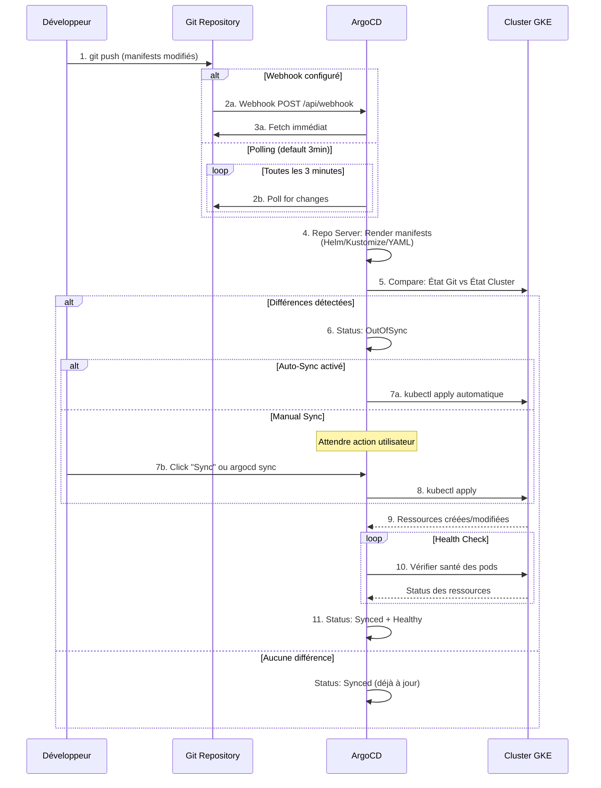

# Module 1 : Architecture ArgoCD

## Objectifs du Module

À l'issue de ce module, vous serez capable de :

- :material-check: Comprendre le rôle de chaque composant ArgoCD
- :material-check: Expliquer le flux de synchronisation
- :material-check: Naviguer dans l'interface Web
- :material-check: Utiliser la CLI ArgoCD

---

## 1. Les Composants ArgoCD

### 1.1 Vue d'Ensemble

```
┌─────────────────────────────────────────────────────────────────┐
│              ARCHITECTURE ARGOCD                                 │
├─────────────────────────────────────────────────────────────────┤
│                                                                 │
│   Namespace: argocd                                             │
│   ┌─────────────────────────────────────────────────────────┐   │
│   │                                                         │   │
│   │  ┌─────────────────┐     ┌─────────────────┐           │   │
│   │  │   API Server    │◄────│   Dex (SSO)     │           │   │
│   │  │                 │     │                 │           │   │
│   │  │  • REST API     │     │  • OIDC         │           │   │
│   │  │  • gRPC API     │     │  • LDAP         │           │   │
│   │  │  • Web UI       │     │  • SAML         │           │   │
│   │  └────────┬────────┘     └─────────────────┘           │   │
│   │           │                                             │   │
│   │           │ Requêtes                                    │   │
│   │           ▼                                             │   │
│   │  ┌─────────────────┐     ┌─────────────────┐           │   │
│   │  │  Application    │◄────│   Repo Server   │           │   │
│   │  │  Controller     │     │                 │           │   │
│   │  │                 │     │  • Clone repos  │           │   │
│   │  │  • Réconcilie   │     │  • Helm render  │           │   │
│   │  │  • Sync         │     │  • Kustomize    │           │   │
│   │  │  • Health check │     │  • Cache        │           │   │
│   │  └────────┬────────┘     └────────┬────────┘           │   │
│   │           │                       │                     │   │
│   │           │                       │ Clone               │   │
│   │           ▼                       ▼                     │   │
│   │  ┌─────────────────┐     ┌─────────────────┐           │   │
│   │  │  Redis          │     │   Git Repos     │           │   │
│   │  │  (Cache)        │     │   (External)    │           │   │
│   │  └─────────────────┘     └─────────────────┘           │   │
│   │                                                         │   │
│   └─────────────────────────────────────────────────────────┘   │
│                                                                 │
│   ┌─────────────────────────────────────────────────────────┐   │
│   │               CLUSTER(S) CIBLE(S)                       │   │
│   │                                                         │   │
│   │   ArgoCD peut gérer :                                   │   │
│   │   • Le cluster local (in-cluster)                       │   │
│   │   • Des clusters distants (multi-cluster)               │   │
│   │                                                         │   │
│   └─────────────────────────────────────────────────────────┘   │
│                                                                 │
└─────────────────────────────────────────────────────────────────┘
```

### 1.2 API Server

Le **cerveau** d'ArgoCD, il expose :

| Interface | Port | Usage |
|-----------|------|-------|
| **REST API** | 443 | Intégrations, Webhooks |
| **gRPC API** | 443 | CLI `argocd`, performance |
| **Web UI** | 443 | Dashboard pour les Ops |

```bash
# Pods du API Server
kubectl get pods -n argocd -l app.kubernetes.io/name=argocd-server

# Logs
kubectl logs -n argocd -l app.kubernetes.io/name=argocd-server -f
```

**Responsabilités :**

- Authentification des utilisateurs (SSO via Dex)
- Autorisation (RBAC ArgoCD)
- Gestion des Applications, Projects, Repos
- Servir l'interface Web

### 1.3 Application Controller

Le **cœur** du GitOps, il exécute la boucle de réconciliation :

```
┌─────────────────────────────────────────────────────────────────┐
│              BOUCLE DE RÉCONCILIATION                            │
├─────────────────────────────────────────────────────────────────┤
│                                                                 │
│   ┌──────────────────────────────────────────────────────────┐  │
│   │                                                          │  │
│   │    ┌─────────┐                                           │  │
│   │    │ OBSERVE │ ◄─── Surveille les Applications CRDs      │  │
│   │    └────┬────┘                                           │  │
│   │         │                                                │  │
│   │         ▼                                                │  │
│   │    ┌─────────┐                                           │  │
│   │    │ COMPARE │ ◄─── État Git vs État Cluster             │  │
│   │    └────┬────┘                                           │  │
│   │         │                                                │  │
│   │         ▼                                                │  │
│   │    ┌─────────┐                                           │  │
│   │    │  DIFF?  │                                           │  │
│   │    └────┬────┘                                           │  │
│   │         │                                                │  │
│   │    ┌────┴────┐                                           │  │
│   │    │         │                                           │  │
│   │   OUI       NON                                          │  │
│   │    │         │                                           │  │
│   │    ▼         ▼                                           │  │
│   │ ┌──────┐  ┌───────┐                                      │  │
│   │ │ SYNC │  │ WAIT  │ ◄─── Attendre le prochain cycle     │  │
│   │ └──┬───┘  └───────┘      (3 minutes par défaut)          │  │
│   │    │                                                     │  │
│   │    ▼                                                     │  │
│   │ ┌─────────┐                                              │  │
│   │ │ HEALTH  │ ◄─── Vérifier que les ressources sont OK    │  │
│   │ │ CHECK   │                                              │  │
│   │ └─────────┘                                              │  │
│   │                                                          │  │
│   └──────────────────────────────────────────────────────────┘  │
│                                                                 │
│   Fréquence de réconciliation : configurable (default 3min)     │
│   Webhook Git : sync immédiat sur push                          │
│                                                                 │
└─────────────────────────────────────────────────────────────────┘
```

```bash
# Pods du Controller
kubectl get pods -n argocd -l app.kubernetes.io/name=argocd-application-controller

# Voir les métriques
kubectl port-forward svc/argocd-application-controller -n argocd 8082:8082
curl http://localhost:8082/metrics
```

**Responsabilités :**

- Réconciliation continue (Git → Cluster)
- Détection de drift
- Health checks des ressources déployées
- Gestion des Sync Waves et Hooks

### 1.4 Repo Server

Le **cache intelligent** des repositories Git :

```
┌─────────────────────────────────────────────────────────────────┐
│              REPO SERVER PIPELINE                                │
├─────────────────────────────────────────────────────────────────┤
│                                                                 │
│   Git Repo                                                      │
│      │                                                          │
│      │ Clone/Fetch                                              │
│      ▼                                                          │
│   ┌─────────────────────────────────────────────────────────┐   │
│   │                    REPO SERVER                          │   │
│   │                                                         │   │
│   │   1. Clone le repo (ou fetch les updates)               │   │
│   │                                                         │   │
│   │   2. Détecte le type de manifest :                      │   │
│   │      ├── Plain YAML    → Retourne tel quel             │   │
│   │      ├── Kustomize     → kustomize build               │   │
│   │      ├── Helm          → helm template                 │   │
│   │      ├── Jsonnet       → jsonnet                       │   │
│   │      └── Custom Plugin → Execute plugin                │   │
│   │                                                         │   │
│   │   3. Cache le résultat (performance)                    │   │
│   │                                                         │   │
│   └─────────────────────────────────────────────────────────┘   │
│      │                                                          │
│      │ Manifests YAML rendus                                    │
│      ▼                                                          │
│   Application Controller                                        │
│                                                                 │
└─────────────────────────────────────────────────────────────────┘
```

```bash
# Pods du Repo Server
kubectl get pods -n argocd -l app.kubernetes.io/name=argocd-repo-server

# Voir les repos configurés
argocd repo list
```

**Responsabilités :**

- Clone et mise à jour des repos Git
- Rendu des manifests (Helm, Kustomize, Jsonnet)
- Cache pour éviter les clones répétés
- Gestion des credentials Git

### 1.5 Dex (Optional, SSO)

Dex est un **Identity Provider** qui permet l'authentification SSO :

```yaml
# Configuration Dex pour Google OIDC
apiVersion: v1
kind: ConfigMap
metadata:
  name: argocd-cm
  namespace: argocd
data:
  dex.config: |
    connectors:
      - type: oidc
        id: google
        name: Google Workspace
        config:
          issuer: https://accounts.google.com
          clientID: $GOOGLE_CLIENT_ID
          clientSecret: $GOOGLE_CLIENT_SECRET
          redirectURI: https://argocd.worldline.internal/api/dex/callback
          hostedDomains:
            - worldline.com
```

---

## 2. Le Dashboard Web

### 2.1 Pourquoi les Ops l'Adorent

```
┌─────────────────────────────────────────────────────────────────┐
│              ARGOCD WEB UI                                       │
├─────────────────────────────────────────────────────────────────┤
│                                                                 │
│   ┌─────────────────────────────────────────────────────────┐   │
│   │  🏠 Applications                     👤 admin ▼   🔔    │   │
│   ├─────────────────────────────────────────────────────────┤   │
│   │                                                         │   │
│   │  ┌─────────────┐ ┌─────────────┐ ┌─────────────┐       │   │
│   │  │ 🟢 frontend │ │ 🟢 backend  │ │ 🟡 database │       │   │
│   │  │             │ │             │ │             │       │   │
│   │  │ Synced      │ │ Synced      │ │ Progressing│       │   │
│   │  │ Healthy     │ │ Healthy     │ │ Degraded   │       │   │
│   │  │             │ │             │ │             │       │   │
│   │  │ v2.3.1      │ │ v1.8.0      │ │ v5.4.2     │       │   │
│   │  └─────────────┘ └─────────────┘ └─────────────┘       │   │
│   │                                                         │   │
│   │  ┌─────────────┐ ┌─────────────┐ ┌─────────────┐       │   │
│   │  │ 🔴 payment  │ │ 🟢 auth     │ │ 🟢 logging  │       │   │
│   │  │             │ │             │ │             │       │   │
│   │  │ OutOfSync   │ │ Synced      │ │ Synced      │       │   │
│   │  │ Missing     │ │ Healthy     │ │ Healthy     │       │   │
│   │  │             │ │             │ │             │       │   │
│   │  │ v3.0.0      │ │ v2.1.0      │ │ v1.0.5     │       │   │
│   │  └─────────────┘ └─────────────┘ └─────────────┘       │   │
│   │                                                         │   │
│   └─────────────────────────────────────────────────────────┘   │
│                                                                 │
│   Légende :                                                     │
│   🟢 Synced + Healthy : Parfait                                │
│   🟡 Progressing : Déploiement en cours                        │
│   🔴 OutOfSync : Git ≠ Cluster (action requise)                │
│   🔴 Degraded/Missing : Problème de santé                      │
│                                                                 │
└─────────────────────────────────────────────────────────────────┘
```

### 2.2 Vue Détaillée d'une Application

```
┌─────────────────────────────────────────────────────────────────┐
│  ← Applications    frontend                    🔄 Sync  ⚙️      │
├─────────────────────────────────────────────────────────────────┤
│                                                                 │
│  Status: 🟢 Synced    Health: 🟢 Healthy    Revision: abc123   │
│                                                                 │
│  ┌──────────────────────────────────────────────────────────┐   │
│  │                    RESOURCE TREE                         │   │
│  │                                                          │   │
│  │   📦 frontend (Application)                              │   │
│  │   │                                                      │   │
│  │   ├── 📋 frontend (Deployment) 🟢                       │   │
│  │   │   └── 📦 frontend-7d8f9c6b4-xxxxx (Pod) 🟢          │   │
│  │   │   └── 📦 frontend-7d8f9c6b4-yyyyy (Pod) 🟢          │   │
│  │   │   └── 📦 frontend-7d8f9c6b4-zzzzz (Pod) 🟢          │   │
│  │   │                                                      │   │
│  │   ├── 🔌 frontend (Service) 🟢                          │   │
│  │   │                                                      │   │
│  │   ├── 🌐 frontend (Ingress) 🟢                          │   │
│  │   │                                                      │   │
│  │   ├── 📄 frontend-config (ConfigMap) 🟢                 │   │
│  │   │                                                      │   │
│  │   └── 🔐 frontend-secret (Secret) 🟢                    │   │
│  │                                                          │   │
│  └──────────────────────────────────────────────────────────┘   │
│                                                                 │
│  ┌───────┐ ┌────────┐ ┌──────────┐ ┌─────────┐ ┌──────────┐   │
│  │Summary│ │ Diff   │ │Parameters│ │ Events  │ │ Manifest │   │
│  └───────┘ └────────┘ └──────────┘ └─────────┘ └──────────┘   │
│                                                                 │
└─────────────────────────────────────────────────────────────────┘
```

### 2.3 Accéder au Dashboard

```bash
# Option 1 : Port-forward (dev/debug)
kubectl port-forward svc/argocd-server -n argocd 8080:443
# Accéder à https://localhost:8080

# Option 2 : Ingress (production)
# Configuré dans le Helm chart

# Récupérer le mot de passe admin initial
kubectl -n argocd get secret argocd-initial-admin-secret \
    -o jsonpath="{.data.password}" | base64 -d && echo

# Changer le mot de passe admin
argocd account update-password
```

---

## 3. Flux de Synchronisation

### 3.1 Diagramme de Flux Complet



### 3.2 États d'une Application

| Sync Status | Description | Action |
|-------------|-------------|--------|
| **Synced** | Git = Cluster | Aucune |
| **OutOfSync** | Git ≠ Cluster | Sync nécessaire |
| **Unknown** | Impossible de déterminer | Vérifier la connexion |

| Health Status | Description | Action |
|---------------|-------------|--------|
| **Healthy** | Toutes les ressources sont OK | Aucune |
| **Progressing** | Déploiement en cours | Attendre |
| **Degraded** | Certaines ressources en échec | Investiguer |
| **Suspended** | Ressources suspendues (scaling à 0) | Normal si voulu |
| **Missing** | Ressources attendues absentes | Sync |

---

## 4. CLI ArgoCD

### 4.1 Commandes Essentielles

```bash
# === CONNEXION ===
# Login avec SSO
argocd login argocd.worldline.internal --sso

# Login avec mot de passe
argocd login argocd.worldline.internal --username admin --password $ARGOCD_PASSWORD

# Vérifier la connexion
argocd account get-user-info

# === APPLICATIONS ===
# Lister les applications
argocd app list

# Voir le statut d'une app
argocd app get frontend

# Voir les différences (ce qui sera appliqué)
argocd app diff frontend

# Synchroniser une application
argocd app sync frontend

# Sync avec prune (supprimer les ressources orphelines)
argocd app sync frontend --prune

# Forcer le sync (ignorer les hooks)
argocd app sync frontend --force

# Rollback à une révision précédente
argocd app rollback frontend 3

# Voir l'historique des déploiements
argocd app history frontend

# === REPOS ===
# Ajouter un repo
argocd repo add https://github.com/worldline/gitops-manifests.git \
    --username $GIT_USER \
    --password $GIT_TOKEN

# Lister les repos
argocd repo list

# === CLUSTERS ===
# Lister les clusters
argocd cluster list

# Ajouter un cluster distant
argocd cluster add gke_project_region_cluster-name

# === DEBUG ===
# Logs d'une application
argocd app logs frontend

# Ressources d'une application
argocd app resources frontend

# Manifests rendus
argocd app manifests frontend
```

### 4.2 Création d'une Application via CLI

```bash
# Créer une application
argocd app create frontend \
    --repo https://github.com/worldline/gitops-manifests.git \
    --path apps/frontend/overlays/prod \
    --dest-server https://kubernetes.default.svc \
    --dest-namespace production \
    --sync-policy automated \
    --auto-prune \
    --self-heal

# Équivalent YAML (recommandé)
argocd app create -f - <<EOF
apiVersion: argoproj.io/v1alpha1
kind: Application
metadata:
  name: frontend
  namespace: argocd
spec:
  project: default
  source:
    repoURL: https://github.com/worldline/gitops-manifests.git
    targetRevision: main
    path: apps/frontend/overlays/prod
  destination:
    server: https://kubernetes.default.svc
    namespace: production
  syncPolicy:
    automated:
      prune: true
      selfHeal: true
EOF
```

---

## 5. Custom Resource : Application

### 5.1 Structure Complète

```yaml
apiVersion: argoproj.io/v1alpha1
kind: Application
metadata:
  name: frontend
  namespace: argocd
  # Annotations utiles
  annotations:
    notifications.argoproj.io/subscribe.on-sync-succeeded.slack: deployments
  # Finalizer pour le nettoyage
  finalizers:
    - resources-finalizer.argocd.argoproj.io
spec:
  # Projet ArgoCD (isolation)
  project: production

  # Source : où trouver les manifests
  source:
    repoURL: https://github.com/worldline/gitops-manifests.git
    targetRevision: main  # Branch, tag, ou commit SHA
    path: apps/frontend/overlays/prod

    # Pour Helm
    # helm:
    #   valueFiles:
    #     - values.yaml
    #     - values-prod.yaml
    #   parameters:
    #     - name: image.tag
    #       value: v2.3.1

    # Pour Kustomize
    # kustomize:
    #   images:
    #     - frontend=gcr.io/project/frontend:v2.3.1

  # Destination : où déployer
  destination:
    server: https://kubernetes.default.svc  # In-cluster
    # Ou pour un cluster distant :
    # server: https://gke-prod-cluster.example.com
    namespace: production

  # Politique de synchronisation
  syncPolicy:
    # Sync automatique
    automated:
      prune: true      # Supprimer les ressources orphelines
      selfHeal: true   # Corriger le drift automatiquement
      allowEmpty: false # Ne pas sync si aucun manifest

    # Options de sync
    syncOptions:
      - CreateNamespace=true
      - PrunePropagationPolicy=foreground
      - PruneLast=true

    # Retry en cas d'échec
    retry:
      limit: 5
      backoff:
        duration: 5s
        factor: 2
        maxDuration: 3m

  # Ignorer certaines différences
  ignoreDifferences:
    - group: apps
      kind: Deployment
      jsonPointers:
        - /spec/replicas  # Ignoré si HPA actif
```

---

## 6. Commandes de Référence

```bash
# === INSTALLATION ===
# Installer ArgoCD
kubectl apply -n argocd -f https://raw.githubusercontent.com/argoproj/argo-cd/stable/manifests/install.yaml

# Récupérer le mot de passe initial
kubectl -n argocd get secret argocd-initial-admin-secret -o jsonpath="{.data.password}" | base64 -d

# === PODS ARGOCD ===
# Voir les pods
kubectl get pods -n argocd

# Logs du controller
kubectl logs -n argocd -l app.kubernetes.io/name=argocd-application-controller -f

# Logs du repo server
kubectl logs -n argocd -l app.kubernetes.io/name=argocd-repo-server -f

# === APPLICATIONS ===
# Lister les CRD Application
kubectl get applications -n argocd

# Décrire une application
kubectl describe application frontend -n argocd

# Voir les events
kubectl get events -n argocd --sort-by='.lastTimestamp'

# === TROUBLESHOOTING ===
# Forcer un refresh
argocd app get frontend --refresh

# Hard refresh (re-clone le repo)
argocd app get frontend --hard-refresh

# Voir les manifests générés
argocd app manifests frontend --source live  # État actuel cluster
argocd app manifests frontend --source git   # État Git
```

---

## Quiz d'Auto-Évaluation

??? question "Question 1 : Quel composant est responsable du rendu des charts Helm ?"
    **Réponse :**

    Le **Repo Server** est responsable de :

    1. Cloner les repositories Git
    2. Détecter le type de manifest (Helm, Kustomize, plain YAML)
    3. Exécuter `helm template` pour rendre les charts
    4. Cacher le résultat pour la performance

    L'Application Controller reçoit ensuite les manifests YAML rendus et les applique au cluster.

??? question "Question 2 : Quelle est la différence entre OutOfSync et Degraded ?"
    **Réponse :**

    | Status | Type | Signification |
    |--------|------|---------------|
    | **OutOfSync** | Sync Status | L'état Git ≠ l'état Cluster. Action : Sync nécessaire |
    | **Degraded** | Health Status | Les ressources sont déployées mais en mauvaise santé (pods en CrashLoopBackOff, etc.) |

    Une application peut être :
    - **Synced + Degraded** : Déployée mais cassée (bug applicatif)
    - **OutOfSync + Healthy** : Fonctionne mais pas à jour (modifs manuelles non commitées)

??? question "Question 3 : Comment forcer ArgoCD à re-cloner un repository ?"
    **Réponse :**

    Utilisez l'option `--hard-refresh` :

    ```bash
    argocd app get frontend --hard-refresh
    ```

    Cela force le Repo Server à :
    1. Invalider le cache
    2. Refaire un `git clone` complet
    3. Re-rendre tous les manifests

    Utile si le cache est corrompu ou après avoir modifié les credentials du repo.

---

## Prochaine Étape

Maintenant que vous comprenez l'architecture, apprenez à industrialiser la gestion de nombreuses applications.

[:octicons-arrow-right-24: Module 2 : App of Apps](02-app-of-apps.md)

---

**Temps estimé :** 45 minutes
**Niveau :** Intermédiaire
