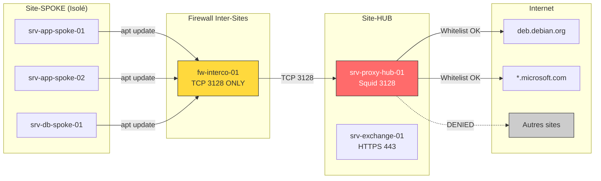

# Edge Services : Squid Proxy & Échanges Sécurisés

!!! danger "Module Critique - SPOF Identifié"
    Ce module documente les **Single Points of Failure (SPOF)** identifiés lors de l'audit d'infrastructure. Les services décrits ici sont sur le chemin critique de production.

    **En cas de panne de ces services : AUCUN serveur du Site-SPOKE ne peut se mettre à jour.**

---

## Vue d'Ensemble

### Contexte Opérationnel

```
┌─────────────────────────────────────────────────────────────────┐
│              ARCHITECTURE MULTI-SITES                            │
├─────────────────────────────────────────────────────────────────┤
│                                                                 │
│   SITE-SPOKE (Isolé)              SITE-HUB (Internet)          │
│   ──────────────────              ────────────────────          │
│                                                                 │
│   ┌─────────────────┐            ┌─────────────────┐           │
│   │ srv-app-spoke-01│            │ srv-proxy-hub-01│           │
│   │ srv-app-spoke-02│            │ (Squid)         │           │
│   │ srv-db-spoke-01 │            └────────┬────────┘           │
│   │ ...             │                     │                    │
│   └────────┬────────┘                     │                    │
│            │                              │                    │
│            │ Pas d'accès                  │ Accès Internet     │
│            │ Internet direct              │ contrôlé           │
│            │                              │                    │
│            └──────────────────────────────┘                    │
│                                                                 │
│   CONTRAINTE SÉCURITÉ :                                         │
│   • Site-SPOKE = Zone de confiance restreinte                   │
│   • Aucun flux sortant direct vers Internet                     │
│   • Tout passe par le proxy HUB (whitelist)                     │
│                                                                 │
│   SPOF IDENTIFIÉ :                                              │
│   ⚠️  srv-proxy-hub-01 = Point unique de sortie                 │
│   ⚠️  Si DOWN → Plus de apt update, plus de téléchargements     │
│                                                                 │
└─────────────────────────────────────────────────────────────────┘
```

---

## Section 1 : Architecture & Flux Réseau

### 1.1 Concept du Proxy Chaîné (Proxy Cascading)

Le **Proxy Chaîné** (ou Proxy Cascading) est une architecture où les requêtes HTTP/HTTPS traversent plusieurs proxies avant d'atteindre Internet.

```
┌─────────────────────────────────────────────────────────────────┐
│              PROXY CASCADING                                     │
├─────────────────────────────────────────────────────────────────┤
│                                                                 │
│   Cas Simple (Site-HUB direct)                                  │
│   ────────────────────────────                                  │
│                                                                 │
│   Client ────► Squid ────► Internet                             │
│                                                                 │
│   ─────────────────────────────────────────────────────────────│
│                                                                 │
│   Cas Complexe (Site-SPOKE via HUB)                             │
│   ─────────────────────────────────                             │
│                                                                 │
│   Client      Squid        Firewall     Squid        Internet   │
│   (SPOKE)     (SPOKE)      Inter-site   (HUB)                   │
│      │          │             │           │             │       │
│      │──GET────►│             │           │             │       │
│      │          │────────────►│           │             │       │
│      │          │             │──────────►│             │       │
│      │          │             │           │────GET─────►│       │
│      │          │             │           │◄───200 OK───│       │
│      │          │             │◄──────────│             │       │
│      │          │◄────────────│           │             │       │
│      │◄─200 OK──│             │           │             │       │
│                                                                 │
│   Configuration Squid SPOKE :                                   │
│   cache_peer srv-proxy-hub-01.internal parent 3128 0 no-query   │
│   never_direct allow all                                        │
│                                                                 │
└─────────────────────────────────────────────────────────────────┘
```

### 1.2 Scénario : Mise à Jour des Serveurs SPOKE

**Problématique :**
Les serveurs du Site-SPOKE (Debian/Ubuntu) doivent exécuter `apt update && apt upgrade`. Ils n'ont pas d'accès Internet direct.

**Solution :**
Configurer `apt` pour utiliser le proxy HUB.

```bash
# Sur chaque serveur SPOKE : /etc/apt/apt.conf.d/95proxy
Acquire::http::Proxy "http://srv-proxy-hub-01.internal:3128";
Acquire::https::Proxy "http://srv-proxy-hub-01.internal:3128";
```

Ou via variable d'environnement (temporaire) :

```bash
export http_proxy="http://srv-proxy-hub-01.internal:3128"
export https_proxy="http://srv-proxy-hub-01.internal:3128"
export no_proxy="localhost,127.0.0.1,.internal"

apt update
```

### 1.3 Diagramme de Flux Complet



### 1.4 Matrice de Flux

| Source | Destination | Port | Protocole | Usage |
|--------|-------------|------|-----------|-------|
| `192.168.10.0/24` (SPOKE) | `srv-proxy-hub-01` | 3128 | TCP | Proxy HTTP/HTTPS |
| `srv-proxy-hub-01` | `0.0.0.0/0` | 80, 443 | TCP | Accès Internet (whitelist) |
| `192.168.10.0/24` (SPOKE) | `srv-exchange-01` | 443 | TCP | Upload/Download fichiers |

---

## Section 2 : Administration Squid

### 2.1 Installation

=== "Debian/Ubuntu"

    ```bash
    # Installation
    apt update
    apt install squid -y

    # Vérifier le service
    systemctl status squid

    # Activer au démarrage
    systemctl enable squid
    ```

=== "RHEL/Rocky"

    ```bash
    # Installation
    dnf install squid -y

    # Firewall
    firewall-cmd --permanent --add-port=3128/tcp
    firewall-cmd --reload

    # Service
    systemctl enable --now squid
    ```

### 2.2 Configuration Squid.conf

!!! warning "Fichier Critique"
    Le fichier `/etc/squid/squid.conf` est la **source de vérité** pour le comportement du proxy.

    **Avant toute modification :**
    ```bash
    cp /etc/squid/squid.conf /etc/squid/squid.conf.backup-$(date +%Y%m%d)
    ```

#### Configuration Complète Commentée

```squid
# /etc/squid/squid.conf - Configuration Production
# Serveur: srv-proxy-hub-01
# Dernière modification: 2025-01-28

#####################################################
# SECTION 1 : DÉFINITION DES ACLs
#####################################################

# Réseaux internes autorisés
acl localnet src 192.168.0.0/16      # Tous les réseaux internes
acl localnet src 10.0.0.0/8          # Si autres réseaux privés
acl localnet src 172.16.0.0/12       # Si autres réseaux privés

# Réseau SPOKE spécifique (plus restrictif)
acl spoke_network src 192.168.10.0/24

# Ports SSL standard
acl SSL_ports port 443

# Ports HTTP standard
acl Safe_ports port 80          # http
acl Safe_ports port 443         # https
acl Safe_ports port 21          # ftp (si nécessaire)

# Méthode CONNECT (pour HTTPS)
acl CONNECT method CONNECT

#####################################################
# SECTION 2 : WHITELIST DE DOMAINES
#####################################################

# Fichier externe de whitelist (recommandé)
acl whitelist_domains dstdomain "/etc/squid/whitelist.txt"

# Ou directement dans squid.conf (moins maintenable)
# acl allowed_domains dstdomain .debian.org
# acl allowed_domains dstdomain .ubuntu.com
# acl allowed_domains dstdomain .microsoft.com
# acl allowed_domains dstdomain .windowsupdate.com

#####################################################
# SECTION 3 : RÈGLES D'ACCÈS (ORDRE IMPORTANT !)
#####################################################

# Refuser les ports non-safe
http_access deny !Safe_ports

# Refuser CONNECT vers des ports non-SSL
http_access deny CONNECT !SSL_ports

# Autoriser localhost (pour les tests locaux)
http_access allow localhost

# Autoriser uniquement les domaines whitelistés
http_access allow localnet whitelist_domains

# DENY ALL - Règle finale (OBLIGATOIRE)
http_access deny all

#####################################################
# SECTION 4 : CONFIGURATION RÉSEAU
#####################################################

# Port d'écoute
http_port 3128

# Nom du serveur (pour les logs et headers)
visible_hostname srv-proxy-hub-01.internal

# Désactiver les headers révélant la topologie
forwarded_for delete
via off

#####################################################
# SECTION 5 : CACHE (Optionnel mais recommandé)
#####################################################

# Cache mémoire
cache_mem 256 MB

# Cache disque (attention à l'espace)
cache_dir ufs /var/spool/squid 10000 16 256
# 10000 MB, 16 répertoires niveau 1, 256 niveau 2

# Taille max des objets en cache
maximum_object_size 100 MB

# Rafraîchissement des packages Debian/Ubuntu
refresh_pattern -i \.deb$ 129600 100% 129600 refresh-ims
refresh_pattern -i \.rpm$ 129600 100% 129600 refresh-ims

#####################################################
# SECTION 6 : LOGGING
#####################################################

# Format des logs (combiné pour analyse)
access_log /var/log/squid/access.log squid

# Rotation des logs
logfile_rotate 7

# Cache des logs
cache_log /var/log/squid/cache.log
```

#### Fichier Whitelist

```text
# /etc/squid/whitelist.txt
# Domaines autorisés pour les mises à jour système

# Debian / Ubuntu
.debian.org
.ubuntu.com
.canonical.com

# Red Hat / Rocky / AlmaLinux
.redhat.com
.rockylinux.org
.almalinux.org

# Microsoft (Windows Update, Azure)
.microsoft.com
.windowsupdate.com
.azure.com

# Docker / Container Registries
.docker.io
.docker.com
.gcr.io
.ghcr.io

# Monitoring / Outils
.grafana.com
.elastic.co

# GitHub (releases, scripts)
.github.com
.githubusercontent.com

# Python / Node (si nécessaire)
.pypi.org
.npmjs.org
```

### 2.3 Validation et Rechargement

```bash
# Vérifier la syntaxe AVANT de recharger
squid -k parse

# Si OK, recharger la configuration (sans interruption)
squid -k reconfigure

# Ou via systemctl
systemctl reload squid

# Vérifier que le service est OK
systemctl status squid
```

### 2.4 Debugging et Troubleshooting

#### Lecture des Logs en Temps Réel

```bash
# Suivre les accès en temps réel
tail -f /var/log/squid/access.log

# Filtrer sur une IP spécifique
tail -f /var/log/squid/access.log | grep "192.168.10.50"

# Filtrer les erreurs uniquement
tail -f /var/log/squid/access.log | grep -E "(DENIED|ERROR|TIMEOUT)"
```

#### Comprendre une Ligne de Log

```
1706450123.456    150 192.168.10.50 TCP_DENIED/403 3900 GET http://malware.example.com/ - HIER_NONE/- text/html
│                 │   │              │              │    │   │                          │ │          │
│                 │   │              │              │    │   │                          │ │          └─ Content-Type
│                 │   │              │              │    │   │                          │ └─ Hiérarchie (NONE = pas de parent)
│                 │   │              │              │    │   │                          └─ User (- = anonyme)
│                 │   │              │              │    │   └─ URL demandée
│                 │   │              │              │    └─ Méthode HTTP
│                 │   │              │              └─ Taille réponse (bytes)
│                 │   │              └─ Code résultat (TCP_DENIED/403)
│                 │   └─ IP Client
│                 └─ Durée (ms)
└─ Timestamp Unix
```

#### Codes de Résultat Importants

| Code | Signification | Action |
|------|---------------|--------|
| `TCP_HIT/200` | Servi depuis le cache | OK |
| `TCP_MISS/200` | Récupéré depuis Internet | OK |
| `TCP_DENIED/403` | **Bloqué par ACL** | Vérifier whitelist |
| `TCP_DENIED/407` | Auth requise | Vérifier credentials |
| `TCP_MISS/503` | Serveur distant indisponible | Vérifier Internet |
| `NONE/400` | Requête malformée | Vérifier client |
| `NONE/503` | Squid surchargé | Vérifier ressources |

#### Diagnostic Rapide

```bash
# Test depuis le serveur Squid lui-même
curl -x http://localhost:3128 http://deb.debian.org/debian/
# Doit retourner du HTML

# Test depuis un client SPOKE
curl -x http://srv-proxy-hub-01.internal:3128 http://deb.debian.org/debian/
# Doit retourner du HTML

# Test d'un domaine NON whitelisté (doit être bloqué)
curl -x http://srv-proxy-hub-01.internal:3128 http://example.com
# Doit retourner une page d'erreur Squid (403)

# Vérifier la connectivité du proxy vers Internet
squidclient -h localhost -p 3128 mgr:info | grep "Request"
```

#### Problèmes Courants et Solutions

```
┌─────────────────────────────────────────────────────────────────┐
│              TROUBLESHOOTING SQUID                               │
├─────────────────────────────────────────────────────────────────┤
│                                                                 │
│   PROBLÈME : TCP_DENIED/403 sur un domaine whitelisté          │
│   ─────────────────────────────────────────────────────         │
│   Causes possibles :                                            │
│   1. Typo dans /etc/squid/whitelist.txt                         │
│   2. Configuration pas rechargée (squid -k reconfigure)         │
│   3. Ordre des ACL incorrect                                    │
│   4. IP client pas dans 'localnet'                              │
│                                                                 │
│   Diagnostic :                                                  │
│   $ grep -i "debian" /etc/squid/whitelist.txt                   │
│   $ squid -k parse 2>&1 | grep -i error                         │
│   $ grep "192.168.10" /etc/squid/squid.conf                     │
│                                                                 │
│   ─────────────────────────────────────────────────────────────│
│                                                                 │
│   PROBLÈME : NONE/503 - Service Unavailable                    │
│   ─────────────────────────────────────────                     │
│   Causes possibles :                                            │
│   1. Squid n'a pas accès à Internet (firewall)                  │
│   2. DNS ne fonctionne pas                                      │
│   3. Proxy parent (cache_peer) down                             │
│                                                                 │
│   Diagnostic :                                                  │
│   $ ping -c 2 8.8.8.8                                           │
│   $ nslookup deb.debian.org                                     │
│   $ curl -I http://deb.debian.org (sans proxy)                  │
│                                                                 │
│   ─────────────────────────────────────────────────────────────│
│                                                                 │
│   PROBLÈME : Connexions lentes ou timeout                       │
│   ───────────────────────────────────────                       │
│   Causes possibles :                                            │
│   1. Cache disque plein                                         │
│   2. Trop de connexions simultanées                             │
│   3. DNS lent                                                   │
│                                                                 │
│   Diagnostic :                                                  │
│   $ df -h /var/spool/squid                                      │
│   $ squidclient mgr:info | grep "Number of clients"             │
│   $ time nslookup deb.debian.org                                │
│                                                                 │
└─────────────────────────────────────────────────────────────────┘
```

---

## Section 3 : WC3S - Échanges de Fichiers Sécurisés

### 3.1 Concept

Le **WC3S** (Web Secure File Exchange) est un serveur de transfert de fichiers sécurisé entre zones de sécurité différentes.

```
┌─────────────────────────────────────────────────────────────────┐
│              ARCHITECTURE WC3S                                   │
├─────────────────────────────────────────────────────────────────┤
│                                                                 │
│   Zone SPOKE                    Zone HUB                        │
│   (Confiance Basse)             (Confiance Haute)               │
│                                                                 │
│   ┌──────────────┐             ┌──────────────────────────────┐ │
│   │ Utilisateur  │             │      srv-exchange-01         │ │
│   │              │             │                              │ │
│   │              │────HTTPS───►│  ┌────────────────────────┐  │ │
│   │              │   Upload    │  │  /upload/               │  │ │
│   │              │             │  │  (Write Only)           │  │ │
│   └──────────────┘             │  └───────────┬────────────┘  │ │
│                                │              │               │ │
│                                │              ▼ Scan AV       │ │
│                                │                              │ │
│   ┌──────────────┐             │  ┌────────────────────────┐  │ │
│   │ Utilisateur  │             │  │  /download/             │  │ │
│   │              │◄───HTTPS────│  │  (Read Only)            │  │ │
│   │              │   Download  │  │  (Directory Listing ON) │  │ │
│   └──────────────┘             │  └────────────────────────┘  │ │
│                                │                              │ │
│                                └──────────────────────────────┘ │
│                                                                 │
│   FLUX :                                                        │
│   1. Upload vers /upload/ (pas de listing)                      │
│   2. Scan antivirus automatique                                 │
│   3. Déplacement vers /download/ si clean                       │
│   4. Download depuis /download/ (listing activé)                │
│                                                                 │
└─────────────────────────────────────────────────────────────────┘
```

### 3.2 Installation et Configuration Nginx

#### Installation

```bash
# Debian/Ubuntu
apt update
apt install nginx -y

# Créer les répertoires d'échange
mkdir -p /srv/exchange/upload
mkdir -p /srv/exchange/download
mkdir -p /srv/exchange/quarantine

# Permissions
chown -R www-data:www-data /srv/exchange
chmod 1733 /srv/exchange/upload    # Sticky bit, write-only
chmod 755 /srv/exchange/download   # Read + listing
```

#### Configuration Nginx Sécurisée

```nginx
# /etc/nginx/sites-available/exchange.conf

server {
    listen 443 ssl http2;
    server_name srv-exchange-01.internal exchange.shellbook.local;

    # ─────────────────────────────────────────────────────────
    # TLS 1.3 UNIQUEMENT (Exigence sécurité)
    # ─────────────────────────────────────────────────────────
    ssl_certificate     /etc/nginx/ssl/exchange.crt;
    ssl_certificate_key /etc/nginx/ssl/exchange.key;

    ssl_protocols TLSv1.3;
    ssl_prefer_server_ciphers off;

    # Headers de sécurité
    add_header Strict-Transport-Security "max-age=63072000" always;
    add_header X-Content-Type-Options "nosniff" always;
    add_header X-Frame-Options "DENY" always;

    # ─────────────────────────────────────────────────────────
    # Logs dédiés
    # ─────────────────────────────────────────────────────────
    access_log /var/log/nginx/exchange_access.log combined;
    error_log /var/log/nginx/exchange_error.log warn;

    # ─────────────────────────────────────────────────────────
    # Zone UPLOAD (Write-Only, No Directory Listing)
    # ─────────────────────────────────────────────────────────
    location /upload/ {
        alias /srv/exchange/upload/;

        # Méthodes autorisées
        limit_except PUT POST {
            deny all;
        }

        # Taille max des fichiers (ajuster selon besoin)
        client_max_body_size 500M;

        # WebDAV pour les uploads (optionnel)
        dav_methods PUT;
        dav_access user:rw group:r all:r;

        # PAS DE DIRECTORY LISTING (sécurité)
        autoindex off;

        # Authentification Basic (optionnel)
        # auth_basic "Upload Zone";
        # auth_basic_user_file /etc/nginx/.htpasswd_upload;
    }

    # ─────────────────────────────────────────────────────────
    # Zone DOWNLOAD (Read-Only, Directory Listing ON)
    # ─────────────────────────────────────────────────────────
    location /download/ {
        alias /srv/exchange/download/;

        # Lecture seule
        limit_except GET HEAD {
            deny all;
        }

        # Directory Listing ACTIVÉ (pour voir les fichiers)
        autoindex on;
        autoindex_exact_size off;
        autoindex_localtime on;
        autoindex_format html;

        # Authentification (optionnel)
        # auth_basic "Download Zone";
        # auth_basic_user_file /etc/nginx/.htpasswd_download;
    }

    # ─────────────────────────────────────────────────────────
    # Page d'accueil
    # ─────────────────────────────────────────────────────────
    location / {
        return 200 '<!DOCTYPE html>
<html>
<head><title>WC3S - Secure Exchange</title></head>
<body>
<h1>Secure File Exchange</h1>
<ul>
<li><a href="/upload/">Upload Zone</a> (Write-Only)</li>
<li><a href="/download/">Download Zone</a> (Read-Only)</li>
</ul>
<p><strong>Warning:</strong> All transfers are logged and audited.</p>
</body>
</html>';
        add_header Content-Type text/html;
    }
}

# Redirection HTTP -> HTTPS
server {
    listen 80;
    server_name srv-exchange-01.internal exchange.shellbook.local;
    return 301 https://$server_name$request_uri;
}
```

### 3.3 Directory Listing : Quand l'Activer ?

| Répertoire | autoindex | Raison |
|------------|-----------|--------|
| `/upload/` | **off** | Sécurité : ne pas révéler les fichiers uploadés |
| `/download/` | **on** | Pratique : permettre aux users de voir les fichiers disponibles |
| `/admin/` | **off** | Sécurité : jamais sur les zones d'administration |
| `/public/` | **on** | Partage intentionnel de fichiers |

### 3.4 Sécurisation Avancée : Chroot SFTP

Pour les utilisateurs qui déposent des fichiers via SFTP (au lieu de HTTPS) :

```bash
# /etc/ssh/sshd_config

# Groupe dédié aux utilisateurs d'échange
Match Group exchange_users
    # Chroot dans le répertoire d'échange
    ChrootDirectory /srv/exchange

    # SFTP uniquement (pas de shell)
    ForceCommand internal-sftp

    # Restrictions
    AllowTcpForwarding no
    X11Forwarding no
    PermitTunnel no

    # Logging
    PasswordAuthentication yes
```

```bash
# Créer le groupe et un utilisateur
groupadd exchange_users
useradd -g exchange_users -s /usr/sbin/nologin -d /srv/exchange uploader

# Le répertoire chroot doit appartenir à root
chown root:root /srv/exchange
chmod 755 /srv/exchange

# Mais le sous-dossier upload appartient à l'utilisateur
chown uploader:exchange_users /srv/exchange/upload
chmod 1755 /srv/exchange/upload

# Redémarrer SSH
systemctl restart sshd
```

**Test :**
```bash
sftp uploader@srv-exchange-01.internal
# L'utilisateur est "emprisonné" dans /srv/exchange
# Il peut écrire dans /upload mais pas ailleurs
```

### 3.5 Script de Scan et Déplacement

```bash
#!/bin/bash
# /usr/local/bin/scan-and-move.sh
# Scanne les fichiers uploadés et les déplace si clean

UPLOAD_DIR="/srv/exchange/upload"
DOWNLOAD_DIR="/srv/exchange/download"
QUARANTINE_DIR="/srv/exchange/quarantine"
LOG_FILE="/var/log/exchange-scan.log"

log() {
    echo "$(date '+%Y-%m-%d %H:%M:%S') - $1" >> "$LOG_FILE"
}

# Scanner avec ClamAV
for file in "$UPLOAD_DIR"/*; do
    [ -f "$file" ] || continue

    filename=$(basename "$file")
    log "Scanning: $filename"

    if clamscan --no-summary "$file" > /dev/null 2>&1; then
        # Clean - déplacer vers download
        mv "$file" "$DOWNLOAD_DIR/"
        chown www-data:www-data "$DOWNLOAD_DIR/$filename"
        chmod 644 "$DOWNLOAD_DIR/$filename"
        log "CLEAN: $filename moved to download"
    else
        # Infected - quarantaine
        mv "$file" "$QUARANTINE_DIR/"
        log "INFECTED: $filename moved to quarantine"
        # Alerte (optionnel)
        # mail -s "ALERT: Infected file detected" admin@shellbook.local < /dev/null
    fi
done
```

```bash
# Crontab pour exécuter toutes les 5 minutes
echo "*/5 * * * * root /usr/local/bin/scan-and-move.sh" >> /etc/crontab
```

---

## Commandes de Référence Rapide

### Squid

```bash
# === SERVICE ===
systemctl status squid
systemctl restart squid
squid -k reconfigure      # Recharger sans interruption

# === VALIDATION ===
squid -k parse            # Vérifier syntaxe

# === LOGS ===
tail -f /var/log/squid/access.log
tail -f /var/log/squid/access.log | grep DENIED

# === STATS ===
squidclient mgr:info
squidclient mgr:utilization

# === CACHE ===
squid -k shutdown         # Arrêt propre
rm -rf /var/spool/squid/* # Vider le cache (si nécessaire)
squid -z                  # Recréer le cache
systemctl start squid
```

### Nginx (WC3S)

```bash
# === SERVICE ===
systemctl status nginx
nginx -t                  # Vérifier syntaxe
systemctl reload nginx    # Recharger

# === LOGS ===
tail -f /var/log/nginx/exchange_access.log
tail -f /var/log/nginx/exchange_error.log

# === TLS ===
openssl s_client -connect srv-exchange-01.internal:443 -tls1_3
# Vérifier que TLS 1.3 est bien utilisé
```

### Tests de Connectivité

```bash
# Depuis un client SPOKE
curl -v -x http://srv-proxy-hub-01.internal:3128 https://deb.debian.org

# Upload via curl
curl -X PUT --data-binary @fichier.txt https://srv-exchange-01.internal/upload/fichier.txt

# Download
curl -O https://srv-exchange-01.internal/download/fichier.txt
```

---

## Checklist Opérationnelle

```
┌─────────────────────────────────────────────────────────────────┐
│              CHECKLIST AVANT MISE EN PRODUCTION                  │
├─────────────────────────────────────────────────────────────────┤
│                                                                 │
│   SQUID PROXY                                                   │
│   ───────────                                                   │
│   ☐ squid -k parse retourne 0 erreurs                           │
│   ☐ Whitelist contient tous les domaines nécessaires            │
│   ☐ ACL localnet inclut tous les réseaux SPOKE                  │
│   ☐ Logs rotation configurée (logrotate)                        │
│   ☐ Monitoring en place (Prometheus/Grafana)                    │
│   ☐ Backup de squid.conf versionné                              │
│                                                                 │
│   WC3S EXCHANGE                                                 │
│   ─────────────                                                 │
│   ☐ TLS 1.3 uniquement (ssl_protocols TLSv1.3)                  │
│   ☐ Certificat valide et non expiré                             │
│   ☐ Directory listing OFF sur /upload/                          │
│   ☐ Permissions correctes (upload: 1733, download: 755)         │
│   ☐ Scan antivirus actif et programmé                           │
│   ☐ Espace disque suffisant sur /srv/exchange                   │
│                                                                 │
│   GÉNÉRAL                                                       │
│   ───────                                                       │
│   ☐ Firewall rules documentées et testées                       │
│   ☐ Procédure de failover documentée (si HA)                    │
│   ☐ Contacts d'escalade à jour                                  │
│   ☐ Runbook de troubleshooting accessible                       │
│                                                                 │
└─────────────────────────────────────────────────────────────────┘
```

---

## Contacts et Escalade

!!! info "En Cas d'Incident sur ces Services"
    1. **Niveau 1** : Équipe Ops (vérifier les logs, restart services)
    2. **Niveau 2** : Équipe Réseau (firewall, routing)
    3. **Niveau 3** : Équipe Sécurité (si suspicion de compromission)

    **Astreinte** : Consulter le planning d'astreinte interne.

---

**Dernière mise à jour :** 2025-01-28
**Version :** 1.0
**Auteur :** ShellBook Infrastructure Team
**Classification :** Interne - Opérationnel
