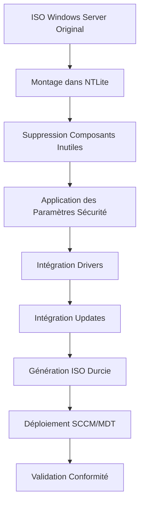

# Formation : Architecture PADSEC & NTLite

## Introduction

**Le point d'entrée de toute infrastructure sécurisée.**

L'architecture **PADSEC** (Plateforme d'Administration Sécurisée) représente le socle fondamental de toute infrastructure respectant les principes de **défense en profondeur**. Cette formation couvre les concepts essentiels pour comprendre et opérer dans un environnement d'administration durci.

```
┌─────────────────────────────────────────────────────────────────┐
│              ARCHITECTURE PADSEC - VUE D'ENSEMBLE               │
├─────────────────────────────────────────────────────────────────┤
│                                                                 │
│   ┌─────────────┐         ┌─────────────┐                       │
│   │   INTERNET  │         │  ZONE CORP  │                       │
│   │  (Hostile)  │         │  (Tier 2)   │                       │
│   └──────┬──────┘         └──────┬──────┘                       │
│          │                       │                              │
│          │    ╔═══════════════════════════════╗                 │
│          │    ║      ZONE D'ADMINISTRATION     ║                │
│          │    ║          (PADSEC)              ║                │
│          │    ╠═══════════════════════════════╣                 │
│          │    ║                               ║                 │
│          ▼    ║  ┌─────────┐   ┌─────────┐   ║                 │
│   ┌──────────┐║  │ Bastion │   │   PAW   │   ║                 │
│   │ FW-EDGE  │║  │ (Jump)  │   │ (Admin) │   ║                 │
│   └────┬─────┘║  └────┬────┘   └────┬────┘   ║                 │
│        │      ║       │             │        ║                 │
│        │      ║       └──────┬──────┘        ║                 │
│        │      ║              │               ║                 │
│        │      ║              ▼               ║                 │
│        │      ║  ┌───────────────────────┐   ║                 │
│        │      ║  │   ADMIN FOREST        │   ║                 │
│        │      ║  │ admin.shellbook.local │   ║                 │
│        │      ║  │      (Tier 0)         │   ║                 │
│        │      ║  └───────────────────────┘   ║                 │
│        │      ╚═══════════════════════════════╝                 │
│        │                     │                                  │
│        │                     │ VPN IPsec                        │
│        │                     ▼                                  │
│        │      ┌───────────────────────────┐                     │
│        └─────►│   ZONE RESSOURCES         │                     │
│               │ corp.shellbook.local      │                     │
│               │      (Tier 1-2)           │                     │
│               └───────────────────────────┘                     │
│                                                                 │
└─────────────────────────────────────────────────────────────────┘
```

---

## Concepts Fondamentaux

### Qu'est-ce que PADSEC ?

!!! info "Définition"
    **PADSEC** est une architecture d'administration sécurisée qui isole physiquement et logiquement les ressources d'administration (Tier 0) des ressources de production (Tier 1-2).

Les principes clés :

| Principe | Description |
|----------|-------------|
| **Isolation réseau** | Séparation physique entre zones Admin et Corp |
| **Moindre privilège** | Accès uniquement aux ressources nécessaires |
| **Authentification forte** | MFA obligatoire pour accès PADSEC |
| **Traçabilité** | Logging exhaustif de toutes les actions |
| **Bastionnement** | Passage obligatoire par un Jump Server |

### Les Zones de Sécurité

```
┌─────────────────────────────────────────────────────────────────┐
│                    MODÈLE DE ZONES PADSEC                       │
├─────────────────────────────────────────────────────────────────┤
│                                                                 │
│   ZONE ADMIN (PADSEC)                     ZONE CORP             │
│   ═══════════════════                     ═════════             │
│                                                                 │
│   ┌─────────────────┐                    ┌─────────────────┐    │
│   │    TIER 0       │                    │    TIER 1       │    │
│   │ ─────────────── │                    │ ─────────────── │    │
│   │ • Domain Ctrl   │    VPN IPsec       │ • App Servers   │    │
│   │ • PKI (Root CA) │◄──────────────────►│ • Databases     │    │
│   │ • SIEM          │                    │ • Middleware    │    │
│   │ • Jump Servers  │                    └─────────────────┘    │
│   │ • PAW Stations  │                                           │
│   └─────────────────┘                    ┌─────────────────┐    │
│                                          │    TIER 2       │    │
│   Accès : Admins Tier 0 uniquement       │ ─────────────── │    │
│   Authentification : Smartcard + PIN     │ • Workstations  │    │
│   Réseau : Isolé, non-routable Internet  │ • Printers      │    │
│                                          │ • End Users     │    │
│                                          └─────────────────┘    │
│                                                                 │
└─────────────────────────────────────────────────────────────────┘
```

---

## NTLite : Durcissement des Images Windows

### Présentation

**NTLite** est un outil permettant de personnaliser et durcir les images Windows avant déploiement. Dans le contexte PADSEC, il est utilisé pour créer des **Golden Images** conformes aux exigences de sécurité.

!!! warning "Usage Production"
    NTLite est utilisé **uniquement** pour la préparation des images de référence.
    Ne jamais modifier une image en production directement.

### Workflow de Création d'Image



### Composants à Supprimer (PAW/Jump Server)

=== "Applications Inutiles"

    ```
    # Composants Windows à supprimer pour un PAW

    - Microsoft Edge (utiliser version managée)
    - Cortana
    - Xbox Game Bar
    - Windows Media Player
    - Internet Explorer
    - Microsoft Store (sauf si requis)
    - OneDrive
    - Skype
    - Weather App
    - News App
    - Tips App
    ```

=== "Services à Désactiver"

    ```
    # Services à désactiver sur un Jump Server

    - Xbox Services (tous)
    - Windows Search (si non requis)
    - Superfetch/SysMain
    - Windows Error Reporting
    - Connected User Experiences (DiagTrack)
    - Remote Registry (sauf besoin spécifique)
    - SSDP Discovery
    - UPnP Device Host
    ```

=== "Fonctionnalités Optionnelles"

    ```
    # Fonctionnalités Windows à supprimer

    - Internet Printing Client
    - Windows Fax and Scan
    - Work Folders Client
    - XPS Viewer
    - WordPad
    - Windows Media Features
    ```

### Paramètres de Sécurité Recommandés

!!! danger "Paramètres Critiques"
    Ces paramètres doivent être appliqués sur toutes les machines PADSEC :

```ini
# Paramètres Registry - Sécurité PADSEC

[HKEY_LOCAL_MACHINE\SYSTEM\CurrentControlSet\Control\Lsa]
; Désactiver LM Hash
"NoLMHash"=dword:00000001
; Niveau d'authentification NTLM
"LmCompatibilityLevel"=dword:00000005

[HKEY_LOCAL_MACHINE\SYSTEM\CurrentControlSet\Services\LanmanServer\Parameters]
; Désactiver SMBv1
"SMB1"=dword:00000000

[HKEY_LOCAL_MACHINE\SOFTWARE\Microsoft\Windows\CurrentVersion\Policies\System]
; UAC au maximum
"EnableLUA"=dword:00000001
"ConsentPromptBehaviorAdmin"=dword:00000002
"PromptOnSecureDesktop"=dword:00000001

[HKEY_LOCAL_MACHINE\SOFTWARE\Policies\Microsoft\Windows\CredentialsDelegation]
; Restricted Admin Mode
"AllowProtectedCreds"=dword:00000001
```

---

## Flux Réseau PADSEC

### Matrice des Flux Autorisés

| Source | Destination | Port | Protocole | Usage |
|--------|-------------|------|-----------|-------|
| PAW | Jump Server | 3389 | RDP/TLS | Administration |
| PAW | DC Admin | 636 | LDAPS | Authentification |
| Jump Server | DC Corp | 636 | LDAPS | Administration cross-forest |
| Jump Server | Servers Corp | 5986 | WinRM/HTTPS | PowerShell Remoting |
| SIEM | Tous | 514 | Syslog/TLS | Collecte logs |
| NTP Admin | DC Admin | 123 | NTP | Synchronisation temps |

### Flux Interdits (Deny by Default)

!!! danger "Règles Firewall Critiques"
    Ces flux doivent être **explicitement bloqués** :

    - Internet → PADSEC : **TOUT** (aucun flux entrant)
    - PADSEC → Internet : **TOUT** (sauf proxy whitelist)
    - Corp Workstations → PADSEC : **TOUT**
    - PADSEC → Corp Workstations : **TOUT** (sauf exceptions documentées)

---

## Procédure d'Accès PADSEC

### Workflow d'Authentification

```
┌─────────────────────────────────────────────────────────────────┐
│              WORKFLOW D'ACCÈS PADSEC                            │
├─────────────────────────────────────────────────────────────────┤
│                                                                 │
│   1. AUTHENTIFICATION INITIALE                                  │
│      ──────────────────────────                                 │
│      L'admin se connecte depuis son poste Corp                  │
│      avec ses credentials Corp (jdoe@corp.shellbook.local)      │
│                                                                 │
│   2. ACCÈS VPN PADSEC                                          │
│      ─────────────────────                                      │
│      Connexion VPN avec certificat + MFA                        │
│      Le poste Corp accède au réseau PADSEC                      │
│                                                                 │
│   3. CONNEXION AU BASTION                                       │
│      ────────────────────────                                   │
│      RDP vers srv-bastion-01.admin.shellbook.local              │
│      Avec compte admin (jdoe-adm@admin.shellbook.local)         │
│                                                                 │
│   4. ADMINISTRATION                                             │
│      ──────────────────                                         │
│      Depuis le bastion, accès aux ressources Tier 0             │
│      Ou tunnel vers les serveurs Corp via le VPN backbone       │
│                                                                 │
└─────────────────────────────────────────────────────────────────┘
```

### Comptes Utilisateurs

!!! tip "Modèle de Double Compte"
    Chaque administrateur dispose de **deux comptes distincts** :

    | Type | Exemple | Usage | Forest |
    |------|---------|-------|--------|
    | **Compte Standard** | `jdoe@corp.shellbook.local` | Travail quotidien, email | Corp |
    | **Compte Admin** | `jdoe-adm@admin.shellbook.local` | Administration uniquement | Admin |

---

## Checklist de Conformité

### Validation d'une Machine PADSEC

```powershell
# Script de validation conformité PADSEC
# À exécuter sur chaque PAW/Jump Server

function Test-PADSECCompliance {
    [CmdletBinding()]
    param()

    $results = @()

    # Test 1: SMBv1 désactivé
    $smb1 = Get-WindowsOptionalFeature -Online -FeatureName SMB1Protocol
    $results += [PSCustomObject]@{
        Test = "SMBv1 Disabled"
        Status = if ($smb1.State -eq "Disabled") { "PASS" } else { "FAIL" }
    }

    # Test 2: UAC activé
    $uac = Get-ItemProperty "HKLM:\SOFTWARE\Microsoft\Windows\CurrentVersion\Policies\System"
    $results += [PSCustomObject]@{
        Test = "UAC Enabled"
        Status = if ($uac.EnableLUA -eq 1) { "PASS" } else { "FAIL" }
    }

    # Test 3: Credential Guard (si supporté)
    $cg = Get-CimInstance -ClassName Win32_DeviceGuard -Namespace root\Microsoft\Windows\DeviceGuard
    $results += [PSCustomObject]@{
        Test = "Credential Guard"
        Status = if ($cg.SecurityServicesRunning -contains 1) { "PASS" } else { "WARN" }
    }

    # Test 4: BitLocker
    $bl = Get-BitLockerVolume -MountPoint "C:" -ErrorAction SilentlyContinue
    $results += [PSCustomObject]@{
        Test = "BitLocker Enabled"
        Status = if ($bl.ProtectionStatus -eq "On") { "PASS" } else { "FAIL" }
    }

    # Test 5: Windows Firewall
    $fw = Get-NetFirewallProfile
    $fwEnabled = ($fw | Where-Object { $_.Enabled -eq $true }).Count -eq 3
    $results += [PSCustomObject]@{
        Test = "Firewall All Profiles"
        Status = if ($fwEnabled) { "PASS" } else { "FAIL" }
    }

    return $results
}

# Exécution
Test-PADSECCompliance | Format-Table -AutoSize
```

---

## Ressources Complémentaires

### Documentation Liée

- :material-shield-lock: [Topologie VPN IPsec](../../network/vpn-topology.md) — Backbone PADSEC
- :material-microsoft-windows: [Active Directory Red Forest](../windows/active-directory.md) — Architecture forêts
- :material-lock: [Hardening AD - Tiering Model](../ad-hardening/01-tiering-model.md) — Modèle de Tiers

### Références Externes

- :material-link: [Microsoft PAW Guidance](https://docs.microsoft.com/en-us/security/compass/privileged-access-devices)
- :material-link: [ESAE (Red Forest) Architecture](https://docs.microsoft.com/en-us/security/compass/esae-retirement)
- :material-link: [ANSSI - Recommandations AD](https://www.ssi.gouv.fr/guide/recommandations-de-securite-relatives-a-active-directory/)

---

!!! quote "Principe de Sécurité"
    *"La sécurité de votre infrastructure ne peut pas être supérieure à la sécurité de son plan d'administration."*

    — Microsoft Security Best Practices

---

**Dernière mise à jour :** 2025-11-28
**Version :** 1.0
**Auteur :** ShellBook Security Team
