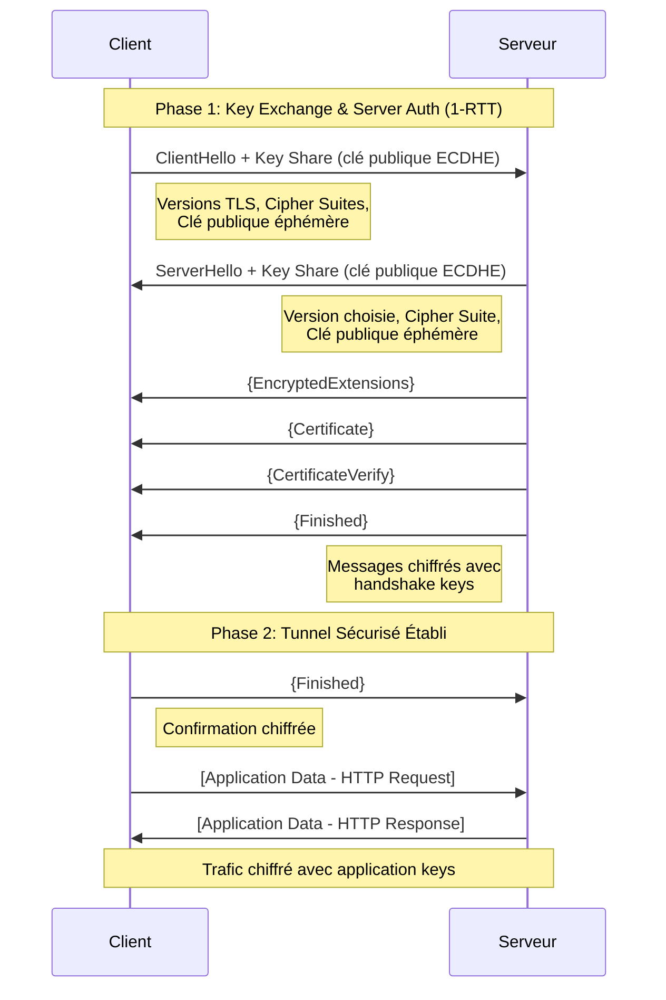

# Module 1 : Concepts Fondamentaux de la PKI

## Objectifs du Module

À l'issue de ce module, vous serez capable de :

- :material-check: Expliquer le fonctionnement de la cryptographie asymétrique
- :material-check: Décrire la chaîne de confiance d'une PKI
- :material-check: Comprendre le déroulement d'un handshake TLS 1.3
- :material-check: Identifier les composants d'un certificat X.509

---

## 1. Cryptographie Asymétrique

### Le Problème Initial

Imaginez deux personnes, Alice et Bob, qui veulent communiquer de manière sécurisée sur un réseau public. Le **chiffrement symétrique** (une seule clé partagée) pose un problème fondamental : comment échanger cette clé secrète sans qu'un attaquant l'intercepte ?

### La Solution : Clé Publique / Clé Privée

La cryptographie asymétrique résout ce problème en utilisant **deux clés mathématiquement liées** :

```
┌─────────────────────────────────────────────────────────────┐
│                     PAIRE DE CLÉS                          │
├─────────────────────────────────────────────────────────────┤
│                                                             │
│   🔓 CLÉ PUBLIQUE                 🔐 CLÉ PRIVÉE            │
│   ─────────────────               ─────────────────         │
│   • Peut être partagée            • JAMAIS partagée         │
│   • Utilisée pour CHIFFRER        • Utilisée pour DÉCHIFFRER│
│   • Utilisée pour VÉRIFIER        • Utilisée pour SIGNER    │
│     une signature                                           │
│                                                             │
└─────────────────────────────────────────────────────────────┘
```

### Principe de Fonctionnement

| Opération | Clé Utilisée | Résultat |
|-----------|--------------|----------|
| **Chiffrement** | Clé publique du destinataire | Seul le destinataire peut déchiffrer |
| **Déchiffrement** | Clé privée du destinataire | Récupération du message original |
| **Signature** | Clé privée de l'émetteur | Preuve d'authenticité |
| **Vérification** | Clé publique de l'émetteur | Validation de la signature |

!!! example "Analogie du Cadenas"
    Pensez à la clé publique comme un **cadenas ouvert** que vous distribuez à tout le monde. N'importe qui peut fermer le cadenas (chiffrer), mais seul vous possédez la **clé unique** (clé privée) pour l'ouvrir (déchiffrer).

---

!!! danger "RÈGLE D'OR : Protection de la Clé Privée"
    La clé privée est le **secret absolu** de votre infrastructure PKI.

    **Ne JAMAIS :**

    - La transmettre par email, chat ou tout canal non sécurisé
    - La stocker sans protection (chiffrement, permissions restrictives)
    - La partager entre plusieurs personnes ou systèmes
    - L'inclure dans un dépôt Git (même privé)

    **Toujours :**

    - Générer la clé sur la machine qui l'utilisera
    - Protéger avec une passphrase forte (pour les CA)
    - Stocker dans un HSM pour les environnements de production
    - Appliquer des permissions `chmod 400` (lecture seule, propriétaire uniquement)

---

## 2. La Chaîne de Confiance (Chain of Trust)

### Architecture Hiérarchique

Une PKI est organisée en **hiérarchie de confiance**. Cette structure permet de déléguer la confiance tout en limitant l'exposition de la clé racine.

```
                    ┌─────────────────────┐
                    │     ROOT CA         │
                    │  (Autorité Racine)  │
                    │                     │
                    │  🔒 OFFLINE         │
                    │  Validité: 20 ans   │
                    └──────────┬──────────┘
                               │
                               │ signe
                               ▼
                    ┌─────────────────────┐
                    │   INTERMEDIATE CA   │
                    │  (CA Intermédiaire) │
                    │                     │
                    │  🌐 ONLINE          │
                    │  Validité: 5-10 ans │
                    └──────────┬──────────┘
                               │
                               │ signe
                               ▼
         ┌─────────────────────┴─────────────────────┐
         │                                           │
         ▼                                           ▼
┌─────────────────────┐                   ┌─────────────────────┐
│   CERTIFICAT        │                   │   CERTIFICAT        │
│   SERVEUR WEB       │                   │   SERVEUR MAIL      │
│                     │                   │                     │
│  web.example.com    │                   │  mail.example.com   │
│  Validité: 1 an     │                   │  Validité: 1 an     │
└─────────────────────┘                   └─────────────────────┘
```

### Rôle de Chaque Niveau

| Niveau | Rôle | Sécurité | Durée de Vie |
|--------|------|----------|--------------|
| **Root CA** | Ancre de confiance ultime | Offline, HSM, air-gapped | 15-25 ans |
| **Intermediate CA** | Signe les certificats finaux | Online, HSM recommandé | 5-10 ans |
| **End-Entity** | Identifie un serveur/utilisateur | Serveur applicatif | 90 jours - 2 ans |

!!! info "Pourquoi une CA Intermédiaire ?"
    Si la Root CA était compromise, **toute la PKI serait à reconstruire**. En utilisant une CA intermédiaire :

    - La Root CA reste hors ligne et protégée
    - En cas de compromission de l'intermédiaire, on peut la révoquer sans toucher à la racine
    - On peut avoir plusieurs CA intermédiaires pour différents usages

### Validation de la Chaîne

Lorsqu'un navigateur reçoit un certificat, il vérifie la chaîne complète :

1. Le certificat serveur est-il signé par une CA intermédiaire valide ?
2. Cette CA intermédiaire est-elle signée par une Root CA ?
3. Cette Root CA est-elle dans le **magasin de confiance** du système ?

```bash
# Visualiser la chaîne de confiance d'un certificat
openssl s_client -connect example.com:443 -showcerts
```

---

## 3. Anatomie d'un Certificat X.509

Un certificat X.509 contient plusieurs champs standardisés :

```
┌───────────────────────────────────────────────────────────────┐
│                    CERTIFICAT X.509 v3                       │
├───────────────────────────────────────────────────────────────┤
│ Version          : 3 (0x2)                                   │
│ Serial Number    : 0A:1B:2C:3D:4E:5F:6A:7B                   │
│ Signature Algo   : sha256WithRSAEncryption                   │
├───────────────────────────────────────────────────────────────┤
│ Issuer (Émetteur):                                           │
│   CN = MyCompany Intermediate CA                             │
│   O  = MyCompany                                             │
│   C  = FR                                                    │
├───────────────────────────────────────────────────────────────┤
│ Validity (Validité):                                         │
│   Not Before: Jan 1 00:00:00 2025 GMT                        │
│   Not After : Jan 1 00:00:00 2026 GMT                        │
├───────────────────────────────────────────────────────────────┤
│ Subject (Sujet):                                             │
│   CN = www.example.com                                       │
│   O  = Example Corp                                          │
│   L  = Paris                                                 │
│   C  = FR                                                    │
├───────────────────────────────────────────────────────────────┤
│ Public Key:                                                  │
│   Algorithm: rsaEncryption (2048 bit)                        │
│   Modulus: 00:bb:c3:45:...                                   │
├───────────────────────────────────────────────────────────────┤
│ Extensions X.509 v3:                                         │
│   Subject Alternative Name (SAN):                            │
│     DNS: www.example.com                                     │
│     DNS: example.com                                         │
│     DNS: api.example.com                                     │
│   Key Usage: Digital Signature, Key Encipherment             │
│   Extended Key Usage: TLS Web Server Authentication          │
│   Basic Constraints: CA:FALSE                                │
├───────────────────────────────────────────────────────────────┤
│ Signature:                                                   │
│   Algorithm: sha256WithRSAEncryption                         │
│   Value: 3a:4b:5c:6d:...                                     │
└───────────────────────────────────────────────────────────────┘
```

### Champs Critiques

| Champ | Description | Importance |
|-------|-------------|------------|
| **Subject CN** | Nom commun (historiquement le domaine) | Déprécié pour la validation |
| **SAN** | Subject Alternative Names | **Obligatoire** depuis 2017 pour les navigateurs |
| **Key Usage** | Opérations autorisées pour la clé | Sécurité du certificat |
| **Basic Constraints** | Indique si c'est une CA | Prévient les attaques par faux certificats |

!!! warning "SAN Obligatoire"
    Depuis 2017, les navigateurs **ignorent le champ CN** et se basent uniquement sur le **SAN** (Subject Alternative Name) pour valider le domaine. Tout certificat sans SAN sera rejeté.

---

## 4. Le Handshake TLS 1.3

TLS 1.3 (RFC 8446) a considérablement simplifié et sécurisé le processus de négociation par rapport à TLS 1.2.

### Diagramme de Séquence



!!! info "Légende du diagramme"
    - `{...}` = Messages chiffrés avec les **handshake keys**
    - `[...]` = Données applicatives chiffrées avec les **application keys**
    - Le **Key Share** est envoyé dès le premier message (différence majeure avec TLS 1.2)

### Améliorations de TLS 1.3

| Aspect | TLS 1.2 | TLS 1.3 |
|--------|---------|---------|
| **Round-trips** | 2 RTT minimum | 1 RTT (0-RTT possible) |
| **Suites obsolètes** | RC4, 3DES, MD5 | Supprimées |
| **Perfect Forward Secrecy** | Optionnel | **Obligatoire** |
| **Handshake chiffré** | Non | Oui (après ServerHello) |
| **Renégociation** | Vulnérable | Supprimée |

!!! tip "Perfect Forward Secrecy (PFS)"
    Grâce à l'échange de clés éphémères (ECDHE), même si la clé privée du serveur est compromise **ultérieurement**, les sessions passées restent protégées. Chaque session utilise une clé unique dérivée d'un échange Diffie-Hellman.

---

## 5. Algorithmes et Standards Actuels

### Recommandations ANSSI (2024)

| Usage | Algorithme Recommandé | Taille Minimale |
|-------|----------------------|-----------------|
| **Signature** | ECDSA (P-256, P-384) | 256 bits |
| **Signature** | RSA | 3072 bits (2048 toléré) |
| **Échange de clés** | ECDHE | 256 bits |
| **Hash** | SHA-256, SHA-384 | 256 bits minimum |

!!! danger "Algorithmes à Proscrire"
    Les algorithmes suivants sont considérés comme **cryptographiquement cassés** :

    - **MD5** : Collisions triviales
    - **SHA-1** : Collisions démontrées (SHAttered, 2017)
    - **RSA < 2048 bits** : Factorisable avec des ressources modestes
    - **3DES** : Attaque Sweet32
    - **RC4** : Multiples faiblesses statistiques

---

## Quiz d'Auto-Évaluation

??? question "Question 1 : Quelle clé utilise-t-on pour chiffrer un message destiné à Bob ?"
    **Réponse :** La **clé publique de Bob**. Seul Bob pourra déchiffrer avec sa clé privée.

??? question "Question 2 : Pourquoi la Root CA doit-elle rester hors ligne ?"
    **Réponse :** Pour minimiser le risque de compromission. Si la Root CA est compromise, toute la PKI doit être reconstruite. En la gardant offline (air-gapped), on réduit drastiquement la surface d'attaque.

??? question "Question 3 : Qu'est-ce que le PFS (Perfect Forward Secrecy) ?"
    **Réponse :** C'est la propriété garantissant que les sessions passées restent sécurisées même si la clé privée du serveur est compromise ultérieurement. Cela est rendu possible par l'utilisation de clés éphémères (ECDHE).

??? question "Question 4 : Pourquoi le SAN est-il obligatoire dans les certificats modernes ?"
    **Réponse :** Depuis 2017, les navigateurs ignorent le champ CN et utilisent exclusivement le SAN (Subject Alternative Name) pour valider le domaine. Un certificat sans SAN sera rejeté.

---

## Prochaine Étape

Maintenant que vous maîtrisez les concepts théoriques, passez à la pratique !

[:octicons-arrow-right-24: Module 2 : Lab OpenSSL - Construire une PKI](02-openssl-lab.md)

---

**Temps estimé :** 45 minutes
**Niveau :** Intermédiaire
