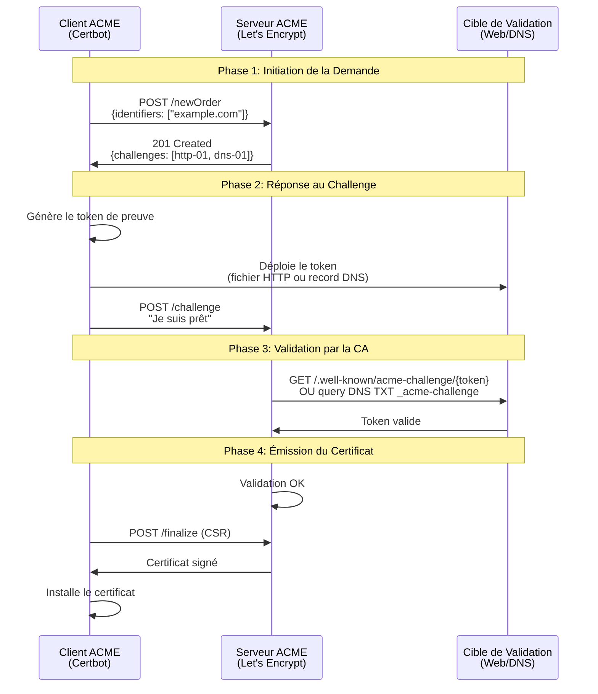

# Module 4 : Automatisation avec ACME & Certbot

## Objectifs du Module

À l'issue de ce module, vous serez capable de :

- :material-check: Comprendre le protocole ACME et ses mécanismes de validation
- :material-check: Choisir entre les challenges HTTP-01 et DNS-01 selon votre contexte
- :material-check: Automatiser l'obtention et le renouvellement de certificats avec Certbot
- :material-check: Intégrer le cycle de vie des certificats dans votre infrastructure

!!! quote "Philosophie DevOps"
    *"Un certificat qui expire est un certificat qui n'aurait jamais dû être géré manuellement."*

    L'automatisation n'est pas une option — c'est une **exigence de production**.

---

## 1. Le Protocole ACME

### 1.1 Qu'est-ce que ACME ?

**ACME** (Automatic Certificate Management Environment) est un protocole standardisé (RFC 8555) qui permet l'automatisation complète du cycle de vie des certificats :

- Demande de certificat
- Validation de la propriété du domaine
- Émission du certificat
- Renouvellement automatique
- Révocation si nécessaire

```
┌─────────────────────────────────────────────────────────────────┐
│                    ÉCOSYSTÈME ACME                              │
├─────────────────────────────────────────────────────────────────┤
│                                                                 │
│   ┌──────────────┐         HTTPS/JSON         ┌──────────────┐  │
│   │              │ ◄─────────────────────────► │              │  │
│   │  CLIENT ACME │                             │ SERVEUR ACME │  │
│   │  (Certbot)   │                             │ (Let's Encrypt)│
│   │              │                             │              │  │
│   └──────────────┘                             └──────────────┘  │
│          │                                            │         │
│          │ Écrit le certificat                        │         │
│          ▼                                            │         │
│   ┌──────────────┐                                    │         │
│   │ Serveur Web  │ ◄──────────────────────────────────┘         │
│   │ (Nginx/Apache)│        Validation HTTP-01 ou DNS-01         │
│   └──────────────┘                                              │
│                                                                 │
└─────────────────────────────────────────────────────────────────┘
```

### 1.2 Le Flux de Validation



---

## 2. Les Types de Challenges

### 2.1 Comparatif HTTP-01 vs DNS-01

| Critère | HTTP-01 | DNS-01 |
|---------|---------|--------|
| **Prérequis** | Port 80 ouvert vers Internet | Accès API au provider DNS |
| **Wildcards** | Non supporté | **Supporté** (`*.example.com`) |
| **Serveurs internes** | Impossible (pas d'accès public) | **Possible** (validation DNS) |
| **Complexité** | Simple | Moyenne (nécessite plugin DNS) |
| **Cas d'usage** | Serveurs web publics | CDN, load balancers, wildcards |

### 2.2 Challenge HTTP-01

Le serveur ACME vérifie que vous contrôlez le domaine en accédant à une URL spécifique :

```
http://example.com/.well-known/acme-challenge/<TOKEN>
```

```
┌─────────────────────────────────────────────────────────────┐
│                     HTTP-01 CHALLENGE                       │
├─────────────────────────────────────────────────────────────┤
│                                                             │
│  1. Certbot génère un token: abc123xyz                      │
│                                                             │
│  2. Certbot crée le fichier:                                │
│     /var/www/html/.well-known/acme-challenge/abc123xyz      │
│                                                             │
│  3. Let's Encrypt accède à:                                 │
│     http://example.com/.well-known/acme-challenge/abc123xyz │
│                    │                                        │
│                    ▼                                        │
│     ┌──────────────────────────────┐                        │
│     │  FIREWALL: Port 80 OUVERT    │  ◄── OBLIGATOIRE      │
│     └──────────────────────────────┘                        │
│                                                             │
│  4. Si le contenu correspond → Certificat émis              │
│                                                             │
└─────────────────────────────────────────────────────────────┘
```

!!! warning "Port 80 Obligatoire"
    Le challenge HTTP-01 **exige** que le port 80 soit accessible depuis Internet, même si votre site final est en HTTPS sur le port 443. C'est une exigence du protocole ACME, pas une option.

### 2.3 Challenge DNS-01

Le serveur ACME vérifie un enregistrement TXT dans votre zone DNS :

```
_acme-challenge.example.com.  300  IN  TXT  "gfj9Xq...Rg85nM"
```

```
┌─────────────────────────────────────────────────────────────┐
│                     DNS-01 CHALLENGE                        │
├─────────────────────────────────────────────────────────────┤
│                                                             │
│  1. Certbot génère un token de validation                   │
│                                                             │
│  2. Certbot appelle l'API DNS (via plugin):                 │
│     POST /zones/example.com/records                         │
│     {                                                       │
│       "type": "TXT",                                        │
│       "name": "_acme-challenge",                            │
│       "content": "gfj9Xq...Rg85nM"                          │
│     }                                                       │
│                                                             │
│  3. Let's Encrypt query DNS:                                │
│     dig TXT _acme-challenge.example.com                     │
│                                                             │
│  4. Si le TXT correspond → Certificat émis                  │
│     (y compris wildcards *.example.com)                     │
│                                                             │
└─────────────────────────────────────────────────────────────┘
```

!!! tip "Cas d'Usage DNS-01"
    Utilisez DNS-01 quand :

    - Vous avez besoin d'un **wildcard** (`*.example.com`)
    - Votre serveur est **derrière un load balancer** sans accès direct
    - Vous gérez des **serveurs internes** non exposés sur Internet
    - Le port 80 est **bloqué** par politique de sécurité

---

## 3. Certbot : Installation et Utilisation

### 3.1 Installation

=== "Debian/Ubuntu"

    ```bash
    # Installation via snap (recommandé par EFF)
    sudo snap install --classic certbot
    sudo ln -s /snap/bin/certbot /usr/bin/certbot

    # Vérifier l'installation
    certbot --version
    ```

=== "RHEL/CentOS/Rocky"

    ```bash
    # Activer EPEL
    sudo dnf install epel-release

    # Installer Certbot
    sudo dnf install certbot python3-certbot-nginx

    # Vérifier l'installation
    certbot --version
    ```

=== "Alpine Linux"

    ```bash
    # Installation via apk
    apk add certbot certbot-nginx

    # Vérifier l'installation
    certbot --version
    ```

### 3.2 Mode Standalone (Test/Développement)

Le mode standalone lance un serveur web temporaire sur le port 80 :

```bash
# Arrêter temporairement le serveur web existant
sudo systemctl stop nginx

# Obtenir un certificat (mode test)
sudo certbot certonly --standalone --dry-run -d example.com -d www.example.com

# Si le dry-run passe, exécuter pour de vrai
sudo certbot certonly --standalone -d example.com -d www.example.com

# Redémarrer le serveur web
sudo systemctl start nginx
```

!!! info "Quand utiliser Standalone ?"
    - Tests initiaux et validation de la configuration
    - Serveurs sans serveur web (mail, VPN, etc.)
    - Environnements de développement

### 3.3 Mode Webroot (Production)

Le mode webroot utilise un serveur web existant — **aucune interruption de service** :

```bash
# Syntaxe générale
sudo certbot certonly --webroot \
    -w /var/www/html \
    -d example.com \
    -d www.example.com

# Avec dry-run pour tester d'abord (TOUJOURS recommandé)
sudo certbot certonly --dry-run --webroot \
    -w /var/www/html \
    -d monsite.com
```

**Configuration Nginx requise :**

```nginx
server {
    listen 80;
    server_name example.com www.example.com;

    # ACME challenge location - NE PAS SUPPRIMER
    location /.well-known/acme-challenge/ {
        root /var/www/html;
        allow all;
    }

    # Redirection HTTPS pour le reste
    location / {
        return 301 https://$host$request_uri;
    }
}
```

**Configuration Apache requise :**

```apache
<VirtualHost *:80>
    ServerName example.com
    ServerAlias www.example.com

    # ACME challenge directory
    Alias /.well-known/acme-challenge/ /var/www/html/.well-known/acme-challenge/
    <Directory "/var/www/html/.well-known/acme-challenge/">
        Options None
        AllowOverride None
        Require all granted
    </Directory>

    # Redirection HTTPS pour le reste
    RewriteEngine On
    RewriteCond %{REQUEST_URI} !^/.well-known/acme-challenge/
    RewriteRule ^(.*)$ https://%{HTTP_HOST}$1 [R=301,L]
</VirtualHost>
```

### 3.4 Mode DNS (Wildcards & Serveurs Internes)

Pour les wildcards ou quand le port 80 n'est pas accessible :

```bash
# Avec plugin Cloudflare
sudo certbot certonly --dns-cloudflare \
    --dns-cloudflare-credentials /etc/letsencrypt/cloudflare.ini \
    -d example.com \
    -d "*.example.com"

# Avec plugin Route53 (AWS)
sudo certbot certonly --dns-route53 \
    -d example.com \
    -d "*.example.com"

# Avec plugin OVH
sudo certbot certonly --dns-ovh \
    --dns-ovh-credentials /etc/letsencrypt/ovh.ini \
    -d example.com \
    -d "*.example.com"
```

**Exemple de fichier credentials Cloudflare (`/etc/letsencrypt/cloudflare.ini`) :**

```ini
# Cloudflare API token (recommandé)
dns_cloudflare_api_token = YOUR_API_TOKEN

# OU Cloudflare Global API Key (legacy)
# dns_cloudflare_email = your@email.com
# dns_cloudflare_api_key = YOUR_GLOBAL_API_KEY
```

```bash
# Sécuriser le fichier
sudo chmod 600 /etc/letsencrypt/cloudflare.ini
```

---

## 4. Automatisation du Renouvellement

### 4.1 Le Problème

Les certificats Let's Encrypt expirent après **90 jours**. Un renouvellement manuel est :

- Source d'erreurs humaines
- Non scalable
- Incompatible avec la philosophie DevOps

### 4.2 Renouvellement Automatique

Certbot installe automatiquement un timer systemd ou une entrée cron :

```bash
# Vérifier le timer systemd
sudo systemctl status certbot.timer

# Ou vérifier la crontab
sudo cat /etc/cron.d/certbot
```

**Entrée cron typique :**

```cron
# /etc/cron.d/certbot
0 */12 * * * root certbot renew --quiet --deploy-hook "systemctl reload nginx"
```

**Timer systemd (`/etc/systemd/system/certbot.timer`) :**

```ini
[Unit]
Description=Run certbot twice daily

[Timer]
OnCalendar=*-*-* 00,12:00:00
RandomizedDelaySec=43200
Persistent=true

[Install]
WantedBy=timers.target
```

### 4.3 Deploy Hooks : Redémarrage Automatique

Le **deploy hook** s'exécute **uniquement** si un certificat a été renouvelé :

=== "Nginx"

    ```bash
    # Renouvellement avec reload Nginx
    sudo certbot renew --deploy-hook "systemctl reload nginx"
    ```

=== "Apache"

    ```bash
    # Renouvellement avec reload Apache
    sudo certbot renew --deploy-hook "systemctl reload apache2"
    ```

=== "HAProxy"

    ```bash
    # HAProxy nécessite un fichier combiné (cert + key)
    sudo certbot renew --deploy-hook "/usr/local/bin/haproxy-renew.sh"
    ```

    ```bash
    #!/bin/bash
    # /usr/local/bin/haproxy-renew.sh
    DOMAIN="example.com"
    LIVE_DIR="/etc/letsencrypt/live/${DOMAIN}"
    HAPROXY_CERT="/etc/haproxy/certs/${DOMAIN}.pem"

    # Combiner fullchain + privkey
    cat "${LIVE_DIR}/fullchain.pem" "${LIVE_DIR}/privkey.pem" > "${HAPROXY_CERT}"

    # Reload HAProxy
    systemctl reload haproxy
    ```

### 4.4 Configuration Permanente des Hooks

Créez un fichier de configuration pour persister les hooks :

```bash
# /etc/letsencrypt/cli.ini
# Configuration globale Certbot

# Hooks de déploiement
deploy-hook = systemctl reload nginx

# Email pour les notifications d'expiration
email = security@example.com

# Accepter les ToS automatiquement
agree-tos = true

# Pas de newsletter EFF
no-eff-email = true
```

Ou par domaine (`/etc/letsencrypt/renewal/example.com.conf`) :

```ini
[renewalparams]
# ... autres paramètres ...

[[ webroot ]]
# ... config webroot ...

# Hook personnalisé pour ce domaine
renew_hook = /usr/local/bin/deploy-example.sh
```

### 4.5 Test du Renouvellement

**Toujours tester avant de mettre en production :**

```bash
# Dry-run complet
sudo certbot renew --dry-run

# Forcer le renouvellement d'un domaine spécifique (test)
sudo certbot renew --cert-name example.com --dry-run --force-renewal
```

---

## 5. Monitoring et Alerting

### 5.1 Script de Monitoring

```bash
#!/bin/bash
# /usr/local/bin/check-cert-expiry.sh

WARN_DAYS=30
CRIT_DAYS=7

for cert in /etc/letsencrypt/live/*/cert.pem; do
    domain=$(basename $(dirname "$cert"))
    expiry=$(openssl x509 -in "$cert" -noout -enddate | cut -d= -f2)
    expiry_epoch=$(date -d "$expiry" +%s)
    now_epoch=$(date +%s)
    days_left=$(( (expiry_epoch - now_epoch) / 86400 ))

    if [ $days_left -lt $CRIT_DAYS ]; then
        echo "CRITICAL: $domain expire dans $days_left jours!"
        # Envoyer alerte (mail, Slack, PagerDuty...)
    elif [ $days_left -lt $WARN_DAYS ]; then
        echo "WARNING: $domain expire dans $days_left jours"
    else
        echo "OK: $domain - $days_left jours restants"
    fi
done
```

### 5.2 Intégration Prometheus

```yaml
# prometheus-certbot-exporter configuration
scrape_configs:
  - job_name: 'ssl-certificates'
    static_configs:
      - targets: ['localhost:9219']
```

---

## 6. Contexte Entreprise

!!! warning "Environnement Corporate (Worldline/SecNumCloud)"
    Dans un contexte d'entreprise soumis à des exigences réglementaires (SecNumCloud, PCI-DSS, HDS), l'utilisation de **Let's Encrypt public** peut être limitée ou interdite pour plusieurs raisons :

    **Contraintes :**

    - Les certificats publics peuvent révéler l'existence de sous-domaines internes
    - Pas de contrôle sur la CA émettrice
    - Logs de Certificate Transparency publics
    - Durée de vie de 90 jours non négociable

    **Solutions Enterprise :**

    | Solution | Description | Cas d'usage |
    |----------|-------------|-------------|
    | **Smallstep CA** | CA interne compatible ACME | PKI privée, microservices |
    | **HashiCorp Vault PKI** | Secrets management + CA | Infrastructure cloud-native |
    | **EJBCA** | CA enterprise open-source | Grande échelle, compliance |
    | **Microsoft AD CS + ACME** | Intégration Active Directory | Environnements Windows |
    | **Venafi** | Plateforme enterprise | Multi-cloud, compliance |

    **Bonne nouvelle :** Les commandes Certbot restent **identiques** ! Seule l'URL du serveur ACME change :

    ```bash
    # Let's Encrypt (public)
    certbot certonly --server https://acme-v02.api.letsencrypt.org/directory ...

    # Smallstep CA (interne)
    certbot certonly --server https://ca.internal.corp:9000/acme/acme/directory ...

    # HashiCorp Vault
    certbot certonly --server https://vault.internal.corp:8200/v1/pki/acme/directory ...
    ```

!!! tip "Recommandation Architecture"
    Pour une infrastructure hybride, considérez :

    - **Certificats publics** (Let's Encrypt) → Services exposés sur Internet
    - **Certificats internes** (Smallstep/Vault) → Services internes, mTLS, microservices

    Utilisez le même tooling (Certbot) pour les deux, seul le `--server` change.

---

## 7. Troubleshooting ACME

### 7.1 Erreurs Courantes

| Erreur | Cause | Solution |
|--------|-------|----------|
| `Connection refused` | Port 80 bloqué | Ouvrir le firewall, vérifier security groups |
| `DNS problem: NXDOMAIN` | Domaine inexistant | Vérifier la configuration DNS |
| `Timeout during connect` | Serveur inaccessible | Vérifier la connectivité réseau |
| `Too many certificates` | Rate limiting | Attendre ou utiliser staging |
| `CAA record prevents issuance` | Enregistrement CAA DNS restrictif | Ajouter `0 issue "letsencrypt.org"` |

### 7.2 Environnement de Staging

**Toujours tester sur le staging avant la production :**

```bash
# Utiliser le serveur de staging (pas de rate limiting)
sudo certbot certonly --staging --webroot \
    -w /var/www/html \
    -d test.example.com

# Les certificats staging ne sont PAS valides pour les navigateurs
# Mais permettent de tester toute la chaîne
```

### 7.3 Logs et Debugging

```bash
# Logs Certbot
sudo cat /var/log/letsencrypt/letsencrypt.log

# Mode verbose
sudo certbot renew --dry-run -v

# Mode très verbose (debug)
sudo certbot renew --dry-run -vvv
```

---

## 8. Checklist de Production

Avant de passer en production, validez cette checklist :

- [ ] **Dry-run réussi** : `certbot certonly --dry-run` passe sans erreur
- [ ] **Port 80 accessible** (HTTP-01) ou **API DNS configurée** (DNS-01)
- [ ] **Webroot configuré** dans Nginx/Apache
- [ ] **Deploy hook testé** : le service redémarre correctement
- [ ] **Timer/cron actif** : `systemctl status certbot.timer`
- [ ] **Monitoring configuré** : alertes avant expiration
- [ ] **Backup des clés** : `/etc/letsencrypt` sauvegardé
- [ ] **Documentation** : procédure de recovery documentée

---

## Quiz Final

??? question "Question 1 : Pourquoi le challenge HTTP-01 ne supporte pas les wildcards ?"
    **Réponse :** Le challenge HTTP-01 valide un domaine spécifique en accédant à une URL précise. Un wildcard (`*.example.com`) représente une infinité de sous-domaines — impossible de tous les valider via HTTP. Seul DNS-01 peut prouver le contrôle de toute la zone DNS.

??? question "Question 2 : Quelle est la différence entre `--pre-hook`, `--deploy-hook` et `--post-hook` ?"
    **Réponse :**

    - `--pre-hook` : Exécuté **avant** toute tentative de renouvellement
    - `--deploy-hook` : Exécuté **uniquement si** un certificat a été renouvelé avec succès
    - `--post-hook` : Exécuté **après** toute tentative, succès ou échec

    Pour redémarrer un service, utilisez `--deploy-hook` pour éviter les redémarrages inutiles.

??? question "Question 3 : Comment obtenir un certificat pour un serveur qui n'est pas accessible depuis Internet ?"
    **Réponse :** Utilisez le challenge **DNS-01**. Il ne nécessite pas d'accès HTTP au serveur — seul l'accès API à votre provider DNS est requis. Certbot crée un enregistrement TXT que Let's Encrypt vérifie, puis le supprime.

---

## Félicitations !

Vous avez terminé le module d'automatisation. Votre infrastructure PKI est maintenant :

- :material-check-circle: **Automatisée** : Plus de renouvellements manuels
- :material-check-circle: **Résiliente** : Hooks de déploiement configurés
- :material-check-circle: **Monitorée** : Alertes avant expiration
- :material-check-circle: **Scalable** : Même process pour N domaines

[:octicons-arrow-left-24: Retour au Module 3 : Debugging](03-debugging.md)

[:octicons-home: Retour à l'index de la formation](index.md)

---

**Temps estimé :** 75 minutes
**Niveau :** Avancé
