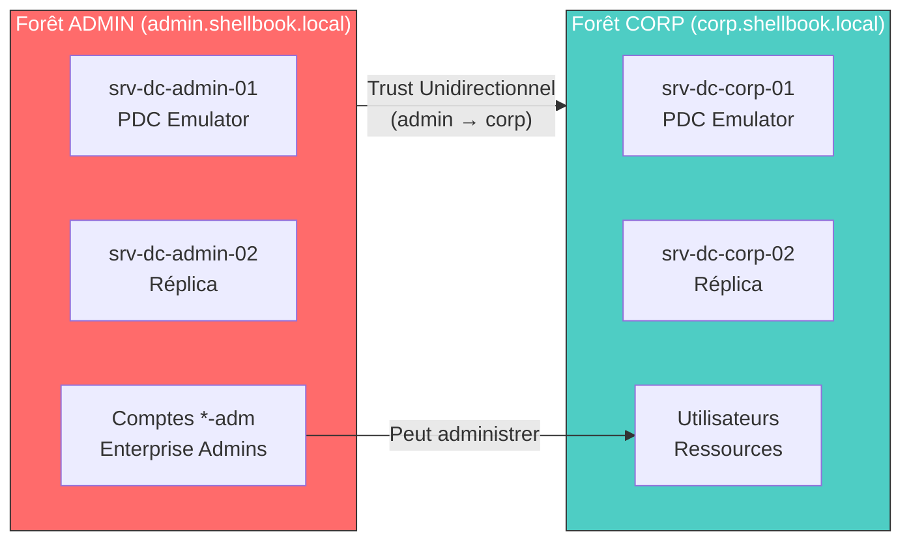

# Architecture Active Directory - Modèle Red Forest

!!! danger "Infrastructure Critique - Tier 0"
    Ce document décrit l'architecture AD de production basée sur le modèle **Red Forest** (Enhanced Security Admin Environment - ESAE).

    **Toute modification sur ces composants nécessite un Change Approval.**

---

## Vue d'Ensemble de l'Architecture

### Le Modèle Red Forest

Le **Red Forest** (ou ESAE) est une architecture de sécurité Microsoft où l'administration des ressources est isolée dans une forêt dédiée, séparée des utilisateurs et ressources de production.

```
┌─────────────────────────────────────────────────────────────────┐
│              ARCHITECTURE RED FOREST - SHELLBOOK                 │
├─────────────────────────────────────────────────────────────────┤
│                                                                 │
│   FORÊT ADMIN (Tier 0)              FORÊT CORP (Production)    │
│   ════════════════════              ═══════════════════════     │
│   admin.shellbook.local             corp.shellbook.local        │
│                                                                 │
│   ┌─────────────────────┐          ┌─────────────────────┐     │
│   │   srv-dc-admin-01   │          │   srv-dc-corp-01    │     │
│   │   (PDC Emulator)    │          │   (PDC Emulator)    │     │
│   │                     │          │                     │     │
│   │   FSMO Roles:       │          │   FSMO Roles:       │     │
│   │   • Schema Master   │          │   • PDC Emulator    │     │
│   │   • Domain Naming   │          │   • RID Master      │     │
│   │   • PDC Emulator    │          │   • Infra Master    │     │
│   └──────────┬──────────┘          └──────────┬──────────┘     │
│              │                                │                 │
│   ┌──────────┴──────────┐          ┌──────────┴──────────┐     │
│   │   srv-dc-admin-02   │          │   srv-dc-corp-02    │     │
│   │   (Réplica)         │          │   (Réplica)         │     │
│   │                     │          │                     │     │
│   │   FSMO Roles:       │          │                     │     │
│   │   • RID Master      │          │                     │     │
│   │   • Infra Master    │          │                     │     │
│   └─────────────────────┘          └─────────────────────┘     │
│                                                                 │
│              │                                │                 │
│              │      TRUST UNIDIRECTIONNEL     │                 │
│              │◄═══════════════════════════════│                 │
│              │   admin GÈRE corp              │                 │
│              │   corp NE GÈRE PAS admin       │                 │
│                                                                 │
│   CONTENU:                          CONTENU:                    │
│   • Comptes admin (*-adm)           • Comptes utilisateurs      │
│   • PAW (Privileged Access)         • Groupes métiers           │
│   • Outils de gestion               • Serveurs applicatifs      │
│   • Aucun utilisateur final         • Postes de travail         │
│                                                                 │
└─────────────────────────────────────────────────────────────────┘
```

### Pourquoi Cette Architecture ?

| Aspect | Forêt Unique (Classique) | Red Forest (ESAE) |
|--------|--------------------------|-------------------|
| **Compromission** | Attaquant = Domain Admin partout | Attaquant sur `corp` ≠ accès à `admin` |
| **Isolation** | Aucune | Forêt dédiée pour Tier 0 |
| **Pass-the-Hash** | Risque élevé | Limité à une forêt |
| **Comptes Admin** | Mélangés avec users | Isolés dans `admin` |
| **Compliance** | Difficile à auditer | Séparation claire |

---

## Section 1 : Trust Unidirectionnel

### 1.1 Diagramme du Trust



### 1.2 Direction du Trust

!!! warning "Comprendre la Direction"
    La direction du trust peut être confuse. Voici la règle :

    - **Trust Direction** : `corp.shellbook.local` **FAIT CONFIANCE À** `admin.shellbook.local`
    - **Accès Direction** : Les comptes de `admin` **PEUVENT ACCÉDER** aux ressources de `corp`
    - **Inverse** : Les comptes de `corp` **NE PEUVENT PAS** accéder à `admin`

```powershell
# Vérifier le trust depuis srv-dc-admin-01
Get-ADTrust -Filter * | Select-Object Name, Direction, TrustType

# Résultat attendu :
# Name                    Direction    TrustType
# ----                    ---------    ---------
# corp.shellbook.local    Outbound     Forest
```

| Propriété | Valeur |
|-----------|--------|
| **Type** | Forest Trust |
| **Direction** | Unidirectionnel (Outbound depuis ADMIN) |
| **Transitivité** | Oui (tous les domaines enfants) |
| **Authentification** | Selective Authentication (recommandé) |
| **SID Filtering** | Activé |

### 1.3 Le Modèle de Comptes Doubles

Chaque administrateur possède **deux comptes distincts** :

```
┌─────────────────────────────────────────────────────────────────┐
│              MODÈLE DE COMPTES DOUBLES                           │
├─────────────────────────────────────────────────────────────────┤
│                                                                 │
│   UTILISATEUR : Jean Dupont                                     │
│                                                                 │
│   ┌─────────────────────────────────────────────────────────┐   │
│   │  COMPTE STANDARD (Forêt CORP)                           │   │
│   │                                                         │   │
│   │  Username:  corp\jdupont                                │   │
│   │  Type:      Utilisateur standard                        │   │
│   │  Usage:     Email, bureautique, navigation              │   │
│   │  Droits:    Aucun droit admin                           │   │
│   │  Poste:     PC standard (Tier 2)                        │   │
│   │                                                         │   │
│   │  ⚠️  Ce compte NE DOIT JAMAIS se connecter à un serveur │   │
│   │                                                         │   │
│   └─────────────────────────────────────────────────────────┘   │
│                                                                 │
│   ┌─────────────────────────────────────────────────────────┐   │
│   │  COMPTE ADMIN (Forêt ADMIN)                             │   │
│   │                                                         │   │
│   │  Username:  admin\jdupont-adm                           │   │
│   │  Type:      Compte privilégié                           │   │
│   │  Usage:     Administration uniquement                   │   │
│   │  Droits:    Domain Admins (corp), Server Operators      │   │
│   │  Poste:     PAW uniquement (Tier 0)                     │   │
│   │                                                         │   │
│   │  ⚠️  Ce compte NE DOIT JAMAIS ouvrir un navigateur      │   │
│   │  ⚠️  Ce compte NE DOIT JAMAIS lire ses emails           │   │
│   │                                                         │   │
│   └─────────────────────────────────────────────────────────┘   │
│                                                                 │
│   RÈGLE D'OR : Un compte = Un usage = Un niveau de risque      │
│                                                                 │
└─────────────────────────────────────────────────────────────────┘
```

### 1.4 Matrice de Flux Réseau (Ports Critiques)

| Source | Destination | Port | Protocole | Service | Criticité |
|--------|-------------|------|-----------|---------|-----------|
| `srv-dc-admin-*` | `srv-dc-corp-*` | **88** | TCP/UDP | Kerberos | **CRITIQUE** |
| `srv-dc-admin-*` | `srv-dc-corp-*` | **389** | TCP/UDP | LDAP | **CRITIQUE** |
| `srv-dc-admin-*` | `srv-dc-corp-*` | **636** | TCP | LDAPS | Élevée |
| `srv-dc-admin-*` | `srv-dc-corp-*` | **445** | TCP | SMB | **CRITIQUE** |
| `srv-dc-admin-*` | `srv-dc-corp-*` | **135** | TCP | RPC Endpoint | **CRITIQUE** |
| `srv-dc-admin-*` | `srv-dc-corp-*` | **49152-65535** | TCP | RPC Dynamic | Élevée |
| `srv-dc-admin-*` | `srv-dc-corp-*` | **3268** | TCP | Global Catalog | Élevée |
| `srv-dc-admin-*` | `srv-dc-corp-*` | **53** | TCP/UDP | DNS | **CRITIQUE** |
| `srv-dc-*` | `srv-dc-*` | **123** | UDP | NTP (w32tm) | **CRITIQUE** |

!!! danger "Ports Critiques pour le Trust"
    Si **TCP 88 (Kerberos)** ou **TCP 389 (LDAP)** sont bloqués entre les forêts, le trust ne fonctionnera pas.

    **Test rapide :**
    ```powershell
    Test-NetConnection -ComputerName srv-dc-corp-01 -Port 88
    Test-NetConnection -ComputerName srv-dc-corp-01 -Port 389
    Test-NetConnection -ComputerName srv-dc-corp-01 -Port 445
    ```

---

## Section 2 : Topologie FSMO

### 2.1 Répartition des Rôles FSMO

Les rôles FSMO (Flexible Single Master Operations) sont répartis stratégiquement :

```
┌─────────────────────────────────────────────────────────────────┐
│              RÉPARTITION FSMO                                    │
├─────────────────────────────────────────────────────────────────┤
│                                                                 │
│   FORÊT admin.shellbook.local                                   │
│   ═══════════════════════════                                   │
│                                                                 │
│   srv-dc-admin-01 (PDC Principal)                               │
│   ├── Schema Master          ← Forêt-wide (unique)             │
│   ├── Domain Naming Master   ← Forêt-wide (unique)             │
│   └── PDC Emulator           ← Domaine (critique pour NTP)     │
│                                                                 │
│   srv-dc-admin-02 (Réplica)                                     │
│   ├── RID Master             ← Domaine                         │
│   └── Infrastructure Master  ← Domaine                         │
│                                                                 │
│   ─────────────────────────────────────────────────────────────│
│                                                                 │
│   FORÊT corp.shellbook.local                                    │
│   ══════════════════════════                                    │
│                                                                 │
│   srv-dc-corp-01 (PDC Principal)                                │
│   ├── Schema Master          ← Forêt-wide                      │
│   ├── Domain Naming Master   ← Forêt-wide                      │
│   ├── PDC Emulator           ← Domaine (SOURCE NTP)            │
│   ├── RID Master             ← Domaine                         │
│   └── Infrastructure Master  ← Domaine                         │
│                                                                 │
│   srv-dc-corp-02 (Réplica)                                      │
│   └── (Aucun rôle FSMO)      ← Failover uniquement             │
│                                                                 │
└─────────────────────────────────────────────────────────────────┘
```

### 2.2 Vérification des Rôles FSMO

```powershell
# Vérifier tous les rôles FSMO du domaine
Get-ADDomain | Select-Object PDCEmulator, RIDMaster, InfrastructureMaster

# Vérifier les rôles FSMO de la forêt
Get-ADForest | Select-Object SchemaMaster, DomainNamingMaster

# Commande alternative (netdom)
netdom query fsmo
```

**Résultat attendu (admin.shellbook.local) :**
```
Schema Master           : srv-dc-admin-01.admin.shellbook.local
Domain Naming Master    : srv-dc-admin-01.admin.shellbook.local
PDC Emulator            : srv-dc-admin-01.admin.shellbook.local
RID Master              : srv-dc-admin-02.admin.shellbook.local
Infrastructure Master   : srv-dc-admin-02.admin.shellbook.local
```

### 2.3 PDC Emulator et Synchronisation NTP

!!! warning "Dépendance Critique : PDC Emulator = Source de Temps"
    Le **PDC Emulator** est la source de temps autoritaire pour tous les clients du domaine.

    - **Kerberos** tolère un décalage maximum de **5 minutes**
    - Au-delà : échec d'authentification, erreur **KRB_AP_ERR_SKEW**
    - **Symptôme** : "La différence de temps entre le client et le serveur est trop importante"

```
┌─────────────────────────────────────────────────────────────────┐
│              HIÉRARCHIE NTP (W32TM)                              │
├─────────────────────────────────────────────────────────────────┤
│                                                                 │
│   ┌─────────────────────────────────────────────────────────┐   │
│   │          SOURCE EXTERNE (pool.ntp.org)                  │   │
│   │          ou Serveur NTP interne dédié                   │   │
│   └────────────────────────┬────────────────────────────────┘   │
│                            │                                    │
│                            ▼                                    │
│   ┌─────────────────────────────────────────────────────────┐   │
│   │          srv-dc-admin-01 (PDC Emulator)                 │   │
│   │          Forêt ADMIN - Source autoritaire               │   │
│   └────────────────────────┬────────────────────────────────┘   │
│                            │                                    │
│              ┌─────────────┴─────────────┐                      │
│              │                           │                      │
│              ▼                           ▼                      │
│   ┌──────────────────────┐    ┌──────────────────────┐         │
│   │   srv-dc-admin-02    │    │   srv-dc-corp-01     │         │
│   │   (Réplica ADMIN)    │    │   (PDC Emulator CORP)│         │
│   └──────────────────────┘    └──────────┬───────────┘         │
│                                          │                      │
│                               ┌──────────┴──────────┐           │
│                               │                     │           │
│                               ▼                     ▼           │
│                    ┌────────────────┐    ┌────────────────┐    │
│                    │ srv-dc-corp-02 │    │ Clients CORP   │    │
│                    │ (Réplica)      │    │ (Workstations) │    │
│                    └────────────────┘    └────────────────┘    │
│                                                                 │
└─────────────────────────────────────────────────────────────────┘
```

**Configuration du PDC Emulator (srv-dc-admin-01) :**

```powershell
# Configurer le PDC Emulator pour utiliser une source externe
w32tm /config /manualpeerlist:"pool.ntp.org" /syncfromflags:manual /reliable:yes /update

# Redémarrer le service
Restart-Service w32time

# Forcer la synchronisation
w32tm /resync /rediscover
```

---

## Section 3 : Troubleshooting

### 3.1 Erreur de Synchronisation Temps (Event ID 1749)

!!! danger "Symptôme"
    Event ID **1749** dans le journal System :
    "The time provider NtpClient was unable to find a domain controller to use as a time source."

**Diagnostic :**

```powershell
# Vérifier le statut de synchronisation
w32tm /query /status

# Vérifier la source de temps
w32tm /query /source

# Vérifier la configuration
w32tm /query /configuration
```

**Résolution :**

```powershell
# Sur le DC avec le problème
w32tm /resync /computer:srv-dc-admin-01.admin.shellbook.local

# Si le service est bloqué
Stop-Service w32time
w32tm /unregister
w32tm /register
Start-Service w32time

# Forcer la redécouverte
w32tm /resync /rediscover

# Vérifier
w32tm /query /status
```

**Vérification du décalage :**

```powershell
# Comparer l'heure avec le PDC
w32tm /stripchart /computer:srv-dc-admin-01.admin.shellbook.local /samples:5 /dataonly
```

### 3.2 Problèmes de Réplication DFSR (SYSVOL)

!!! warning "Symptôme"
    - GPO non appliquées sur certains DCs
    - Contenu de SYSVOL différent entre DCs
    - Event ID 4012, 5002, 5008 dans DFS Replication

**Diagnostic :**

```powershell
# Vérifier l'état DFSR
Get-DfsrMember -GroupName "Domain System Volume"

# Vérifier les backlogs de réplication
Get-DfsrBacklog -SourceComputerName srv-dc-admin-01 -DestinationComputerName srv-dc-admin-02 -GroupName "Domain System Volume"

# État détaillé
dfsrdiag.exe pollad
```

**Résolution :**

```powershell
# Forcer la réplication immédiate
repadmin /syncall /AdeP

# Redémarrer le service DFSR sur le DC problématique
Restart-Service DFSR

# Attendre et vérifier
Start-Sleep -Seconds 30
dfsrdiag.exe pollad
```

**Si le problème persiste (reconstruction SYSVOL) :**

```powershell
# ATTENTION : Procédure invasive - Backup d'abord !

# 1. Identifier le DC autoritaire (habituellement le PDC)
# 2. Sur le DC NON-autoritaire, arrêter DFSR
Stop-Service DFSR

# 3. Définir l'attribut pour reconstruction
# Via ADSIEDIT : CN=SYSVOL Subscription -> msDFSR-Enabled = FALSE

# 4. Redémarrer DFSR
Start-Service DFSR

# 5. Attendre la reconstruction, puis réactiver
# msDFSR-Enabled = TRUE
```

### 3.3 Problèmes de Trust Inter-Forêts

!!! danger "Symptôme"
    - Impossible de résoudre les comptes de l'autre forêt
    - Erreur "The trust relationship between this workstation and the primary domain failed"
    - Échec d'authentification cross-forest

**Diagnostic :**

```powershell
# Vérifier que le trust existe
Get-ADTrust -Filter * | Format-List *

# Tester la connectivité réseau vers les DCs de l'autre forêt
Test-NetConnection -ComputerName srv-dc-corp-01.corp.shellbook.local -Port 88
Test-NetConnection -ComputerName srv-dc-corp-01.corp.shellbook.local -Port 389
Test-NetConnection -ComputerName srv-dc-corp-01.corp.shellbook.local -Port 445

# Lister les domaines de confiance
nltest /trusted_domains

# Vérifier le secure channel
nltest /sc_query:corp.shellbook.local
```

**Résolution :**

```powershell
# Réinitialiser le secure channel du trust
netdom trust admin.shellbook.local /domain:corp.shellbook.local /reset /passwordt:*

# Ou via PowerShell (préféré)
$trustPassword = Read-Host -AsSecureString "Entrez le mot de passe du trust"
Reset-ADTrust -Identity "corp.shellbook.local" -TrustPassword $trustPassword

# Vérifier
nltest /sc_verify:corp.shellbook.local
```

### 3.4 Tableau de Diagnostic Rapide

| Symptôme | Event ID | Commande de Diagnostic | Résolution Rapide |
|----------|----------|------------------------|-------------------|
| Décalage horaire | 1749 | `w32tm /query /status` | `w32tm /resync` |
| GPO non appliquée | 4012, 5002 | `dfsrdiag pollad` | `Restart-Service DFSR` |
| Trust cassé | 1789, 5719 | `nltest /sc_query:corp` | `netdom trust /reset` |
| Réplication AD | 1311, 1388 | `repadmin /showrepl` | `repadmin /syncall` |
| DNS inter-forêt | - | `nslookup srv-dc-corp-01` | Vérifier conditional forwarders |

### 3.5 Script de Diagnostic Complet

```powershell
<#
.SYNOPSIS
    Diagnostic complet de l'infrastructure AD Red Forest
.DESCRIPTION
    Vérifie : FSMO, Réplication, Trust, NTP, DNS
#>

Write-Host "=== DIAGNOSTIC AD RED FOREST ===" -ForegroundColor Cyan
Write-Host ""

# 1. FSMO Roles
Write-Host "[1/5] Vérification des rôles FSMO..." -ForegroundColor Yellow
try {
    $domain = Get-ADDomain
    $forest = Get-ADForest
    Write-Host "  PDC Emulator     : $($domain.PDCEmulator)" -ForegroundColor Green
    Write-Host "  RID Master       : $($domain.RIDMaster)" -ForegroundColor Green
    Write-Host "  Infra Master     : $($domain.InfrastructureMaster)" -ForegroundColor Green
    Write-Host "  Schema Master    : $($forest.SchemaMaster)" -ForegroundColor Green
    Write-Host "  Domain Naming    : $($forest.DomainNamingMaster)" -ForegroundColor Green
} catch {
    Write-Host "  ERREUR: $($_.Exception.Message)" -ForegroundColor Red
}
Write-Host ""

# 2. Réplication
Write-Host "[2/5] Vérification de la réplication AD..." -ForegroundColor Yellow
$replStatus = repadmin /showrepl /csv | ConvertFrom-Csv
$failures = $replStatus | Where-Object { $_.'Number of Failures' -gt 0 }
if ($failures) {
    Write-Host "  ATTENTION: Échecs de réplication détectés!" -ForegroundColor Red
    $failures | ForEach-Object { Write-Host "  - $($_.'Source DSA')" }
} else {
    Write-Host "  Réplication OK" -ForegroundColor Green
}
Write-Host ""

# 3. Trusts
Write-Host "[3/5] Vérification des trusts..." -ForegroundColor Yellow
$trusts = Get-ADTrust -Filter *
foreach ($trust in $trusts) {
    $testResult = nltest /sc_query:$($trust.Name) 2>&1
    if ($testResult -match "NERR_Success") {
        Write-Host "  Trust $($trust.Name) : OK" -ForegroundColor Green
    } else {
        Write-Host "  Trust $($trust.Name) : ERREUR" -ForegroundColor Red
    }
}
Write-Host ""

# 4. Synchronisation NTP
Write-Host "[4/5] Vérification de la synchronisation horaire..." -ForegroundColor Yellow
$timeStatus = w32tm /query /status
if ($timeStatus -match "Leap Indicator: 0") {
    Write-Host "  Synchronisation NTP : OK" -ForegroundColor Green
} else {
    Write-Host "  Synchronisation NTP : ATTENTION" -ForegroundColor Yellow
}
$source = w32tm /query /source
Write-Host "  Source: $source"
Write-Host ""

# 5. Connectivité inter-forêt
Write-Host "[5/5] Test de connectivité inter-forêt..." -ForegroundColor Yellow
$targetDC = "srv-dc-corp-01.corp.shellbook.local"
$ports = @(88, 389, 445, 135)
foreach ($port in $ports) {
    $test = Test-NetConnection -ComputerName $targetDC -Port $port -WarningAction SilentlyContinue
    if ($test.TcpTestSucceeded) {
        Write-Host "  Port $port vers $targetDC : OK" -ForegroundColor Green
    } else {
        Write-Host "  Port $port vers $targetDC : BLOQUÉ" -ForegroundColor Red
    }
}

Write-Host ""
Write-Host "=== FIN DU DIAGNOSTIC ===" -ForegroundColor Cyan
```

---

## Commandes de Référence Rapide

### FSMO

```powershell
# Voir les rôles
netdom query fsmo
Get-ADDomain | Select-Object PDCEmulator, RIDMaster, InfrastructureMaster
Get-ADForest | Select-Object SchemaMaster, DomainNamingMaster

# Transférer un rôle (planifié)
Move-ADDirectoryServerOperationMasterRole -Identity srv-dc-admin-02 -OperationMasterRole PDCEmulator

# Seize un rôle (urgence - DC source down)
Move-ADDirectoryServerOperationMasterRole -Identity srv-dc-admin-02 -OperationMasterRole PDCEmulator -Force
```

### Trust

```powershell
# Vérifier
Get-ADTrust -Filter *
nltest /trusted_domains
nltest /sc_query:corp.shellbook.local

# Réparer
netdom trust admin.shellbook.local /domain:corp.shellbook.local /reset /passwordt:*
```

### Réplication

```powershell
# Statut
repadmin /showrepl
repadmin /replsummary

# Forcer
repadmin /syncall /AdeP

# DFSR (SYSVOL)
dfsrdiag pollad
Get-DfsrBacklog -SourceComputerName srv-dc-admin-01 -DestinationComputerName srv-dc-admin-02
```

### NTP

```powershell
# Statut
w32tm /query /status
w32tm /query /source

# Resync
w32tm /resync /rediscover

# Configurer source externe (PDC uniquement)
w32tm /config /manualpeerlist:"pool.ntp.org" /syncfromflags:manual /reliable:yes /update
```

---

## Checklist Opérationnelle

```
┌─────────────────────────────────────────────────────────────────┐
│              CHECKLIST QUOTIDIENNE AD                            │
├─────────────────────────────────────────────────────────────────┤
│                                                                 │
│   RÉPLICATION                                                   │
│   ───────────                                                   │
│   ☐ repadmin /replsummary : 0 failures                          │
│   ☐ Event Viewer : pas d'erreurs 1311, 1388                     │
│   ☐ DFSR : dfsrdiag pollad sans erreur                          │
│                                                                 │
│   TRUSTS                                                        │
│   ──────                                                        │
│   ☐ nltest /sc_query retourne SUCCESS                           │
│   ☐ Test-NetConnection ports 88, 389, 445 : OK                  │
│                                                                 │
│   NTP                                                           │
│   ───                                                           │
│   ☐ w32tm /query /status : synchronisé                          │
│   ☐ Décalage < 5 minutes entre tous les DCs                     │
│                                                                 │
│   FSMO                                                          │
│   ────                                                          │
│   ☐ Tous les rôles attribués (netdom query fsmo)                │
│   ☐ DCs détenteurs des rôles : accessibles                      │
│                                                                 │
└─────────────────────────────────────────────────────────────────┘
```

---

## Contacts et Escalade

!!! info "En Cas d'Incident Tier 0"
    1. **Niveau 1** : Vérifier réplication, NTP, connectivité
    2. **Niveau 2** : Trust reset, FSMO transfer
    3. **Niveau 3** : Reconstruction SYSVOL, Forest Recovery

    **ATTENTION** : Toute modification FSMO ou Trust nécessite un **Change Approval**.

---

**Dernière mise à jour :** 2025-01-28
**Version :** 2.0
**Classification :** Interne - Infrastructure Critique
**Auteur :** ShellBook ADSEC Team
