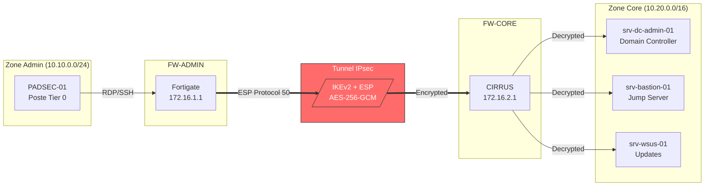
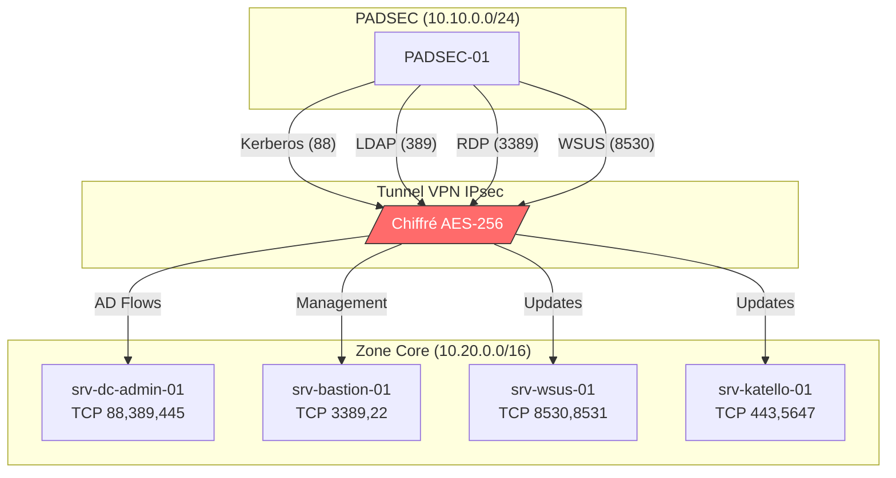

# Topologie VPN IPsec - Infrastructure ADSEC

!!! danger "Infrastructure Critique - Chemin d'Administration"
    Ce tunnel VPN IPsec est le **SEUL chemin** permettant aux postes PADSEC d'administrer les serveurs de production.

    **Si ce tunnel tombe : PLUS AUCUNE ADMINISTRATION POSSIBLE.**

    Temps de résolution cible : **< 30 minutes**

---

## Vue d'Ensemble

### Pourquoi ce VPN ?

```
┌─────────────────────────────────────────────────────────────────┐
│              PROBLÉMATIQUE DE SÉCURITÉ                           │
├─────────────────────────────────────────────────────────────────┤
│                                                                 │
│   SANS VPN (Interdit)                                           │
│   ───────────────────                                           │
│                                                                 │
│   PADSEC ────────────────────────────────────────► Serveurs     │
│          Trafic en clair sur le réseau interne                  │
│          Risque : Interception, Man-in-the-Middle               │
│                                                                 │
│   ❌ Credentials RDP/SSH visibles                               │
│   ❌ Kerberos tickets interceptables                            │
│   ❌ Pas d'isolation réseau                                     │
│                                                                 │
│   ─────────────────────────────────────────────────────────────│
│                                                                 │
│   AVEC VPN IPsec (Architecture Actuelle)                        │
│   ──────────────────────────────────────                        │
│                                                                 │
│   PADSEC ──► FW-Admin ════════════════► FW-Core ──► Serveurs    │
│              │        Tunnel Chiffré         │                  │
│              │        (AES-256-GCM)          │                  │
│              │                               │                  │
│                                                                 │
│   ✅ Trafic entièrement chiffré                                 │
│   ✅ Authentification mutuelle (certificats)                    │
│   ✅ Isolation complète du réseau de transit                    │
│   ✅ Intégrité garantie (HMAC-SHA256)                           │
│                                                                 │
└─────────────────────────────────────────────────────────────────┘
```

---

## Section 1 : Architecture VPN Site-to-Site

### 1.1 Topologie Globale

```
┌─────────────────────────────────────────────────────────────────┐
│              ARCHITECTURE VPN IPSEC - ADSEC                      │
├─────────────────────────────────────────────────────────────────┤
│                                                                 │
│   ZONE ADMIN                        ZONE CORE (Production)      │
│   (Réseau Management)               (Serveurs Critiques)        │
│                                                                 │
│   ┌─────────────────┐              ┌─────────────────┐         │
│   │   PADSEC-01     │              │ srv-dc-admin-01 │         │
│   │   PADSEC-02     │              │ srv-dc-corp-01  │         │
│   │   PADSEC-03     │              │ srv-bastion-01  │         │
│   │   (Tier 0)      │              │ srv-wsus-01     │         │
│   └────────┬────────┘              └────────▲────────┘         │
│            │                                │                   │
│            │ 10.10.0.0/24                   │ 10.20.0.0/16      │
│            │                                │                   │
│            ▼                                │                   │
│   ┌─────────────────┐              ┌────────┴────────┐         │
│   │                 │              │                 │         │
│   │    FW-ADMIN     │══════════════│    FW-CORE      │         │
│   │   (Fortigate)   │  VPN IPsec   │   (CIRRUS)      │         │
│   │                 │  IKEv2/ESP   │                 │         │
│   │  172.16.1.1     │──────────────│  172.16.2.1     │         │
│   │                 │              │                 │         │
│   └─────────────────┘              └─────────────────┘         │
│                                                                 │
│   TUNNEL IPSEC :                                                │
│   ─────────────                                                 │
│   • Endpoint Local  : 172.16.1.1 (FW-ADMIN)                    │
│   • Endpoint Distant: 172.16.2.1 (FW-CORE)                     │
│   • Réseaux Protégés: 10.10.0.0/24 ↔ 10.20.0.0/16             │
│   • Encryption      : AES-256-GCM                               │
│   • Authentification: Certificats X.509 (PKI interne)          │
│                                                                 │
└─────────────────────────────────────────────────────────────────┘
```

### 1.2 Diagramme de Flux



### 1.3 Protocoles IPsec

| Protocole | Port/Protocol | Fonction | Criticité |
|-----------|---------------|----------|-----------|
| **IKEv2** | UDP 500 | Négociation des clés, établissement du tunnel | **CRITIQUE** |
| **NAT-T** | UDP 4500 | Traversée NAT (encapsulation ESP dans UDP) | Élevée |
| **ESP** | IP Protocol 50 | Chiffrement et intégrité des données | **CRITIQUE** |
| **AH** | IP Protocol 51 | Authentification uniquement (non utilisé) | N/A |

!!! warning "Attention au Filtrage"
    Si **UDP 500** ou **IP Protocol 50** sont bloqués sur le chemin, le tunnel ne peut pas s'établir.

    Les pare-feu intermédiaires doivent autoriser :
    ```
    UDP 500   : IKE (négociation)
    UDP 4500  : NAT-Traversal
    ESP (50)  : Données chiffrées
    ```

### 1.4 Phases de Négociation IKEv2

```
┌─────────────────────────────────────────────────────────────────┐
│              ÉTABLISSEMENT DU TUNNEL IPSEC                       │
├─────────────────────────────────────────────────────────────────┤
│                                                                 │
│   PHASE 1 : IKE_SA_INIT (Authentification Mutuelle)             │
│   ─────────────────────────────────────────────────             │
│                                                                 │
│   FW-ADMIN                              FW-CORE                 │
│      │                                     │                    │
│      │──── IKE_SA_INIT (proposals) ───────►│                    │
│      │                                     │                    │
│      │◄─── IKE_SA_INIT (response) ─────────│                    │
│      │                                     │                    │
│      │    Échange Diffie-Hellman           │                    │
│      │    Vérification Certificats         │                    │
│      │                                     │                    │
│                                                                 │
│   PHASE 2 : IKE_AUTH + CREATE_CHILD_SA (Tunnel Data)            │
│   ──────────────────────────────────────────────────            │
│                                                                 │
│      │──── IKE_AUTH (identité, cert) ─────►│                    │
│      │                                     │                    │
│      │◄─── IKE_AUTH (identité, cert) ──────│                    │
│      │                                     │                    │
│      │──── CREATE_CHILD_SA (traffic sel) ─►│                    │
│      │                                     │                    │
│      │◄─── CREATE_CHILD_SA (confirm) ──────│                    │
│      │                                     │                    │
│                                                                 │
│   TUNNEL ÉTABLI ✅                                              │
│   ──────────────                                                │
│      │═════════════════════════════════════│                    │
│      │         ESP (données chiffrées)     │                    │
│      │═════════════════════════════════════│                    │
│                                                                 │
└─────────────────────────────────────────────────────────────────┘
```

---

## Section 2 : Matrice de Flux à Travers le Tunnel

### 2.1 Pourquoi Ces Flux ?

Le tunnel VPN transporte **uniquement** les flux d'administration critiques. Tout autre trafic est interdit.

```
┌─────────────────────────────────────────────────────────────────┐
│              JUSTIFICATION DES FLUX                              │
├─────────────────────────────────────────────────────────────────┤
│                                                                 │
│   1. FLUX ACTIVE DIRECTORY                                      │
│   ────────────────────────                                      │
│   Pourquoi : Les PADSEC doivent s'authentifier sur le domaine   │
│              admin.shellbook.local pour obtenir leurs tickets   │
│              Kerberos avant de pouvoir administrer.             │
│                                                                 │
│   2. FLUX MANAGEMENT (RDP/SSH)                                  │
│   ────────────────────────────                                  │
│   Pourquoi : Accès aux serveurs pour administration.            │
│              Toujours via le Bastion (srv-bastion-01).          │
│                                                                 │
│   3. FLUX MISE À JOUR                                           │
│   ───────────────────                                           │
│   Pourquoi : Les PADSEC doivent recevoir leurs patches depuis   │
│              WSUS interne (pas d'accès Internet direct).        │
│                                                                 │
└─────────────────────────────────────────────────────────────────┘
```

### 2.2 Matrice de Flux Détaillée

#### Flux Active Directory (Authentification)

| Source | Destination | Port | Protocole | Service | Usage |
|--------|-------------|------|-----------|---------|-------|
| `10.10.0.0/24` (PADSEC) | `srv-dc-admin-01` | **88** | TCP/UDP | Kerberos | Authentification |
| `10.10.0.0/24` (PADSEC) | `srv-dc-admin-01` | **389** | TCP | LDAP | Annuaire |
| `10.10.0.0/24` (PADSEC) | `srv-dc-admin-01` | **636** | TCP | LDAPS | Annuaire chiffré |
| `10.10.0.0/24` (PADSEC) | `srv-dc-admin-01` | **53** | TCP/UDP | DNS | Résolution |
| `10.10.0.0/24` (PADSEC) | `srv-dc-admin-01` | **135** | TCP | RPC | Services AD |
| `10.10.0.0/24` (PADSEC) | `srv-dc-admin-01` | **445** | TCP | SMB | GPO, Scripts |
| `10.10.0.0/24` (PADSEC) | `srv-dc-admin-01` | **49152-65535** | TCP | RPC Dynamic | Services AD |

#### Flux Management (Administration)

| Source | Destination | Port | Protocole | Service | Usage |
|--------|-------------|------|-----------|---------|-------|
| `10.10.0.0/24` (PADSEC) | `srv-bastion-01` | **3389** | TCP | RDP | Jump Server Windows |
| `10.10.0.0/24` (PADSEC) | `srv-bastion-01` | **22** | TCP | SSH | Jump Server Linux |
| `srv-bastion-01` | `10.20.0.0/16` | **3389** | TCP | RDP | Vers serveurs cibles |
| `srv-bastion-01` | `10.20.0.0/16` | **22** | TCP | SSH | Vers serveurs cibles |
| `srv-bastion-01` | `10.20.0.0/16` | **5985/5986** | TCP | WinRM | PowerShell Remoting |

#### Flux Mise à Jour

| Source | Destination | Port | Protocole | Service | Usage |
|--------|-------------|------|-----------|---------|-------|
| `10.10.0.0/24` (PADSEC) | `srv-wsus-01` | **8530** | TCP | HTTP | WSUS Updates |
| `10.10.0.0/24` (PADSEC) | `srv-wsus-01` | **8531** | TCP | HTTPS | WSUS Updates (SSL) |
| `10.10.0.0/24` (PADSEC) | `srv-katello-01` | **443** | TCP | HTTPS | Katello/Satellite |
| `10.10.0.0/24` (PADSEC) | `srv-katello-01` | **5647** | TCP | AMQP | Katello Agent |

### 2.3 Diagramme des Flux



---

## Section 3 : Troubleshooting Connectivité

### 3.1 Vérifier si le Tunnel est Actif

**Depuis un PADSEC (Windows) :**

```powershell
# Test de connectivité TCP vers un serveur cible
Test-NetConnection -ComputerName srv-bastion-01 -Port 3389

# Résultat attendu si tunnel UP :
# ComputerName     : srv-bastion-01
# RemoteAddress    : 10.20.1.50
# RemotePort       : 3389
# TcpTestSucceeded : True

# Si tunnel DOWN :
# TcpTestSucceeded : False
# WARNING: TCP connect to (10.20.1.50 : 3389) failed
```

```powershell
# Tests multiples
$targets = @(
    @{Host="srv-dc-admin-01"; Port=88},
    @{Host="srv-dc-admin-01"; Port=389},
    @{Host="srv-bastion-01"; Port=3389},
    @{Host="srv-wsus-01"; Port=8530}
)

foreach ($target in $targets) {
    $result = Test-NetConnection -ComputerName $target.Host -Port $target.Port -WarningAction SilentlyContinue
    $status = if ($result.TcpTestSucceeded) { "✅ OK" } else { "❌ FAILED" }
    Write-Host "$($target.Host):$($target.Port) - $status"
}
```

**Depuis un serveur Linux :**

```bash
# Test TCP avec nc (netcat)
nc -zv srv-bastion-01 22
# Connection to srv-bastion-01 22 port [tcp/ssh] succeeded!

# Test TCP avec timeout
timeout 5 bash -c '</dev/tcp/srv-bastion-01/22 && echo "OK" || echo "FAILED"'

# Test multiple ports
for port in 22 3389 88 389; do
    nc -zv srv-dc-admin-01 $port 2>&1 | grep -E "(succeeded|failed)"
done
```

### 3.2 Problèmes de MTU (Fragmentation)

!!! warning "Symptôme Classique"
    - Ping fonctionne
    - Petits transferts fonctionnent
    - Gros transferts (RDP, copies de fichiers) **bloquent ou sont très lents**

    **Cause probable** : La MTU effective dans le tunnel est réduite (overhead IPsec ~50-100 bytes).

**Diagnostic MTU :**

```powershell
# Windows : Test avec différentes tailles de paquets
# -f = Don't Fragment, -l = taille du payload

# Test avec MTU standard (1500 - 28 = 1472 max payload)
ping -f -l 1472 srv-bastion-01
# Si "Packet needs to be fragmented but DF set" → MTU trop grande

# Réduire progressivement jusqu'à ce que ça passe
ping -f -l 1400 srv-bastion-01
ping -f -l 1300 srv-bastion-01
ping -f -l 1200 srv-bastion-01

# La bonne valeur est la plus grande qui passe + 28 (headers IP+ICMP)
```

```bash
# Linux : Même principe
ping -M do -s 1472 srv-bastion-01
# "Frag needed and DF set" → MTU trop grande

ping -M do -s 1300 srv-bastion-01
# Si ça passe, MTU effective ≥ 1328
```

**Résolution MTU :**

```powershell
# Windows : Ajuster la MTU de l'interface
# Identifier l'interface
Get-NetAdapter | Select-Object Name, InterfaceIndex, Status

# Voir la MTU actuelle
Get-NetIPInterface -InterfaceIndex <INDEX> | Select-Object InterfaceAlias, NlMtu

# Réduire la MTU (nécessite admin)
Set-NetIPInterface -InterfaceIndex <INDEX> -NlMtuBytes 1400

# Ou via netsh
netsh interface ipv4 set subinterface "Ethernet" mtu=1400 store=persistent
```

```bash
# Linux : Ajuster la MTU
ip link set eth0 mtu 1400

# Permanent (Debian/Ubuntu)
# Dans /etc/network/interfaces :
# iface eth0 inet static
#     mtu 1400
```

### 3.3 Diagnostic Complet

```
┌─────────────────────────────────────────────────────────────────┐
│              ARBRE DE DÉCISION TROUBLESHOOTING                   │
├─────────────────────────────────────────────────────────────────┤
│                                                                 │
│   ÉTAPE 1 : Le tunnel est-il UP ?                               │
│   ───────────────────────────────                               │
│                                                                 │
│   Test: ping srv-bastion-01                                     │
│         │                                                       │
│         ├── Succès → Tunnel probablement UP, aller à ÉTAPE 2    │
│         │                                                       │
│         └── Échec → Tunnel DOWN                                 │
│                     │                                           │
│                     ├── Vérifier statut VPN sur FW-ADMIN        │
│                     ├── Vérifier statut VPN sur FW-CORE         │
│                     └── Contacter équipe Réseau/Sécurité        │
│                                                                 │
│   ─────────────────────────────────────────────────────────────│
│                                                                 │
│   ÉTAPE 2 : Le port cible est-il accessible ?                   │
│   ───────────────────────────────────────────                   │
│                                                                 │
│   Test: Test-NetConnection srv-target -Port 3389                │
│         │                                                       │
│         ├── TcpTestSucceeded: True → Service accessible ✅      │
│         │                                                       │
│         └── TcpTestSucceeded: False                             │
│                     │                                           │
│                     ├── Service arrêté sur le serveur cible ?   │
│                     ├── Firewall Windows bloque le port ?       │
│                     └── ACL sur FW-CORE bloque le flux ?        │
│                                                                 │
│   ─────────────────────────────────────────────────────────────│
│                                                                 │
│   ÉTAPE 3 : Problème de performance ?                           │
│   ───────────────────────────────────                           │
│                                                                 │
│   Test: ping -f -l 1400 srv-target                              │
│         │                                                       │
│         ├── Succès → MTU OK                                     │
│         │                                                       │
│         └── "Packet needs fragmentation"                        │
│                     │                                           │
│                     └── Réduire MTU sur l'interface client      │
│                         ou demander ajustement sur les FW       │
│                                                                 │
└─────────────────────────────────────────────────────────────────┘
```

### 3.4 Script de Diagnostic VPN

```powershell
<#
.SYNOPSIS
    Diagnostic de connectivité VPN ADSEC
.DESCRIPTION
    Vérifie la connectivité à travers le tunnel VPN vers les cibles critiques
#>

param(
    [switch]$Verbose
)

Write-Host "=== DIAGNOSTIC VPN ADSEC ===" -ForegroundColor Cyan
Write-Host "Date: $(Get-Date -Format 'yyyy-MM-dd HH:mm:ss')"
Write-Host ""

# Cibles à tester
$targets = @(
    @{Name="DC Admin (Kerberos)"; Host="srv-dc-admin-01"; Port=88},
    @{Name="DC Admin (LDAP)"; Host="srv-dc-admin-01"; Port=389},
    @{Name="DC Admin (DNS)"; Host="srv-dc-admin-01"; Port=53},
    @{Name="Bastion (RDP)"; Host="srv-bastion-01"; Port=3389},
    @{Name="Bastion (SSH)"; Host="srv-bastion-01"; Port=22},
    @{Name="WSUS (HTTP)"; Host="srv-wsus-01"; Port=8530}
)

$failures = 0

Write-Host "[1/3] Test de connectivité TCP..." -ForegroundColor Yellow
foreach ($target in $targets) {
    $result = Test-NetConnection -ComputerName $target.Host -Port $target.Port -WarningAction SilentlyContinue
    if ($result.TcpTestSucceeded) {
        Write-Host "  ✅ $($target.Name) [$($target.Host):$($target.Port)]" -ForegroundColor Green
    } else {
        Write-Host "  ❌ $($target.Name) [$($target.Host):$($target.Port)]" -ForegroundColor Red
        $failures++
    }
}
Write-Host ""

Write-Host "[2/3] Test de résolution DNS..." -ForegroundColor Yellow
$dnsTargets = @("srv-dc-admin-01", "srv-bastion-01", "srv-wsus-01")
foreach ($dns in $dnsTargets) {
    try {
        $resolved = Resolve-DnsName -Name $dns -ErrorAction Stop
        Write-Host "  ✅ $dns → $($resolved.IPAddress)" -ForegroundColor Green
    } catch {
        Write-Host "  ❌ $dns → Résolution échouée" -ForegroundColor Red
        $failures++
    }
}
Write-Host ""

Write-Host "[3/3] Test MTU (fragmentation)..." -ForegroundColor Yellow
$mtuTest = ping -f -l 1300 srv-bastion-01 -n 2 2>&1
if ($mtuTest -match "Reply from") {
    Write-Host "  ✅ MTU 1300+ : OK" -ForegroundColor Green
} else {
    Write-Host "  ⚠️  MTU 1300 : Fragmentation possible" -ForegroundColor Yellow
}
Write-Host ""

# Résumé
Write-Host "=== RÉSUMÉ ===" -ForegroundColor Cyan
if ($failures -eq 0) {
    Write-Host "Tous les tests ont réussi. Tunnel VPN opérationnel." -ForegroundColor Green
} else {
    Write-Host "$failures test(s) en échec. Vérifier le tunnel VPN." -ForegroundColor Red
    Write-Host ""
    Write-Host "Actions recommandées :" -ForegroundColor Yellow
    Write-Host "  1. Vérifier le statut du tunnel sur FW-ADMIN"
    Write-Host "  2. Vérifier le statut du tunnel sur FW-CORE"
    Write-Host "  3. Contacter l'équipe Réseau/Sécurité"
}
```

### 3.5 Commandes Rapides

```powershell
# === CONNECTIVITÉ ===
# Test port unique
Test-NetConnection srv-bastion-01 -Port 3389

# Test ping simple
ping srv-bastion-01

# Traceroute (voir le chemin)
tracert srv-bastion-01

# === MTU ===
# Test MTU (Windows)
ping -f -l 1400 srv-bastion-01

# Voir MTU actuelle
netsh interface ipv4 show subinterfaces

# === DNS ===
# Résolution
nslookup srv-bastion-01
Resolve-DnsName srv-bastion-01

# === ROUTE ===
# Table de routage
route print
Get-NetRoute -DestinationPrefix "10.20.0.0/16"
```

```bash
# === LINUX ===
# Test port
nc -zv srv-bastion-01 22

# Test MTU
ping -M do -s 1400 srv-bastion-01

# Traceroute
traceroute srv-bastion-01

# Route
ip route show
```

---

## Procédure d'Escalade

### En Cas de Tunnel DOWN

```
┌─────────────────────────────────────────────────────────────────┐
│              PROCÉDURE D'ESCALADE - TUNNEL VPN DOWN              │
├─────────────────────────────────────────────────────────────────┤
│                                                                 │
│   NIVEAU 1 : Vérification Initiale (Ops)              [5 min]   │
│   ─────────────────────────────────────                         │
│   ☐ Exécuter le script de diagnostic                            │
│   ☐ Vérifier si le problème affecte tous les PADSEC            │
│   ☐ Documenter l'heure de début et les symptômes               │
│                                                                 │
│   NIVEAU 2 : Équipe Réseau                            [15 min]  │
│   ────────────────────────                                      │
│   ☐ Vérifier statut IKE/IPsec sur FW-ADMIN                     │
│   ☐ Vérifier statut IKE/IPsec sur FW-CORE                      │
│   ☐ Vérifier les logs VPN pour erreurs                          │
│   ☐ Tenter un flap du tunnel (disable/enable)                   │
│                                                                 │
│   NIVEAU 3 : Équipe Sécurité                          [30 min]  │
│   ─────────────────────────                                     │
│   ☐ Vérifier expiration des certificats                         │
│   ☐ Vérifier les changements récents de configuration           │
│   ☐ Analyser les logs de sécurité                               │
│                                                                 │
│   CONTACTS :                                                    │
│   • Réseau : [Voir annuaire interne]                            │
│   • Sécurité : [Voir annuaire interne]                          │
│   • Astreinte : [Voir planning astreinte]                       │
│                                                                 │
└─────────────────────────────────────────────────────────────────┘
```

---

## Paramètres de Référence

### Configuration IPsec

| Paramètre | Valeur | Notes |
|-----------|--------|-------|
| **IKE Version** | IKEv2 | Plus sécurisé que IKEv1 |
| **Encryption** | AES-256-GCM | Chiffrement + intégrité |
| **PRF** | SHA-384 | Pseudo-Random Function |
| **DH Group** | Group 20 (NIST P-384) | Échange de clés |
| **Auth Method** | Certificats X.509 | PKI interne |
| **Lifetime Phase 1** | 28800 sec (8h) | Rekey automatique |
| **Lifetime Phase 2** | 3600 sec (1h) | Rekey automatique |
| **PFS** | Oui (Group 20) | Perfect Forward Secrecy |
| **DPD** | 30 sec | Dead Peer Detection |

### Endpoints

| Équipement | IP Externe | IP Interne | Rôle |
|------------|------------|------------|------|
| FW-ADMIN | 172.16.1.1 | 10.10.0.1 | Initiator |
| FW-CORE | 172.16.2.1 | 10.20.0.1 | Responder |

---

**Dernière mise à jour :** 2025-01-28
**Version :** 1.0
**Classification :** Interne - Infrastructure Critique
**Auteur :** ShellBook Network Security Team
